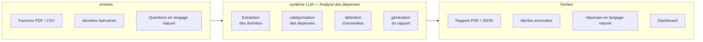
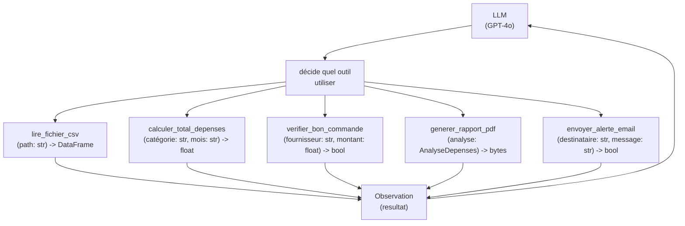
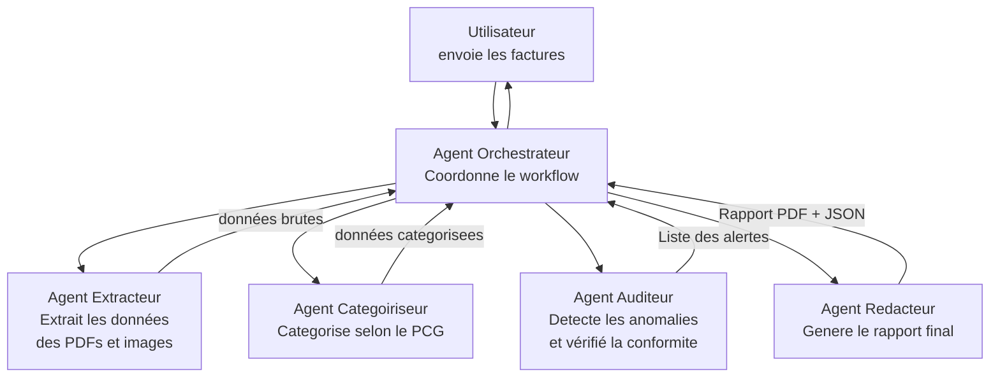
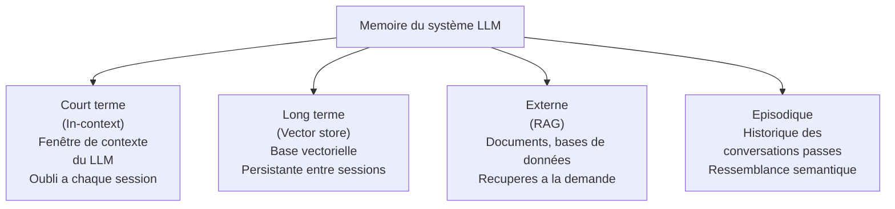
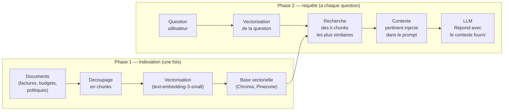
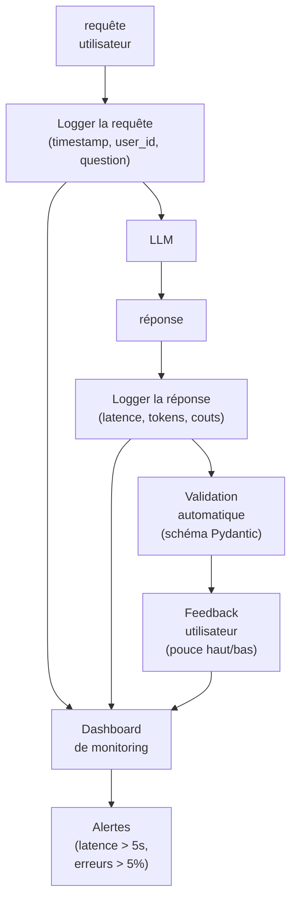

<a id="top"></a>

# Comment préparer un projet LLM — De l'idée au déploiement

> Exemple fil rouge : **Projet 1 — Analyse des dépenses**
> Un agent LLM qui analyse des factures, catégorisé les depenses, détecté les anomalies et produit un rapport.

## Table des matières

| # | Section |
|---|---------|
| 0 | [Project Overview — Comprendre le projet avant de coder](#section-0) |
| 1 | [Step 1 — Define rôle & Goal](#section-1) |
| 1a | &nbsp;&nbsp;&nbsp;↳ [définir le rôle du LLM](#section-1) |
| 1b | &nbsp;&nbsp;&nbsp;↳ [définir l'objectif et les contraintes](#section-1) |
| 2 | [Step 2 — Structure I/O](#section-2) |
| 2a | &nbsp;&nbsp;&nbsp;↳ [définir les entrées](#section-2) |
| 2b | &nbsp;&nbsp;&nbsp;↳ [définir les sorties attendues](#section-2) |
| 2c | &nbsp;&nbsp;&nbsp;↳ [schémas de validation avec Pydantic](#section-2) |
| 3 | [Step 3 — Prompt & Tune](#section-3) |
| 3a | &nbsp;&nbsp;&nbsp;↳ [Ecrire un system prompt efficace](#section-3) |
| 3b | &nbsp;&nbsp;&nbsp;↳ [Techniques de prompting](#section-3) |
| 3c | &nbsp;&nbsp;&nbsp;↳ [Fine-tuning vs prompting](#section-3) |
| 4 | [Step 4 — Reasoning & Tools](#section-4) |
| 4a | &nbsp;&nbsp;&nbsp;↳ [Choisir un mode de raisonnement](#section-4) |
| 4b | &nbsp;&nbsp;&nbsp;↳ [définir et connecter les outils](#section-4) |
| 5 | [Step 5 — Multi-Agent](#section-5) |
| 5a | &nbsp;&nbsp;&nbsp;↳ [Quand passer au multi-agent](#section-5) |
| 5b | &nbsp;&nbsp;&nbsp;↳ [Concevoir l'architecture multi-agent](#section-5) |
| 6 | [Step 6 — Memory & RAG](#section-6) |
| 6a | &nbsp;&nbsp;&nbsp;↳ [Les types de memoire](#section-6) |
| 6b | &nbsp;&nbsp;&nbsp;↳ [Mettre en place le RAG](#section-6) |
| 7 | [Step 7 — Voice & Vision](#section-7) |
| 7a | &nbsp;&nbsp;&nbsp;↳ [ajouter la vision (images, documents)](#section-7) |
| 7b | &nbsp;&nbsp;&nbsp;↳ [ajouter la voix (STT / TTS)](#section-7) |
| 8 | [Step 8 — Deliver Output](#section-8) |
| 8a | &nbsp;&nbsp;&nbsp;↳ [Formater la sortie](#section-8) |
| 8b | &nbsp;&nbsp;&nbsp;↳ [Exposer via une API FastAPI](#section-8) |
| 9 | [Step 9 — Wrap in UI](#section-9) |
| 9a | &nbsp;&nbsp;&nbsp;↳ [Interface Streamlit](#section-9) |
| 9b | &nbsp;&nbsp;&nbsp;↳ [Interface Gradio](#section-9) |
| 10 | [Step 10 — Evaluate & Monitor](#section-10) |
| 10a | &nbsp;&nbsp;&nbsp;↳ [évaluer la qualité des réponses](#section-10) |
| 10b | &nbsp;&nbsp;&nbsp;↳ [Monitorer en production](#section-10) |

---

<a id="section-0"></a>

<details>
<summary><strong>0 — Project Overview — Comprendre le projet avant de coder</strong></summary>

<br/>

Avant d'ecrire la moindre ligne de code, il faut repondre a ces quatre questions fondamentales.

### Les 4 questions du Project Overview

| Question | Exemple — Analyse des depenses |
|----------|-------------------------------|
| **Quel est le problème a resoudre ?** | L'entreprise passe 3h par semaine a catégoriser manuellement ses factures |
| **Qui sont les utilisateurs ?** | Comptables, responsables financiers, PME sans departement finance dedié |
| **Quelle valeur créé le LLM ici ?** | catégorisation automatique, détection d'anomalies, génération de rapport |
| **Quelles sont les contraintes ?** | données confidentielles, réponse < 5s, budget API limite |

---

### Diagramme de vision du projet



---

### Checklist du Project Overview

- [ ] Le problème metier est clairement défini en une phrase
- [ ] Les utilisateurs finaux sont identifies
- [ ] La valeur ajoutee du LLM par rapport a une solution classique est justifiee
- [ ] Les contraintes techniques, legales et budgetaires sont listees
- [ ] Un critère de succes mesurable est défini

</details>

<p align="right"><a href="#top">↑ Retour en haut</a></p>

---

<a id="section-1"></a>

<details>
<summary><strong>Step 1 — Define rôle & Goal</strong></summary>

<br/>

> La premiere erreur la plus courante est de déployer un LLM sans lui définir un rôle précis. Un LLM sans rôle est un outil sans direction.

---

### définir le rôle du LLM

Le **rôle** du LLM est sa personnalite et son domaine de competence. Il répond a la question : **qui est cet assistant ?**

| Mauvais rôle (trop vague) | Bon rôle (précis et contextualise) |
|--------------------------|-----------------------------------|
| « Tu es un assistant IA » | « Tu es un analyste financier spécialisé dans les depenses d'entreprise. Tu analyses des factures, identifies les catégories de depenses selon le plan comptable francais, et detectes les anomalies. Tu es précis, factuel et tu fournis toujours les montants en euros avec deux decimales. » |

---

### définir l'objectif et les contraintes

L'**objectif** répond a : **que doit accomplir cet assistant ?**
Les **contraintes** repondent a : **ce qu'il ne doit jamais faire.**

```
OBJECTIF :
- Analyser les factures fournies et extraire : date, montant, fournisseur, catégorie
- Comparer les depenses au budget previsionnel
- Signaler toute depense supérieure a 500 EUR sans bon de commande
- générer un résumé mensuel des depenses par catégorie

CONTRAINTES :
- Ne jamais inventer de chiffres — si une information est manquante, le dire explicitement
- Ne pas donner de conseils fiscaux ou juridiques
- Toujours repondre en francais
- Format de sortie : JSON structure + texte explicatif
```

---

### Template de définition rôle & Goal

```
rôle :
[Qui est cet assistant ? Quelle est son expertise ? Son ton ?]

OBJECTIF PRINCIPAL :
[Quelle est la tache principale qu'il accomplit ?]

OBJECTIFS SECONDAIRES :
[Quelles sont les taches complementaires ?]

CONTRAINTES ABSOLUES :
[Ce qu'il ne doit jamais faire, même si demande]

PERIMETRE :
[Sur quels sujets peut-il repondre ? Sur quels sujets doit-il decliner ?]
```

---

### Exemple complet — Analyse des depenses

```
rôle :
Tu es un analyste financier expert en comptabilite d'entreprise.
Tu maitrises le plan comptable general (PCG) francais et les normes IFRS.
Ton ton est professionnel, précis et concis.

OBJECTIF PRINCIPAL :
Analyser les documents de depenses fournis et produire une analyse structuree.

OBJECTIFS SECONDAIRES :
- catégoriser chaque depense selon le PCG
- Comparer au budget si fourni
- Signaler les anomalies et depenses inhabituelles

CONTRAINTES ABSOLUES :
- Ne jamais inventer de montants ou de références
- Ne pas donner de conseils fiscaux
- Si une information est ambigue, demander une clarification

PERIMETRE :
- Depenses professionnelles d'entreprise : oui
- Fiscalite et optimisation fiscale : non — rediriger vers un expert-comptable
- Analyse personnelle (particuliers) : hors perimetre
```

</details>

<p align="right"><a href="#top">↑ Retour en haut</a></p>

---

<a id="section-2"></a>

<details>
<summary><strong>Step 2 — Structure I/O</strong></summary>

<br/>

> Un LLM qui recoit n'importe quoi en entrée et produit n'importe quoi en sortie est impossible a intégrer dans un système. Structurer les I/O est la base de tout projet serieux.

---

### définir les entrées

| Type d'entrée | Format | Exemple |
|--------------|--------|---------|
| Texte libre | `str` | Question de l'utilisateur |
| Document structure | `JSON`, `CSV` | Export bancaire |
| Fichier | `PDF`, `image` | Facture scannee |
| Contexte additionnel | `dict` | Budget previsionnel du mois |
| Historique de conversation | `list[dict]` | Messages précédents |

---

### définir les sorties attendues

Toujours définir le **format exact** de la sortie avant de commencer.

| Sortie | Format | Exemple |
|--------|--------|---------|
| Analyse structuree | `JSON` | `{"catégorie": "Fournitures", "montant": 245.00}` |
| Rapport textuel | `Markdown` | résumé mensuel des depenses |
| Alerte | `JSON` avec flag | `{"anomalie": true, "raison": "Montant anormal"}` |
| réponse conversationnelle | `str` | Explication en langage naturel |

---

### schémas de validation avec Pydantic

Pydantic garantit que les sorties du LLM respectent un format strict.

```python
from pydantic import BaseModel, Field
from typing import Optional
from enum import Enum

class CategoriePCG(str, Enum):
    ACHATS = "60 - Achats"
    SERVICES_EXTERIEURS = "61 - Services exterieurs"
    AUTRES_SERVICES = "62 - Autrès services exterieurs"
    FRAIS_PERSONNEL = "64 - Charges de personnel"
    FRAIS_FINANCIERS = "66 - Charges financieres"
    AUTRES = "Autre"

class LigneDepense(BaseModel):
    date: str = Field(description="Date de la depense au format YYYY-MM-DD")
    fournisseur: str = Field(description="Nom du fournisseur")
    description: str = Field(description="Description de la depense")
    montant_ht: float = Field(description="Montant hors taxes en euros")
    tva: float = Field(description="Taux de TVA en pourcentage")
    montant_ttc: float = Field(description="Montant TTC en euros")
    catégorie: CategoriePCG = Field(description="catégorie comptable PCG")
    anomalie: bool = Field(default=False, description="True si la depense est anormale")
    raison_anomalie: Optional[str] = Field(default=None)

class AnalyseDepenses(BaseModel):
    période: str
    nombre_factures: int
    total_ht: float
    total_ttc: float
    lignes: list[LigneDepense]
    alertes: list[str]
    résumé: str
```

---

### Forcer le LLM a produire un JSON valide

```python
from openai import OpenAI
import json

client = OpenAI()

def analyser_depenses(texte_factures: str) -> AnalyseDepenses:
    response = client.chat.completions.create(
        model="gpt-4o",
        response_format={"type": "json_object"},  # force le JSON
        messages=[
            {"rôle": "system", "content": SYSTEM_PROMPT},
            {"rôle": "user", "content": texte_factures}
        ]
    )
    data = json.loads(response.choices[0].message.content)
    return AnalyseDepenses(**data)  # validation Pydantic
```

</details>

<p align="right"><a href="#top">↑ Retour en haut</a></p>

---

<a id="section-3"></a>

<details>
<summary><strong>Step 3 — Prompt & Tune</strong></summary>

<br/>

> Le prompt est le code du LLM. Un prompt mal ecrit donné des resultats impredictibles, quelle que soit la puissance du modèle.

---

### Ecrire un system prompt efficace

Un bon system prompt contient 5 elements :

| Element | Description | Exemple |
|---------|-------------|---------|
| **rôle** | Qui est l'assistant | « Tu es un analyste financier expert... » |
| **Contexte** | Informations de fond | « Tu travailles pour une PME... » |
| **Instructions** | Ce qu'il doit faire | « Analyse chaque ligne et catégorisé... » |
| **Format de sortie** | Structure exacte attendue | « Reponds en JSON avec les champs suivants... » |
| **Contraintes** | Ce qu'il ne doit pas faire | « Ne jamais inventer de chiffres... » |

---

### Techniques de prompting

#### Zero-shot

Le LLM répond sans exemple. Fonctionne bien sur des taches simples.

```
catégorisé cette depense selon le plan comptable francais :
"Achat de papier A4 pour imprimante — 45,00 EUR HT"
```

#### Few-shot

On fournit des exemples avant la vraie question. améliore la précision.

```
Exemples de catégorisation :
Input: "Abonnement Slack mensuel — 80 EUR HT"
Output: {"catégorie": "62 - Autrès services exterieurs", "code_pcg": "626"}

Input: "Salaire employe octobre — 2500 EUR"
Output: {"catégorie": "64 - Charges de personnel", "code_pcg": "641"}

Maintenant catégorisé :
Input: "Achat de cafe et fournitures cuisine — 32 EUR HT"
Output:
```

#### Chain-of-Thought (CoT)

On demande au LLM de raisonner étape par étape. améliore les resultats sur des taches complexes.

```
Analyse cette depense étape par étape :
1. Identifie d'abord la nature de la depense
2. Determine si elle est ordinaire ou exceptionnelle
3. Selectionne la catégorie PCG appropriee
4. vérifié si le montant est cohérent avec ce type de depense

Depense : "Consultant externe strategie — facture 15 000 EUR HT"
```

#### ReAct (Reason + Act)

Pour les agents. Le LLM alterne raisonnement et appel d'outils.

```
Pensée: Je dois vérifier si cette depense de 15 000 EUR a un bon de commande associe.
Action: rechercher_bon_commande(fournisseur="Cabinet McKinsey", mois="octobre 2026")
Observation: Aucun bon de commande trouve.
Pensée: Il s'agit d'une anomalie — depense > 500 EUR sans bon de commande.
réponse: ALERTE — Depense de 15 000 EUR sans bon de commande référence.
```

---

### Structure complète du system prompt — Analyse des depenses

```python
SYSTEM_PROMPT = """
Tu es un analyste financier expert en comptabilite d'entreprise francaise.

CONTEXTE :
Tu analyses les depenses d'une PME. Le budget mensuel total est de 50 000 EUR HT.
Toute depense supérieure a 500 EUR doit avoir un bon de commande.

INSTRUCTIONS :
1. Extraire les informations de chaque facture : date, fournisseur, montant HT, TVA, TTC
2. catégoriser selon le plan comptable general (PCG)
3. vérifier la cohérence des montants
4. Signaler toute anomalie avec une explication claire

ANOMALIES A détecter :
- Montant supérieur a 500 EUR sans bon de commande mentionne
- même fournisseur facture deux fois le même mois
- Taux de TVA incorrect (standard : 20 %, reduit : 5.5 %, super-reduit : 2.1 %)
- Description trop vague pour catégoriser

FORMAT DE SORTIE :
Reponds uniquement en JSON valide avec la structure AnalyseDepenses definie.
N'ajoute aucun texte avant ou après le JSON.

CONTRAINTES :
- Si une information est manquante, utilise null — ne l'invente jamais
- Si tu n'es pas certain de la catégorie, utilise "Autre" et explique dans raison_anomalie
- Reponds toujours en francais
"""
```

---

### Fine-tuning vs Prompting

| critère | Prompting | Fine-tuning |
|---------|-----------|-------------|
| **Quand l'utiliser** | Comportement general, instructions complexes | Style très spécifique, format fixe, domaine spécialisé |
| **Cout** | Tokens supplementaires a chaque appel | entraînement unique + cout reduit par appel |
| **données requises** | 0 a quelques exemples | 100 a 10 000 exemples etiquetes |
| **flexibilité** | Très flexible — modifiable sans retrainement | Rigide — nécessité un nouveau fine-tuning pour changer |
| **Recommendation 2026** | Commencer toujours par le prompting | Fine-tuner seulement si le prompting atteint ses limites |

</details>

<p align="right"><a href="#top">↑ Retour en haut</a></p>

---

<a id="section-4"></a>

<details>
<summary><strong>Step 4 — Reasoning & Tools</strong></summary>

<br/>

### Choisir un mode de raisonnement

| Mode | Description | Quand l'utiliser |
|------|-------------|-----------------|
| **Direct** | Le LLM répond directement | Questions simples, génération de texte |
| **Chain-of-Thought** | Raisonnement étape par étape | Calculs, analyse, décisions complexes |
| **ReAct** | Raisonnement + appel d'outils en boucle | Agents avec acces a des outils |
| **Tree-of-Thought** | Explore plusieurs chemins de raisonnement | problèmes d'optimisation |
| **Self-reflection** | Le LLM évalué et corrige sa propre réponse | Haute précision requise |

---

### définir et connecter les outils

Un outil est une **fonction Python** que le LLM peut appeler pour agir dans le monde.



---

### Implementation avec OpenAI Function Calling

```python
from openai import OpenAI
import json
import pandas as pd

client = OpenAI()

# définition des outils pour le LLM
tools = [
    {
        "type": "function",
        "function": {
            "name": "lire_fichier_csv",
            "description": "Lit un fichier CSV de depenses et retourne les données",
            "parameters": {
                "type": "object",
                "properties": {
                    "chemin": {
                        "type": "string",
                        "description": "Chemin vers le fichier CSV"
                    }
                },
                "required": ["chemin"]
            }
        }
    },
    {
        "type": "function",
        "function": {
            "name": "calculer_total_par_categorie",
            "description": "Calcule le total des depenses par catégorie pour un mois donné",
            "parameters": {
                "type": "object",
                "properties": {
                    "mois": {"type": "string", "description": "Mois au format YYYY-MM"},
                    "catégorie": {"type": "string", "description": "catégorie PCG (optionnel)"}
                },
                "required": ["mois"]
            }
        }
    }
]

# Fonctions réelles appelees par le LLM
def lire_fichier_csv(chemin: str) -> str:
    df = pd.read_csv(chemin)
    return df.to_json(orient="records", force_ascii=False)

def calculer_total_par_categorie(mois: str, catégorie: str = None) -> str:
    # Logique metier ici
    return json.dumps({"mois": mois, "total": 12450.00})

# Dispatcher
FONCTIONS = {
    "lire_fichier_csv": lire_fichier_csv,
    "calculer_total_par_categorie": calculer_total_par_categorie,
}

def run_agent(question: str) -> str:
    messages = [
        {"rôle": "system", "content": SYSTEM_PROMPT},
        {"rôle": "user", "content": question}
    ]

    while True:
        response = client.chat.completions.create(
            model="gpt-4o",
            messages=messages,
            tools=tools,
            tool_choice="auto"
        )

        message = response.choices[0].message

        # Si aucun outil appele — réponse finale
        if not message.tool_calls:
            return message.content

        # exécuter les outils demandes
        messages.append(message)
        for tool_call in message.tool_calls:
            nom = tool_call.function.name
            args = json.loads(tool_call.function.arguments)
            resultat = FONCTIONS[nom](**args)
            messages.append({
                "rôle": "tool",
                "tool_call_id": tool_call.id,
                "content": resultat
            })
```

</details>

<p align="right"><a href="#top">↑ Retour en haut</a></p>

---

<a id="section-5"></a>

<details>
<summary><strong>Step 5 — Multi-Agent</strong></summary>

<br/>

### Quand passer au multi-agent ?

Un seul agent suffit dans la majorite des cas. Le multi-agent se justifie quand :

| Situation | Exemple |
|-----------|---------|
| La tache nécessité des expertises distinctes | Extraction + catégorisation + rapport = 3 rôles différents |
| Des taches peuvent s'exécuter en parallele | Analyser plusieurs factures simultanement |
| La tache est trop longue pour un seul contexte | 500 factures depassent la fenêtre de contexte |
| Un agent doit vérifier le travail d'un autre | Agent critique qui valide les resultats |

---

### Architecture multi-agent — Analyse des depenses



---

### Implementation avec CrewAI

```python
from crewai import Agent, Task, Crew, Process
from crewai_tools import FileReadTool

# définition des agents
extracteur = Agent(
    rôle="Extracteur de données financieres",
    goal="Extraire avec précision toutes les informations des factures fournies",
    backstory="Tu es specialiste en lecture de documents financiers. Tu lis des factures depuis 10 ans.",
    tools=[FileReadTool()],
    verbose=True
)

categoiriseur = Agent(
    rôle="Comptable expert en plan comptable general",
    goal="catégoriser chaque depense selon le PCG francais avec le bon code comptable",
    backstory="Tu es expert-comptable certifie avec 15 ans d'experience en PME francaises.",
    verbose=True
)

auditeur = Agent(
    rôle="Auditeur financier",
    goal="détecter toutes les anomalies, fraudes potentielles et non-conformites",
    backstory="Tu as travaille 10 ans en cabinet d'audit. Tu ne laisses rien passer.",
    verbose=True
)

# définition des taches
tache_extraction = Task(
    description="Lis les factures dans le dossier /factures et extrais toutes les données.",
    expected_output="JSON avec toutes les lignes de factures extraites",
    agent=extracteur
)

tache_categorisation = Task(
    description="Prends les données extraites et catégorisé chaque ligne selon le PCG.",
    expected_output="JSON avec catégories PCG et codes comptables",
    agent=categoiriseur,
    context=[tache_extraction]
)

tache_audit = Task(
    description="Analyse les depenses categorisees et identifie toutes les anomalies.",
    expected_output="Liste des alertes avec justification",
    agent=auditeur,
    context=[tache_categorisation]
)

# Crew — orchestration
crew = Crew(
    agents=[extracteur, categoiriseur, auditeur],
    tasks=[tache_extraction, tache_categorisation, tache_audit],
    process=Process.sequential,
    verbose=True
)

resultat = crew.kickoff()
print(resultat)
```

</details>

<p align="right"><a href="#top">↑ Retour en haut</a></p>

---

<a id="section-6"></a>

<details>
<summary><strong>Step 6 — Memory & RAG</strong></summary>

<br/>

### Les types de memoire



---

### Mettre en place le RAG

Le **RAG** (Retrieval-Augmented génération) permet au LLM de repondre a partir de documents spécifiques sans les mettre entierement dans le contexte.



---

### Implementation RAG avec LangChain

```python
from langchain_community.vectorstores import Chroma
from langchain_openai import OpenAIEmbeddings, ChatOpenAI
from langchain.text_splitter import RecursiveCharacterTextSplitter
from langchain_community.document_loaders import PyPDFLoader
from langchain.chains import RetrievalQA

# 1. Charger et decouper les documents
loader = PyPDFLoader("politique_achats.pdf")
documents = loader.load()

splitter = RecursiveCharacterTextSplitter(chunk_size=1000, chunk_overlap=200)
chunks = splitter.split_documents(documents)

# 2. créer la base vectorielle
embeddings = OpenAIEmbeddings(model="text-embedding-3-small")
vectorstore = Chroma.from_documents(chunks, embeddings, persist_directory="./chroma_db")

# 3. créer la chaine RAG
llm = ChatOpenAI(model="gpt-4o", temperature=0)
retriever = vectorstore.as_retriever(search_kwargs={"k": 5})

qa_chain = RetrievalQA.from_chain_type(
    llm=llm,
    retriever=retriever,
    return_source_documents=True
)

# 4. Utiliser le RAG
réponse = qa_chain.invoke({"query": "Quelle est la limite de depense sans bon de commande ?"})
print(réponse["result"])
print("Sources :", [doc.metadata for doc in réponse["source_documents"]])
```

</details>

<p align="right"><a href="#top">↑ Retour en haut</a></p>

---

<a id="section-7"></a>

<details>
<summary><strong>Step 7 — Voice & Vision</strong></summary>

<br/>

### ajouter la vision — Analyser des images et documents

Les modèles multimodaux permettent d'envoyer des images directement au LLM — utile pour lire des factures scannees.

```python
import base64
from openai import OpenAI

client = OpenAI()

def encoder_image(chemin: str) -> str:
    with open(chemin, "rb") as f:
        return base64.b64encode(f.read()).decode("utf-8")

def analyser_facture_image(chemin_image: str) -> dict:
    image_base64 = encoder_image(chemin_image)

    response = client.chat.completions.create(
        model="gpt-4o",
        messages=[
            {
                "rôle": "user",
                "content": [
                    {
                        "type": "text",
                        "text": "Extrais toutes les informations de cette facture en JSON : date, fournisseur, lignes de detail, total HT, TVA, total TTC."
                    },
                    {
                        "type": "image_url",
                        "image_url": {
                            "url": f"data:image/jpeg;base64,{image_base64}"
                        }
                    }
                ]
            }
        ],
        response_format={"type": "json_object"}
    )
    import json
    return json.loads(response.choices[0].message.content)
```

---

### ajouter la voix — Speech-to-Text et Text-to-Speech

#### STT (Speech-to-Text) — Transcrire la voix en texte

```python
from openai import OpenAI

client = OpenAI()

def transcrire_audio(chemin_audio: str) -> str:
    with open(chemin_audio, "rb") as f:
        transcription = client.audio.transcriptions.create(
            model="whisper-1",
            file=f,
            language="fr"
        )
    return transcription.text

# Flux complet voix -> analyse
audio_texte = transcrire_audio("question_comptable.mp3")
# "Quel est le total des depenses en fournitures ce mois-ci ?"
réponse = run_agent(audio_texte)
```

#### TTS (Text-to-Speech) — Lire la réponse a voix haute

```python
from pathlib import Path

def synthetiser_voix(texte: str, fichier_sortie: str = "réponse.mp3"):
    response = client.audio.speech.create(
        model="tts-1",
        voice="onyx",     # voix disponibles : alloy, echo, fable, onyx, nova, shimmer
        input=texte
    )
    Path(fichier_sortie).write_bytes(response.content)
    return fichier_sortie
```

</details>

<p align="right"><a href="#top">↑ Retour en haut</a></p>

---

<a id="section-8"></a>

<details>
<summary><strong>Step 8 — Deliver Output</strong></summary>

<br/>

### Formater la sortie selon le contexte

| Contexte | Format recommande | Pourquoi |
|----------|------------------|---------|
| intégration avec d'autrès systèmes | JSON | Parseable par toute application |
| Rapport pour humains | Markdown ou PDF | Lisible et imprimable |
| Interface web | HTML ou Markdown | Affichage direct |
| données tabulaires | CSV | Traitement Excel / Sheets |
| Notification courte | Texte brut | Email, SMS, Slack |

---

### Exposer via une API FastAPI

```python
from fastapi import FastAPI, UploadFile, File, HTTPException
from fastapi.responses import JSONResponse
import shutil
import os

app = FastAPI(title="API Analyse des Depenses", version="1.0")

@app.post("/analyser", response_model=AnalyseDepenses)
async def analyser_factures(fichier: UploadFile = File(...)):
    """
    Recoit un fichier CSV ou PDF de factures et retourne l'analyse complète.
    """
    if not fichier.filename.endswith((".csv", ".pdf")):
        raise HTTPException(status_code=400, detail="Format accepte : CSV ou PDF uniquement")

    chemin_tmp = f"/tmp/{fichier.filename}"
    with open(chemin_tmp, "wb") as f:
        shutil.copyfileobj(fichier.file, f)

    try:
        if fichier.filename.endswith(".pdf"):
            texte = extraire_texte_pdf(chemin_tmp)
        else:
            texte = open(chemin_tmp).read()

        analyse = analyser_depenses(texte)
        return analyse
    finally:
        os.remove(chemin_tmp)

@app.post("/question")
async def poser_question(question: str):
    """
    Pose une question en langage naturel sur les depenses.
    """
    réponse = run_agent(question)
    return {"réponse": réponse}

@app.get("/rapport/{mois}")
async def generer_rapport(mois: str):
    """
    généré un rapport mensuel pour le mois donné (format: YYYY-MM).
    """
    rapport = run_agent(f"généré un rapport complet des depenses pour {mois}")
    return {"mois": mois, "rapport": rapport}
```

</details>

<p align="right"><a href="#top">↑ Retour en haut</a></p>

---

<a id="section-9"></a>

<details>
<summary><strong>Step 9 — Wrap in UI</strong></summary>

<br/>

### Interface Streamlit

Streamlit permet de créer une interface web en quelques lignes de Python.

```python
import streamlit as st
import requests

st.set_page_config(page_title="Analyse des Depenses IA", layout="wide")
st.title("Analyse des Depenses — Assistant IA")

# Sidebar
with st.sidebar:
    st.header("configuration")
    modèle = st.selectbox("modèle", ["gpt-4o", "gpt-4o-mini", "claude-3-5-sonnet"])
    temperature = st.slider("Temperature", 0.0, 1.0, 0.0)

# Onglets
tab1, tab2, tab3 = st.tabs(["Analyser des factures", "Poser une question", "Rapport mensuel"])

with tab1:
    st.subheader("Deposer vos factures")
    fichier = st.file_uploader("Fichier CSV ou PDF", type=["csv", "pdf"])
    if fichier and st.button("Analyser"):
        with st.spinner("Analyse en cours..."):
            response = requests.post(
                "http://localhost:8000/analyser",
                files={"fichier": fichier.getvalue()}
            )
            if response.status_code == 200:
                data = response.json()
                st.success(f"Analyse terminee — {data['nombre_factures']} factures traitees")
                col1, col2, col3 = st.columns(3)
                col1.metric("Total HT", f"{data['total_ht']:,.2f} EUR")
                col2.metric("Total TTC", f"{data['total_ttc']:,.2f} EUR")
                col3.metric("Alertes", len(data["alertes"]))
                if data["alertes"]:
                    st.warning("Anomalies détectées :")
                    for alerte in data["alertes"]:
                        st.write(f"- {alerte}")
                st.json(data["lignes"])
            else:
                st.error("Erreur lors de l'analyse")

with tab2:
    st.subheader("Posez une question sur vos depenses")
    if "messages" not in st.session_state:
        st.session_state.messages = []
    for msg in st.session_state.messages:
        with st.chat_message(msg["rôle"]):
            st.write(msg["content"])
    question = st.chat_input("Ex: Quel est le total des depenses en marketing ce mois ?")
    if question:
        st.session_state.messages.append({"rôle": "user", "content": question})
        with st.chat_message("assistant"):
            with st.spinner("Reflexion en cours..."):
                response = requests.post(
                    "http://localhost:8000/question",
                    params={"question": question}
                )
                réponse = response.json()["réponse"]
                st.write(réponse)
                st.session_state.messages.append({"rôle": "assistant", "content": réponse})

with tab3:
    st.subheader("Rapport mensuel")
    mois = st.text_input("Mois (YYYY-MM)", value="2026-03")
    if st.button("générer le rapport"):
        with st.spinner("génération en cours..."):
            response = requests.get(f"http://localhost:8000/rapport/{mois}")
            if response.status_code == 200:
                st.markdown(response.json()["rapport"])
                st.download_button("Telecharger", response.json()["rapport"], file_name=f"rapport_{mois}.md")
```

---

### Interface Gradio

Gradio est plus rapide a mettre en place pour les prototypes.

```python
import gradio as gr
import requests

def analyser_fichier(fichier):
    if fichier is None:
        return "Veuillez deposer un fichier."
    response = requests.post(
        "http://localhost:8000/analyser",
        files={"fichier": open(fichier.name, "rb")}
    )
    return response.json()

def repondre_question(question, historique):
    response = requests.post(
        "http://localhost:8000/question",
        params={"question": question}
    )
    réponse = response.json()["réponse"]
    historique.append((question, réponse))
    return "", historique

with gr.Blocks(title="Analyse des Depenses IA") as demo:
    gr.Markdown("# Analyse des Depenses — Assistant IA")
    with gr.Tab("Analyser des factures"):
        fichier_input = gr.File(label="Deposer un CSV ou PDF")
        output = gr.JSON(label="Resultat de l'analyse")
        gr.Button("Analyser").click(analyser_fichier, fichier_input, output)
    with gr.Tab("Chat"):
        chatbot = gr.Chatbot()
        msg = gr.Textbox(placeholder="Posez votre question...")
        msg.submit(repondre_question, [msg, chatbot], [msg, chatbot])

demo.launch()
```

</details>

<p align="right"><a href="#top">↑ Retour en haut</a></p>

---

<a id="section-10"></a>

<details>
<summary><strong>Step 10 — Evaluate & Monitor</strong></summary>

<br/>

> Un LLM déployé sans évaluation ni monitoring est une boite noire. On ne sait ni s'il est bon, ni s'il se degrade.

---

### évaluer la qualité des réponses

#### Les metriques d'évaluation pour les LLMs

| Metrique | Description | Outil |
|----------|-------------|-------|
| **Exactitude factuelle** | La réponse est-elle correcte ? | Comparaison avec ground truth |
| **Fidelite au contexte (RAG)** | La réponse est-elle basee sur les documents fournis ? | RAGAS |
| **Pertinence** | La réponse repond-elle vraiment a la question ? | LLM-as-judge |
| **Hallucination** | Le LLM a-t-il invente des informations ? | RAGAS, FactScore |
| **Format** | La sortie respecte-t-elle le schéma Pydantic ? | Validation automatique |
| **Latence** | Temps de réponse en production | Prometheus, logs |

---

### LLM-as-judge — évaluer avec un autre LLM

```python
from openai import OpenAI

client = OpenAI()

def evaluer_reponse(question: str, réponse: str, contexte: str) -> dict:
    prompt_juge = f"""
    Tu es un evaluateur de qualité pour un système d'analyse financiere.

    Question posee : {question}
    Contexte fourni au système : {contexte}
    réponse du système : {réponse}

    évalué la réponse sur ces critères (note de 1 a 5) :
    1. Exactitude : Les chiffres et faits sont-ils corrects ?
    2. Completude : La réponse repond-elle a toute la question ?
    3. Fidelite : La réponse est-elle basee sur le contexte fourni ?
    4. Format : La réponse est-elle bien structuree ?

    Reponds en JSON : {{"exactitude": X, "completude": X, "fidelite": X, "format": X, "commentaire": "..."}}
    """
    response = client.chat.completions.create(
        model="gpt-4o",
        messages=[{"rôle": "user", "content": prompt_juge}],
        response_format={"type": "json_object"}
    )
    import json
    return json.loads(response.choices[0].message.content)
```

---

### Monitorer en production



---

### Ce qu'il faut loguer a chaque appel

```python
import time
import logging
from datetime import datetime

logging.basicConfig(level=logging.INFO)

def appel_llm_monitore(question: str, user_id: str) -> dict:
    debut = time.time()
    nb_tokens_entree = len(question.split()) * 1.3  # estimation

    try:
        réponse = run_agent(question)
        statut = "succes"
        erreur = None
    except Exception as e:
        réponse = None
        statut = "erreur"
        erreur = str(e)

    fin = time.time()
    latence = round(fin - debut, 3)

    log_entry = {
        "timestamp": datetime.now().isoformat(),
        "user_id": user_id,
        "question": question[:200],  # tronquer pour la confidentialite
        "statut": statut,
        "latence_s": latence,
        "tokens_entree_estime": int(nb_tokens_entree),
        "erreur": erreur
    }
    logging.info(log_entry)

    return {"réponse": réponse, "meta": log_entry}
```

---

### Checklist finale avant mise en production

- [ ] Le system prompt est teste sur au moins 20 cas réels
- [ ] Les sorties JSON sont validees par Pydantic sur 100 % des appels
- [ ] Un jeu de test de référence (ground truth) est constitue
- [ ] La latence moyenne est acceptable (< 5s pour ce projet)
- [ ] Les couts par appel sont estimes et un budget mensuel est défini
- [ ] Un mécanisme de feedback utilisateur est en place
- [ ] Les logs sont stockes et consultables
- [ ] Un seuil d'alerte est défini (ex : taux d'erreur > 5 %)
- [ ] Le modèle de fallback est défini si le LLM principal est indisponible
- [ ] La conformite RGPD est verifiee (données personnelles dans les factures)

</details>

<p align="right"><a href="#top">↑ Retour en haut</a></p>
