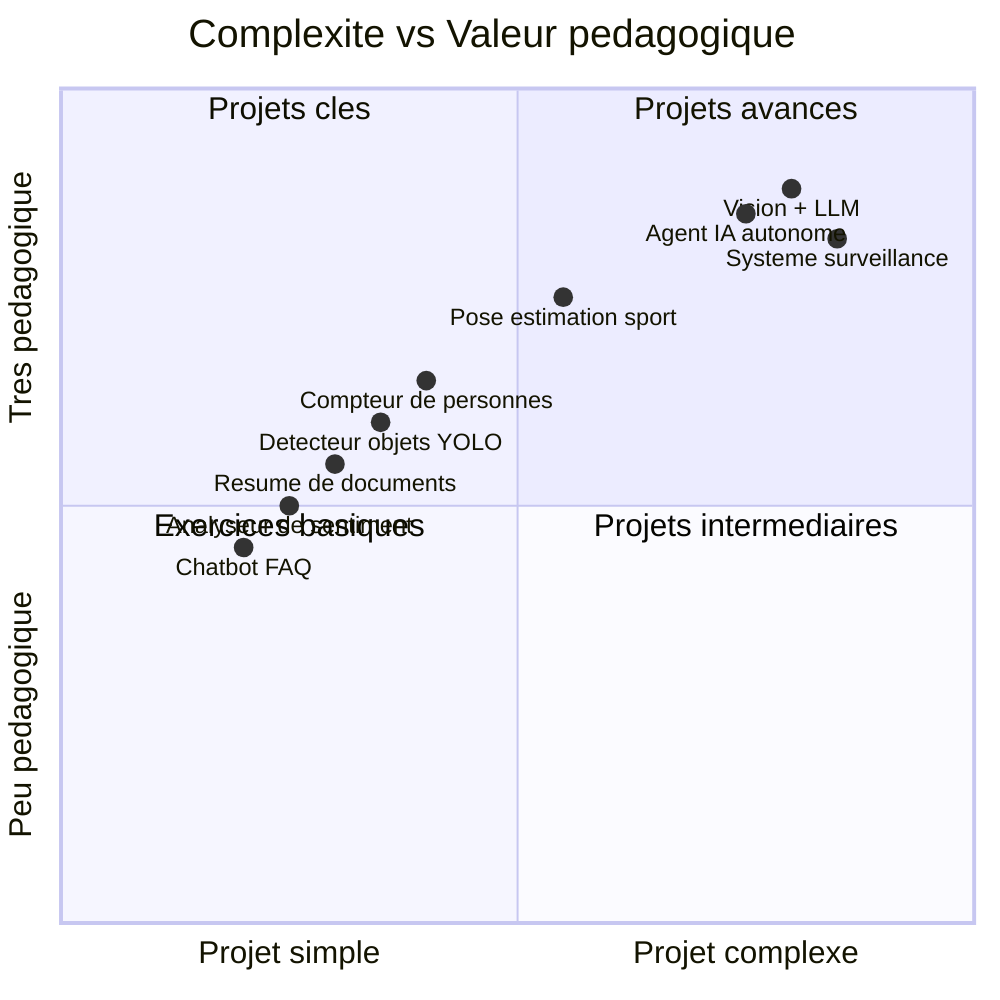
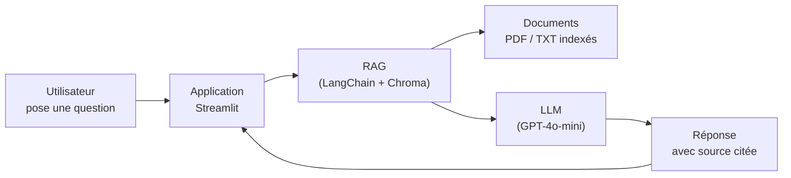
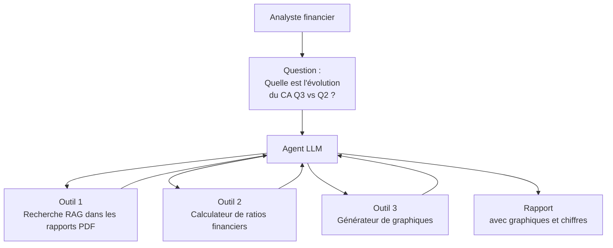
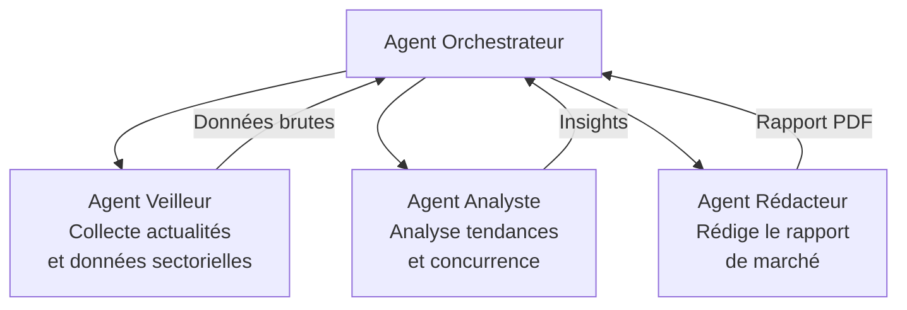
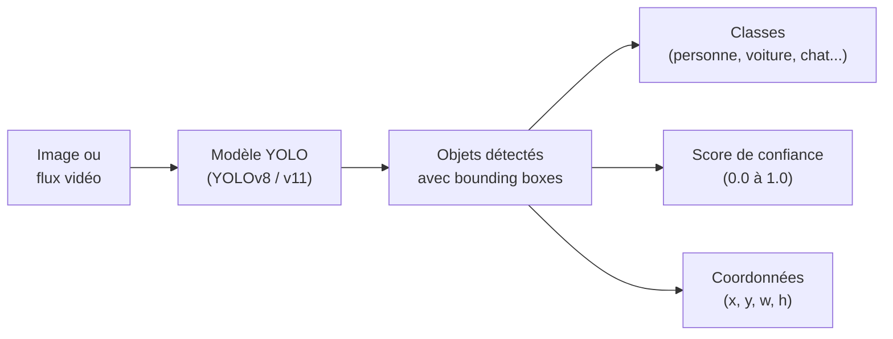
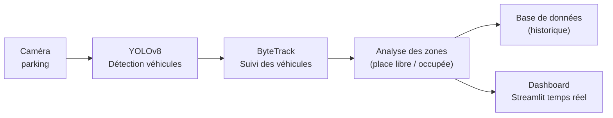
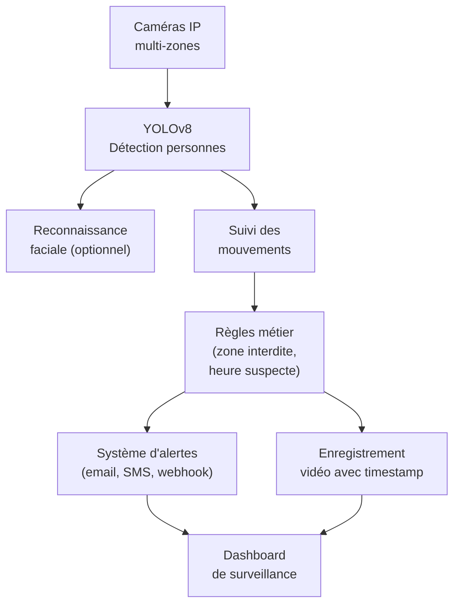
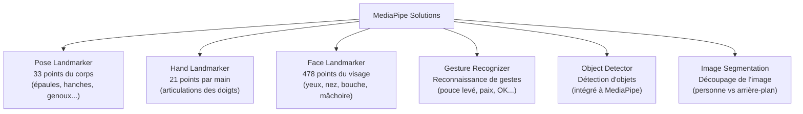
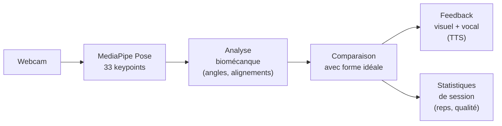
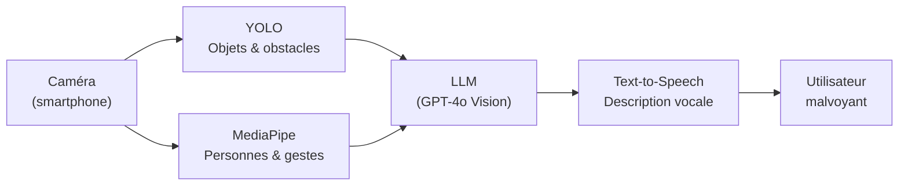

<a id="top"></a>

# Idées de Projets IA — LLM, YOLO et MediaPipe

> Catalogue de projets classés par niveau de difficulté et domaine d'application.
> Chaque projet inclut une description, la stack technique, les données nécessaires et les étapes clés.

## Table des matières

| # | Section |
|---|---------|
| 1 | [Comment choisir son projet](#section-1) |
| 2 | [Projets LLM — Large Language Models](#section-2) |
| 2a | &nbsp;&nbsp;&nbsp;↳ [Niveau débutant](#section-2) |
| 2b | &nbsp;&nbsp;&nbsp;↳ [Niveau intermédiaire](#section-2) |
| 2c | &nbsp;&nbsp;&nbsp;↳ [Niveau avancé](#section-2) |
| 3 | [Projets YOLO — Détection d'objets](#section-3) |
| 3a | &nbsp;&nbsp;&nbsp;↳ [Qu'est-ce que YOLO ?](#section-3) |
| 3b | &nbsp;&nbsp;&nbsp;↳ [Niveau débutant](#section-3) |
| 3c | &nbsp;&nbsp;&nbsp;↳ [Niveau intermédiaire](#section-3) |
| 3d | &nbsp;&nbsp;&nbsp;↳ [Niveau avancé](#section-3) |
| 4 | [Projets MediaPipe — Analyse du corps humain](#section-4) |
| 4a | &nbsp;&nbsp;&nbsp;↳ [Qu'est-ce que MediaPipe ?](#section-4) |
| 4b | &nbsp;&nbsp;&nbsp;↳ [Niveau débutant](#section-4) |
| 4c | &nbsp;&nbsp;&nbsp;↳ [Niveau intermédiaire](#section-4) |
| 4d | &nbsp;&nbsp;&nbsp;↳ [Niveau avancé](#section-4) |
| 5 | [Projets combinés — LLM + YOLO + MediaPipe](#section-5) |
| 6 | [Stack technique recommandée par projet](#section-6) |
| 7 | [Gabarit de fiche projet](#section-7) |

---

<a id="section-1"></a>

<details>
<summary><strong>1 — Comment choisir son projet</strong></summary>

<br/>

### Matrice de sélection



### Choisir selon votre objectif

| Objectif | Technologie recommandée | Projet suggéré |
|----------|------------------------|----------------|
| Apprendre les LLMs | LLM + FastAPI | Chatbot sur documents internes |
| Apprendre la vision par ordinateur | YOLO | Détecteur d'objets avec webcam |
| Apprendre l'analyse du corps | MediaPipe | Coach sportif virtuel |
| Construire un portfolio | LLM + YOLO | Système de surveillance intelligente |
| Projet professionnel rapide | LLM + Streamlit | Assistant métier spécialisé |
| Projet recherche | MediaPipe + ML | Analyse de posture et bien-être |

### Niveaux de difficulté

| Niveau | Prérequis | Durée estimée |
|--------|-----------|--------------|
| Débutant | Python de base, pip, Jupyter | 2 à 5 jours |
| Intermédiaire | FastAPI, Streamlit, notions de ML | 1 à 3 semaines |
| Avancé | Docker, APIs, agents, fine-tuning | 1 à 2 mois |

</details>

<p align="right"><a href="#top">↑ Retour en haut</a></p>

---

<a id="section-2"></a>

<details>
<summary><strong>2 — Projets LLM — Large Language Models</strong></summary>

<br/>

### Niveau débutant

---

#### Projet LLM-01 — Chatbot FAQ sur vos propres documents

**Description :** Créer un assistant qui répond aux questions à partir d'un ensemble de documents PDF ou texte (règlement intérieur, manuel, FAQ). Utilise le RAG pour chercher l'information pertinente avant de répondre.



**Stack technique :**
- `langchain`, `chromadb`, `openai`, `streamlit`, `pdfplumber`

**Données :** Vos propres documents PDF (règlements, cours, manuels)

**Étapes clés :**
1. Charger et découper les PDF en chunks
2. Vectoriser avec `text-embedding-3-small`
3. Stocker dans Chroma
4. Créer une chaîne RAG avec LangChain
5. Interface Streamlit avec affichage des sources

**Ce que vous apprenez :** RAG, embeddings, bases vectorielles, LangChain

---

#### Projet LLM-02 — Analyseur de sentiment de commentaires clients

**Description :** Analyser automatiquement des avis clients (positif, négatif, neutre) et extraire les points forts et points faibles mentionnés. Peut traiter des fichiers CSV de commentaires en lot.

**Stack technique :**
- `openai`, `pandas`, `streamlit`, `plotly`

**Données :** Avis Amazon, TripAdvisor, Google Reviews (scraping ou Kaggle)

**Étapes clés :**
1. Charger un CSV d'avis clients
2. Appeler le LLM pour analyser chaque commentaire (sentiment + thèmes)
3. Valider la sortie JSON avec Pydantic
4. Visualiser les résultats avec Plotly

**Ce que vous apprenez :** Structured output, traitement en lot, visualisation

---

#### Projet LLM-03 — Générateur de quiz à partir d'un cours

**Description :** Donner un texte de cours en entrée et générer automatiquement des questions à choix multiples (QCM) avec réponses et explications. Utile pour les enseignants et étudiants.

**Stack technique :**
- `openai`, `pydantic`, `streamlit`

**Données :** N'importe quel texte de cours ou article Wikipedia

**Étapes clés :**
1. Découper le cours en sections
2. Demander au LLM de générer N questions par section
3. Valider le schéma Pydantic (question, options, bonne réponse, explication)
4. Interface de quiz interactif dans Streamlit

**Ce que vous apprenez :** Prompt engineering, structured output, Pydantic

---

### Niveau intermédiaire

---

#### Projet LLM-04 — Assistant d'analyse financière (RAG + outils)

**Description :** Un agent qui analyse des rapports financiers (PDF), répond à des questions sur les chiffres, compare des périodes et génère des résumés exécutifs. Peut appeler des outils pour calculer des ratios financiers.



**Stack technique :**
- `langchain`, `openai`, `pdfplumber`, `pandas`, `plotly`, `fastapi`, `streamlit`

**Données :** Rapports annuels publics (PDF) d'entreprises cotées

**Ce que vous apprenez :** Agents avec outils, RAG sur PDF, Function Calling

---

#### Projet LLM-05 — Correcteur et tuteur de code

**Description :** Un assistant qui analyse du code soumis par un étudiant, identifie les erreurs, explique pourquoi c'est une erreur, propose une correction et suggère des améliorations. Supporte Python, JavaScript, SQL.

**Stack technique :**
- `openai`, `streamlit`, `pygments` (coloration syntaxique)

**Données :** Aucune donnée externe requise — le code de l'étudiant est l'entrée

**Fonctionnalités :**
- Détection d'erreurs de syntaxe et de logique
- Explication pédagogique adaptée au niveau
- Suggestion de refactoring
- Génération de tests unitaires automatiques

**Ce que vous apprenez :** Prompt engineering avancé, gestion du contexte, mode pédagogique

---

#### Projet LLM-06 — Traducteur et adaptateur de contenu multilingue

**Description :** Traduire des documents dans plusieurs langues en adaptant le ton selon le public cible (formel, informel, technique, simplifié). Peut traiter des fichiers entiers en préservant le formatage Markdown.

**Stack technique :**
- `openai` ou `mistral`, `python-docx`, `streamlit`, `langdetect`

**Données :** Documents texte, Markdown, Word

**Ce que vous apprenez :** Gestion de prompts multilingues, traitement de fichiers, streaming

---

#### Projet LLM-07 — Agent de recherche et synthèse web

**Description :** Donner un sujet de recherche, l'agent cherche sur le web, lit les sources pertinentes, élimine les doublons et produit une synthèse structurée avec citations.

**Stack technique :**
- `langchain`, `openai`, `tavily` (API de recherche), `streamlit`

**Données :** Requêtes de recherche + web en temps réel

**Ce que vous apprenez :** Agents ReAct, intégration d'outils de recherche, gestion des sources

---

### Niveau avancé

---

#### Projet LLM-08 — Système multi-agents d'analyse de marché

**Description :** Plusieurs agents spécialisés collaborent pour produire une analyse de marché complète : un agent collecte des données, un autre analyse la concurrence, un troisième rédige le rapport final.



**Stack technique :**
- `crewai` ou `autogen`, `openai`, `tavily`, `reportlab`, `fastapi`

**Ce que vous apprenez :** Architecture multi-agents, CrewAI, orchestration

---

#### Projet LLM-09 — Assistant médical de triage (avec disclaimers éthiques)

**Description :** Assistant qui aide à évaluer des symptômes, suggère un niveau d'urgence (non urgent / consulter un médecin / urgences) et prépare un résumé pour le médecin. Ne pose jamais de diagnostic.

**Stack technique :**
- `openai`, `fastapi`, `streamlit`, `pydantic`

**Contraintes importantes :**
- Toujours afficher : « Ce système ne remplace pas un médecin »
- Ne jamais donner de diagnostic ou prescription
- Intégration de garde-fous (guardrails) pour les sujets sensibles

**Ce que vous apprenez :** Guardrails, éthique de l'IA, gestion des sujets sensibles

---

#### Projet LLM-10 — Fine-tuning d'un LLM sur un style ou domaine spécifique

**Description :** Fine-tuner GPT-3.5 ou Mistral sur un corpus de textes spécifiques pour qu'il adopte un style d'écriture particulier ou maîtrise un vocabulaire spécialisé (juridique, médical, technique).

**Stack technique :**
- `openai` (fine-tuning API) ou `transformers`, `peft`, `datasets`

**Données :** 500 à 5 000 paires (question, réponse idéale) dans le domaine ciblé

**Ce que vous apprenez :** Fine-tuning, RLHF, LoRA, évaluation de modèles fine-tunés

</details>

<p align="right"><a href="#top">↑ Retour en haut</a></p>

---

<a id="section-3"></a>

<details>
<summary><strong>3 — Projets YOLO — Détection d'objets</strong></summary>

<br/>

### Qu'est-ce que YOLO ?

**YOLO** (You Only Look Once) est une famille d'algorithmes de **détection d'objets en temps réel**. Il analyse une image en une seule passe du réseau de neurones, ce qui le rend extrêmement rapide.



**Versions disponibles en 2026 :**

| Version | Créateur | Points forts |
|---------|---------|--------------|
| **YOLOv8** | Ultralytics | Très utilisé, documentation excellente |
| **YOLOv9** | WongKinYiu | Meilleure précision sur petits objets |
| **YOLOv10** | Tsinghua University | Sans post-processing (NMS-free) |
| **YOLOv11** | Ultralytics | Tâches multiples : détection, segmentation, pose |
| **RT-DETR** | Baidu | Transformer-based, très précis |

```python
# Installation et utilisation de base
# pip install ultralytics

from ultralytics import YOLO
import cv2

# Charger un modèle pré-entraîné
model = YOLO("yolov8n.pt")   # n=nano, s=small, m=medium, l=large, x=extra-large

# Inférence sur une image
results = model("photo.jpg")
for r in results:
    print(r.boxes.cls)    # classes détectées
    print(r.boxes.conf)   # scores de confiance
    print(r.boxes.xyxy)   # coordonnées des bounding boxes
    r.show()              # afficher le résultat

# Inférence sur webcam en temps réel
results = model(source=0, show=True, stream=True)
for r in results:
    pass  # traitement frame par frame
```

---

### Niveau débutant

---

#### Projet YOLO-01 — Détecteur d'objets du quotidien avec webcam

**Description :** Application temps réel qui détecte et nomme les objets dans le champ de la webcam (chaise, tasse, téléphone, personne...). Affiche les bounding boxes et le nom des objets avec le score de confiance.

```python
from ultralytics import YOLO
import cv2

model = YOLO("yolov8n.pt")   # modèle nano — rapide

cap = cv2.VideoCapture(0)    # webcam

while cap.isOpened():
    ret, frame = cap.read()
    if not ret:
        break

    results = model(frame, verbose=False)
    annotated = results[0].plot()   # dessiner les bounding boxes

    cv2.imshow("Détection YOLO", annotated)

    if cv2.waitKey(1) & 0xFF == ord("q"):
        break

cap.release()
cv2.destroyAllWindows()
```

**Stack technique :** `ultralytics`, `opencv-python`

**Ce que vous apprenez :** YOLO de base, traitement vidéo temps réel, OpenCV

---

#### Projet YOLO-02 — Compteur de personnes dans une image

**Description :** Analyser des photos ou flux vidéo pour compter le nombre de personnes présentes. Utile pour la gestion de foule, la surveillance de locaux ou l'analyse d'événements.

```python
from ultralytics import YOLO
from pathlib import Path
import pandas as pd

model = YOLO("yolov8m.pt")

def compter_personnes(source) -> dict:
    results = model(source, classes=[0])   # classe 0 = personne dans COCO
    nb_personnes = 0
    confidences = []

    for r in results:
        nb_personnes += len(r.boxes)
        confidences.extend(r.boxes.conf.cpu().numpy().tolist())

    return {
        "nb_personnes": nb_personnes,
        "confiance_moyenne": round(sum(confidences) / len(confidences), 3) if confidences else 0
    }

# Traiter un dossier d'images
resultats = []
for img_path in Path("./images/").glob("*.jpg"):
    res = compter_personnes(str(img_path))
    res["fichier"] = img_path.name
    resultats.append(res)

df = pd.DataFrame(resultats)
print(df)
print(f"Total personnes détectées : {df['nb_personnes'].sum()}")
```

**Ce que vous apprenez :** Filtrage par classe, traitement en lot, statistiques sur détections

---

#### Projet YOLO-03 — Détecteur d'EPI (Équipements de Protection Individuelle)

**Description :** Détecter si les travailleurs portent bien leur casque, gilet et chaussures de sécurité sur un chantier ou en usine. Alerter quand un EPI est manquant.

**Données :** Dataset public sur Roboflow Universe — "PPE Detection" ou "Hard Hat Detection"

**Stack technique :** `ultralytics`, `roboflow`, `opencv-python`, `fastapi`

**Étapes clés :**
1. Télécharger le dataset annoté depuis Roboflow
2. Fine-tuner YOLOv8 sur les classes casque/gilet/chaussures
3. Inférence sur flux vidéo
4. Envoyer une alerte si EPI manquant

**Ce que vous apprenez :** Fine-tuning YOLO, Roboflow, datasets annotés

---

### Niveau intermédiaire

---

#### Projet YOLO-04 — Système de surveillance de parking intelligent

**Description :** Analyser un flux caméra de parking pour détecter les places libres et occupées, compter les voitures, identifier les plaques et générer un tableau de bord en temps réel.



**Stack technique :**
- `ultralytics` (YOLOv8 + ByteTrack), `opencv-python`, `streamlit`, `sqlite3`

**Fonctionnalités :**
- Détection et suivi de véhicules
- Définition de zones de parking par polygones
- Comptage entrées / sorties
- Tableau de bord avec taux d'occupation en temps réel

**Ce que vous apprenez :** Object tracking, zones d'intérêt (ROI), bases de données temps réel

---

#### Projet YOLO-05 — Détecteur de maladies des plantes

**Description :** Photographier une feuille de plante et détecter si elle est saine ou atteinte d'une maladie (mildiou, rouille, tache noire...) en identifiant précisément les zones affectées.

**Données :**
- Dataset "Plant Disease" sur Kaggle (54 000 images, 38 classes)
- Dataset "Plant Pathology" sur Kaggle

**Stack technique :**
- `ultralytics` (YOLOv8 segmentation), `streamlit`, `pillow`

**Étapes clés :**
1. Fine-tuner YOLOv8-seg pour la segmentation des zones malades
2. Application mobile-friendly avec Streamlit
3. Rapport avec pourcentage de surface affectée

**Ce que vous apprenez :** Segmentation d'instance, fine-tuning sur domaine spécifique

---

#### Projet YOLO-06 — Analyse de trafic routier

**Description :** Analyser un flux vidéo de caméra de circulation pour compter les véhicules par type (voiture, camion, moto, vélo), mesurer la vitesse estimée et détecter les infractions (feu rouge).

**Stack technique :**
- `ultralytics` (YOLOv8 + ByteTrack), `opencv-python`, `numpy`, `fastapi`

**Fonctionnalités :**
- Détection et classification de véhicules
- Suivi multi-objets (ByteTrack ou BotSort)
- Estimation de vitesse par homographie
- Comptage directionnel (entrées / sorties par voie)

**Ce que vous apprenez :** Multi-object tracking, estimation de vitesse, homographie

---

#### Projet YOLO-07 — Contrôle qualité visuel en production

**Description :** Détecter automatiquement les défauts de fabrication sur une ligne de production (rayures, fissures, pièces manquantes, mal alignées) en analysant les images prises par une caméra industrielle.

**Données :**
- Dataset "MVTec AD" — anomaly detection industrielle
- Dataset "NEU Surface Defect" — défauts de surface métallique

**Stack technique :**
- `ultralytics`, `opencv-python`, `fastapi`, `sqlalchemy`

**Ce que vous apprenez :** Détection d'anomalies, YOLO sur images industrielles, pipeline de production

---

### Niveau avancé

---

#### Projet YOLO-08 — Système de sécurité avec reconnaissance et alertes

**Description :** Système de surveillance intelligent qui détecte les intrusions, reconnaît les personnes autorisées, suit les mouvements suspects et envoie des alertes par email ou SMS avec capture d'écran.



**Stack technique :**
- `ultralytics`, `deepface` (reconnaissance faciale), `opencv-python`
- `fastapi`, `celery`, `redis` (file de tâches asynchrones)
- `twilio` (SMS), `smtplib` (email), `streamlit`

**Ce que vous apprenez :** Architecture microservices, tâches asynchrones, alertes temps réel

---

#### Projet YOLO-09 — Arbitre automatique pour sport (tennis, football)

**Description :** Analyser des vidéos de match pour détecter automatiquement les fautes, les hors-jeu, les positions des joueurs et générer des statistiques de match (distance parcourue, zones de présence, vitesse).

**Stack technique :**
- `ultralytics` (YOLOv8 + pose), `opencv-python`, `scipy`, `plotly`

**Ce que vous apprenez :** Pose estimation avec YOLO, analyse spatiale, sports analytics

---

#### Projet YOLO-10 — Pipeline MLOps de ré-entraînement continu

**Description :** Système complet qui collecte automatiquement les nouvelles images mal classifiées en production, les envoie pour annotation, relance l'entraînement YOLO et déploie le nouveau modèle si ses performances sont meilleures.

**Stack technique :**
- `ultralytics`, `label-studio` (annotation), `mlflow`, `fastapi`, `docker`

**Ce que vous apprenez :** MLOps complet, active learning, CI/CD pour modèles de vision

</details>

<p align="right"><a href="#top">↑ Retour en haut</a></p>

---

<a id="section-4"></a>

<details>
<summary><strong>4 — Projets MediaPipe — Analyse du corps humain</strong></summary>

<br/>

### Qu'est-ce que MediaPipe ?

**MediaPipe** est un framework open source de Google qui permet d'analyser le corps humain en temps réel depuis une caméra ordinaire — sans GPU puissant. Il détecte des points clés anatomiques (keypoints) sur le visage, les mains, le corps et les yeux.



**Installation et modèles :**

```python
# pip install mediapipe

import mediapipe as mp
from mediapipe.tasks import python
from mediapipe.tasks.python import vision

# Télécharger les modèles depuis :
# https://developers.google.com/mediapipe/solutions/vision/

# Exemple — Pose Landmarker
BaseOptions = mp.tasks.BaseOptions
PoseLandmarker = mp.tasks.vision.PoseLandmarker
PoseLandmarkerOptions = mp.tasks.vision.PoseLandmarkerOptions

options = PoseLandmarkerOptions(
    base_options=BaseOptions(model_asset_path="pose_landmarker_full.task"),
    output_segmentation_masks=True
)
```

**Les 33 points du corps (Pose Landmarks) :**

| Index | Point | Index | Point |
|-------|-------|-------|-------|
| 0 | Nez | 11-12 | Épaules |
| 1-4 | Yeux | 13-14 | Coudes |
| 5-6 | Oreilles | 15-16 | Poignets |
| 7-8 | Bouche | 23-24 | Hanches |
| 9-10 | Bouche (coins) | 25-26 | Genoux |
| — | — | 27-28 | Chevilles |

---

### Niveau débutant

---

#### Projet MP-01 — Détecteur de posture au bureau

**Description :** Analyser en temps réel si l'utilisateur est bien assis devant son ordinateur. Détecter une mauvaise posture (dos courbé, tête penchée) et afficher une alerte visuelle ou sonore.

```python
import mediapipe as mp
import cv2
import numpy as np

mp_pose = mp.solutions.pose
mp_drawing = mp.solutions.drawing_utils

def calculer_angle(a, b, c):
    """Calculer l'angle en degrés entre trois points."""
    a, b, c = np.array(a), np.array(b), np.array(c)
    radians = np.arctan2(c[1] - b[1], c[0] - b[0]) - \
              np.arctan2(a[1] - b[1], a[0] - b[0])
    angle = abs(np.degrees(radians))
    return angle if angle <= 180 else 360 - angle

cap = cv2.VideoCapture(0)

with mp_pose.Pose(min_detection_confidence=0.7, min_tracking_confidence=0.7) as pose:
    while cap.isOpened():
        ret, frame = cap.read()
        if not ret:
            break

        rgb = cv2.cvtColor(frame, cv2.COLOR_BGR2RGB)
        results = pose.process(rgb)

        if results.pose_landmarks:
            lm = results.pose_landmarks.landmark

            # Points clés pour la posture
            epaule_g = [lm[11].x, lm[11].y]
            hanche_g = [lm[23].x, lm[23].y]
            genou_g  = [lm[25].x, lm[25].y]
            nez      = [lm[0].x, lm[0].y]

            # Angle du dos
            angle_dos = calculer_angle(epaule_g, hanche_g, genou_g)

            # Évaluation de la posture
            if angle_dos < 160:
                statut = "MAUVAISE POSTURE"
                couleur = (0, 0, 255)   # rouge
            else:
                statut = "Bonne posture"
                couleur = (0, 255, 0)   # vert

            cv2.putText(frame, f"{statut} ({angle_dos:.0f}deg)",
                        (30, 50), cv2.FONT_HERSHEY_SIMPLEX, 1, couleur, 2)

            mp_drawing.draw_landmarks(frame, results.pose_landmarks,
                                      mp_pose.POSE_CONNECTIONS)

        cv2.imshow("Analyse de posture", frame)
        if cv2.waitKey(1) & 0xFF == ord("q"):
            break

cap.release()
cv2.destroyAllWindows()
```

**Ce que vous apprenez :** MediaPipe Pose, calcul d'angles, feedback visuel temps réel

---

#### Projet MP-02 — Compteur de répétitions pour exercices physiques

**Description :** Compter automatiquement les répétitions d'un exercice (pompes, squats, biceps curls) en analysant les angles des articulations. Afficher le compteur en temps réel et détecter la qualité de l'exécution.

```python
import mediapipe as mp
import cv2
import numpy as np

mp_pose = mp.solutions.pose

def calculer_angle(a, b, c):
    a, b, c = np.array(a), np.array(b), np.array(c)
    radians = np.arctan2(c[1]-b[1], c[0]-b[0]) - np.arctan2(a[1]-b[1], a[0]-b[0])
    angle = abs(np.degrees(radians))
    return angle if angle <= 180 else 360 - angle

compteur = 0
phase = None   # "haut" ou "bas"

cap = cv2.VideoCapture(0)
with mp_pose.Pose() as pose:
    while cap.isOpened():
        ret, frame = cap.read()
        if not ret: break

        rgb = cv2.cvtColor(frame, cv2.COLOR_BGR2RGB)
        results = pose.process(rgb)

        if results.pose_landmarks:
            lm = results.pose_landmarks.landmark

            # Points pour les biceps curls (coude droit)
            epaule = [lm[12].x, lm[12].y]
            coude  = [lm[14].x, lm[14].y]
            poignet = [lm[16].x, lm[16].y]

            angle = calculer_angle(epaule, coude, poignet)

            # Logique de comptage
            if angle > 160:
                phase = "bas"
            if angle < 40 and phase == "bas":
                phase = "haut"
                compteur += 1

            # Affichage
            cv2.rectangle(frame, (0, 0), (250, 80), (245, 117, 16), -1)
            cv2.putText(frame, f"Reps: {compteur}", (10, 60),
                        cv2.FONT_HERSHEY_SIMPLEX, 2, (255, 255, 255), 3)
            cv2.putText(frame, f"Angle: {angle:.0f}",
                        (10, frame.shape[0]-20),
                        cv2.FONT_HERSHEY_SIMPLEX, 1, (0, 255, 0), 2)

        cv2.imshow("Compteur de reps", frame)
        if cv2.waitKey(1) & 0xFF == ord("q"): break

cap.release()
cv2.destroyAllWindows()
```

**Ce que vous apprenez :** Tracking de mouvements, machine à états, angles articulaires

---

#### Projet MP-03 — Souris virtuelle contrôlée par la main

**Description :** Contrôler le curseur de la souris avec le mouvement de l'index. Cliquer en pinçant le pouce et l'index. Permet de contrôler un ordinateur sans contact physique.

```python
import mediapipe as mp
import cv2
import pyautogui
import numpy as np

mp_hands = mp.solutions.hands
pyautogui.FAILSAFE = False

SCREEN_W, SCREEN_H = pyautogui.size()
CAM_W, CAM_H = 640, 480

cap = cv2.VideoCapture(0)
cap.set(cv2.CAP_PROP_FRAME_WIDTH, CAM_W)
cap.set(cv2.CAP_PROP_FRAME_HEIGHT, CAM_H)

with mp_hands.Hands(max_num_hands=1, min_detection_confidence=0.8) as hands:
    while cap.isOpened():
        ret, frame = cap.read()
        if not ret: break

        frame = cv2.flip(frame, 1)   # miroir
        rgb = cv2.cvtColor(frame, cv2.COLOR_BGR2RGB)
        results = hands.process(rgb)

        if results.multi_hand_landmarks:
            lm = results.multi_hand_landmarks[0].landmark

            # Index (point 8) contrôle le curseur
            ix = int(lm[8].x * SCREEN_W)
            iy = int(lm[8].y * SCREEN_H)

            # Distance pouce-index pour cliquer
            pouce_x, pouce_y = lm[4].x, lm[4].y
            index_x, index_y = lm[8].x, lm[8].y
            distance = np.sqrt((pouce_x - index_x)**2 + (pouce_y - index_y)**2)

            pyautogui.moveTo(ix, iy, duration=0.05)

            if distance < 0.04:   # pincement détecté
                pyautogui.click()
                cv2.putText(frame, "CLIC", (30, 80),
                            cv2.FONT_HERSHEY_SIMPLEX, 2, (0, 0, 255), 3)

        cv2.imshow("Souris virtuelle", frame)
        if cv2.waitKey(1) & 0xFF == ord("q"): break

cap.release()
cv2.destroyAllWindows()
```

**Ce que vous apprenez :** MediaPipe Hands, interaction homme-machine, pyautogui

---

### Niveau intermédiaire

---

#### Projet MP-04 — Coach sportif virtuel avec retour vocal

**Description :** Analyser l'exécution d'un exercice (squat, planche, deadlift), comparer à la forme idéale, donner des corrections en temps réel par synthèse vocale ("Descends plus bas", "Redresse le dos").



**Stack technique :**
- `mediapipe`, `opencv-python`, `pyttsx3` (TTS local) ou `gtts`
- `numpy`, `pandas`, `plotly`, `streamlit`

**Exercices supportés :** Squat, pompe, planche, fente, biceps curl

**Ce que vous apprenez :** Analyse biomécanque, feedback multi-modal, TTS

---

#### Projet MP-05 — Interprète de langue des signes (LSF/ASL)

**Description :** Reconnaître les lettres et mots de base de la langue des signes (American Sign Language ou Langue des Signes Française) à partir des positions des doigts captées par la webcam.

**Données :**
- Dataset ASL Alphabet sur Kaggle (87 000 images, 29 classes)
- Capturer ses propres données avec MediaPipe

**Stack technique :**
- `mediapipe`, `opencv-python`, `scikit-learn` ou `tensorflow`, `streamlit`

**Approche :**
1. Extraire les 21 landmarks de la main avec MediaPipe
2. Entraîner un classifieur (RandomForest ou réseau dense) sur les coordonnées
3. Inférence en temps réel avec affichage de la lettre reconnue
4. Assembler les lettres en mots

**Ce que vous apprenez :** Classification de séries de keypoints, pipeline ML custom

---

#### Projet MP-06 — Analyse des émotions et fatigue du conducteur

**Description :** Détecter en temps réel si un conducteur est fatigué (yeux fermés, bâillement) ou distrait (regard détourné) et déclencher une alerte sonore. Utilise les 478 landmarks du visage.

```python
import mediapipe as mp
import cv2
import numpy as np

mp_face = mp.solutions.face_mesh

def ratio_ouverture_oeil(landmarks, indices_oeil):
    """Calculer l'Eye Aspect Ratio (EAR) pour détecter la fermeture des yeux."""
    pts = np.array([[landmarks[i].x, landmarks[i].y] for i in indices_oeil])
    # Distance verticale / distance horizontale
    vert1 = np.linalg.norm(pts[1] - pts[5])
    vert2 = np.linalg.norm(pts[2] - pts[4])
    horiz = np.linalg.norm(pts[0] - pts[3])
    ear = (vert1 + vert2) / (2.0 * horiz)
    return ear

# Indices des points des yeux dans Face Mesh
OEIL_GAUCHE = [362, 385, 387, 263, 373, 380]
OEIL_DROIT  = [33, 160, 158, 133, 153, 144]
SEUIL_FATIGUE = 0.25
FRAMES_ALERTE = 20

compteur_fermeture = 0
cap = cv2.VideoCapture(0)

with mp_face.FaceMesh(max_num_faces=1, min_detection_confidence=0.8) as face_mesh:
    while cap.isOpened():
        ret, frame = cap.read()
        if not ret: break

        rgb = cv2.cvtColor(frame, cv2.COLOR_BGR2RGB)
        results = face_mesh.process(rgb)

        if results.multi_face_landmarks:
            lm = results.multi_face_landmarks[0].landmark
            ear_g = ratio_ouverture_oeil(lm, OEIL_GAUCHE)
            ear_d = ratio_ouverture_oeil(lm, OEIL_DROIT)
            ear_moyen = (ear_g + ear_d) / 2

            if ear_moyen < SEUIL_FATIGUE:
                compteur_fermeture += 1
                if compteur_fermeture >= FRAMES_ALERTE:
                    cv2.putText(frame, "ALERTE FATIGUE!", (30, 100),
                                cv2.FONT_HERSHEY_SIMPLEX, 2, (0, 0, 255), 3)
            else:
                compteur_fermeture = 0

        cv2.imshow("Détection fatigue", frame)
        if cv2.waitKey(1) & 0xFF == ord("q"): break

cap.release()
cv2.destroyAllWindows()
```

**Ce que vous apprenez :** Face Mesh, Eye Aspect Ratio, détection d'anomalies comportementales

---

#### Projet MP-07 — Système de reconnaissance de gestes pour contrôler une présentation

**Description :** Contrôler un diaporama PowerPoint ou PDF avec des gestes des mains : pouce levé = slide suivante, pouce baissé = slide précédente, main ouverte = pause, poing fermé = zoom.

**Stack technique :**
- `mediapipe`, `opencv-python`, `python-pptx` ou `pyautogui`, `streamlit`

**Gestes à reconnaître :**
- Pouce levé → slide suivante
- Pouce baissé → slide précédente
- Main ouverte → pause / reprendre
- Index pointé → pointeur laser virtuel
- Deux doigts levés → zoom avant

**Ce que vous apprenez :** Gesture recognition, contrôle d'applications système

---

### Niveau avancé

---

#### Projet MP-08 — Physiothérapeute virtuel — Rééducation guidée

**Description :** Guider un patient dans ses exercices de rééducation à domicile. Vérifier que chaque mouvement est exécuté correctement, mesurer l'amplitude articulaire, suivre la progression et générer un rapport pour le thérapeute.

**Stack technique :**
- `mediapipe`, `opencv-python`, `fastapi`, `streamlit`
- `pandas`, `plotly` (courbes de progression), `reportlab` (rapport PDF)
- LLM pour générer les commentaires personnalisés

**Fonctionnalités :**
- Bibliothèque d'exercices avec angles de référence
- Mesure d'amplitude articulaire en degrés
- Score de qualité par répétition (0–100 %)
- Rapport hebdomadaire automatique avec graphiques

**Ce que vous apprenez :** Application médicale complète, rapport automatisé, intégration LLM

---

#### Projet MP-09 — Capture de mouvement pour animation 3D

**Description :** Utiliser MediaPipe pour capturer les mouvements du corps d'un acteur et les transférer sur un personnage 3D animé en temps réel. Sans costume de mocap coûteux.

**Stack technique :**
- `mediapipe`, `opencv-python`, `blender` (via API Python) ou `three.js`
- `numpy`, `scipy` (filtrage du signal)

**Ce que vous apprenez :** Retargeting de squelette, interpolation de mouvement, 3D

---

#### Projet MP-10 — Système de bien-être au travail avec tableau de bord RH

**Description :** Analyser (de manière anonyme et consentie) la posture et le niveau de tension musculaire des employés au bureau. Détecter les risques de troubles musculo-squelettiques (TMS) et générer des recommandations.

**Stack technique :**
- `mediapipe`, `opencv-python`, `fastapi`, `postgresql`, `streamlit`
- LLM pour les recommandations personnalisées

**Points éthiques importants :**
- Consentement explicite obligatoire
- Toutes les données sont anonymisées localement
- Aucune image n'est stockée — seulement les métriques agrégées

**Ce que vous apprenez :** Éthique de la surveillance, anonymisation, application RH

</details>

<p align="right"><a href="#top">↑ Retour en haut</a></p>

---

<a id="section-5"></a>

<details>
<summary><strong>5 — Projets combinés — LLM + YOLO + MediaPipe</strong></summary>

<br/>

Les projets les plus puissants combinent plusieurs technologies. Voici des idées qui exploitent les trois.

---

#### Projet COMBO-01 — Assistant visuel pour personnes malvoyantes

**Description :** L'utilisateur pointe sa caméra vers une scène. YOLO détecte les objets et obstacles, MediaPipe analyse la gestuelle et les personnes présentes, un LLM synthétise le tout et décrit la scène à voix haute.



**Stack technique :**
- `ultralytics`, `mediapipe`, `openai` (GPT-4o vision), `gtts` ou `openai TTS`
- `fastapi`, application mobile (Streamlit ou Flutter)

---

#### Projet COMBO-02 — Arbitre de yoga intelligent

**Description :** L'utilisateur suit un cours de yoga. MediaPipe analyse sa posture, compare aux poses de référence, et un LLM génère des corrections personnalisées et encourageantes en temps réel.

**Stack technique :**
- `mediapipe`, `opencv-python`, `openai`, `streamlit`, `pyttsx3`

**Fonctionnement :**
1. MediaPipe extrait les 33 landmarks du corps
2. Comparaison avec la pose de yoga de référence (cosine similarity)
3. Score de correspondance calculé (0–100 %)
4. LLM génère une correction naturelle et bienveillante
5. Synthèse vocale pour le feedback

---

#### Projet COMBO-03 — Surveillance intelligente avec rapport narratif

**Description :** Système de sécurité qui utilise YOLO pour détecter des événements (intrusion, chute de personne, rassemblement anormal) et un LLM pour rédiger automatiquement des rapports d'incident en langage naturel.

**Stack technique :**
- `ultralytics`, `mediapipe` (détection de chute), `openai`, `fastapi`, `postgresql`

**Ce que génère le LLM :**
```
Rapport d'incident — 14 mars 2026 à 23h47
Une personne non identifiée a pénétré dans la zone B (couloir nord) par la porte
de secours. L'individu portait un manteau sombre et se déplaçait rapidement vers
le bureau 204. Aucun autre individu présent dans le secteur. Durée de présence
détectée : 3 minutes 12 secondes. Alerte envoyée au gardien à 23h47.
```

---

#### Projet COMBO-04 — Professeur de sport personnalisé IA

**Description :** Application complète de coaching sportif : MediaPipe analyse chaque mouvement, YOLO identifie les équipements utilisés, et un LLM adapte le programme d'entraînement en fonction des performances mesurées.

**Stack technique :**
- `mediapipe`, `ultralytics`, `openai`, `fastapi`, `streamlit`, `postgresql`

**Fonctionnalités :**
- Analyse de forme en temps réel
- Comptage de reps avec score de qualité
- Programme d'entraînement adaptatif généré par LLM
- Tableau de bord de progression sur 30 / 90 jours

</details>

<p align="right"><a href="#top">↑ Retour en haut</a></p>

---

<a id="section-6"></a>

<details>
<summary><strong>6 — Stack technique recommandée par projet</strong></summary>

<br/>

### Installation rapide par technologie

```bash
# LLM
pip install openai langchain langchain-community chromadb pydantic streamlit

# YOLO
pip install ultralytics opencv-python roboflow

# MediaPipe
pip install mediapipe opencv-python numpy

# Combiné — tout installer
pip install openai langchain chromadb ultralytics mediapipe opencv-python \
            streamlit fastapi uvicorn pandas numpy plotly pydantic \
            pyttsx3 gtts pyautogui pillow
```

### Tableau récapitulatif des dépendances par projet

| Projet | LLM | YOLO | MediaPipe | API | UI |
|--------|-----|------|-----------|-----|-----|
| LLM-01 Chatbot RAG | GPT-4o-mini | — | — | LangChain | Streamlit |
| LLM-04 Analyse financière | GPT-4o | — | — | FastAPI | Streamlit |
| LLM-08 Multi-agents | GPT-4o | — | — | CrewAI | FastAPI |
| YOLO-01 Détection webcam | — | YOLOv8n | — | — | OpenCV |
| YOLO-04 Parking | — | YOLOv8m + ByteTrack | — | FastAPI | Streamlit |
| YOLO-08 Surveillance | — | YOLOv8l | — | Celery + Redis | Streamlit |
| MP-01 Posture | — | — | Pose | — | OpenCV |
| MP-04 Coach sportif | GPT-4o | — | Pose | FastAPI | Streamlit |
| MP-06 Fatigue conducteur | — | — | Face Mesh | — | OpenCV |
| COMBO-01 Assistant malvoyant | GPT-4o Vision | YOLOv8 | Pose | FastAPI | Mobile |
| COMBO-04 Prof de sport | GPT-4o | YOLOv8 | Pose + Hands | FastAPI | Streamlit |

### Recommandations hardware

| Projet | CPU suffit ? | GPU recommandé | RAM minimale |
|--------|-------------|----------------|-------------|
| Chatbot LLM (API cloud) | Oui | Non nécessaire | 4 Go |
| YOLO détection image | Oui | Optionnel | 8 Go |
| YOLO flux vidéo temps réel | Marginal | GTX 1060 / RTX 3060 | 16 Go |
| MediaPipe webcam | Oui | Non nécessaire | 4 Go |
| Fine-tuning YOLO | Non | RTX 3080+ | 32 Go |
| Fine-tuning LLM (LoRA) | Non | RTX 4090 / A100 | 32–64 Go |

</details>

<p align="right"><a href="#top">↑ Retour en haut</a></p>

---

<a id="section-7"></a>

<details>
<summary><strong>7 — Gabarit de fiche projet</strong></summary>

<br/>

Utilisez ce gabarit pour documenter votre projet avant de commencer à coder.

```
========================================
FICHE PROJET IA
========================================

NOM DU PROJET : _______________
TECHNOLOGIE PRINCIPALE : [ ] LLM  [ ] YOLO  [ ] MediaPipe  [ ] Combiné
NIVEAU : [ ] Débutant  [ ] Intermédiaire  [ ] Avancé
ÉTUDIANT(E) : _______________
DATE DE DÉBUT : _______________

---

1. DESCRIPTION EN UNE PHRASE :
[Ce projet fait quoi, pour qui, et pourquoi ?]

2. PROBLÈME RÉSOLU :
[Quel problème concret ce projet adresse-t-il ?]

3. UTILISATEURS CIBLES :
[Qui va utiliser cette application ?]

4. ENTRÉES DU SYSTÈME :
[ ] Webcam en temps réel
[ ] Images uploadées
[ ] Vidéos
[ ] Texte / Questions
[ ] Fichiers (PDF, CSV, JSON)
[ ] Données de capteurs
Autre : _______________

5. SORTIES DU SYSTÈME :
[ ] Détections avec bounding boxes
[ ] Analyse de pose / gestes
[ ] Texte / Rapport généré
[ ] Alerte / Notification
[ ] Données structurées (JSON)
[ ] Graphiques / Tableau de bord
Autre : _______________

6. STACK TECHNIQUE :
Modèle IA : _______________
Framework : _______________
Backend : _______________
Frontend : _______________
Base de données : _______________

7. DONNÉES NÉCESSAIRES :
Source : _______________
Volume estimé : _______________
Annotation requise : [ ] Oui  [ ] Non

8. ÉTAPES DE DÉVELOPPEMENT :
Étape 1 : _______________
Étape 2 : _______________
Étape 3 : _______________
Étape 4 : _______________
Étape 5 : _______________

9. CRITÈRES DE SUCCÈS :
Métrique technique : _______________
Validation utilisateur : _______________

10. RISQUES IDENTIFIÉS :
- _______________
- _______________

11. POINTS ÉTHIQUES (si applicable) :
- _______________
========================================
```

</details>

<p align="right"><a href="#top">↑ Retour en haut</a></p>
