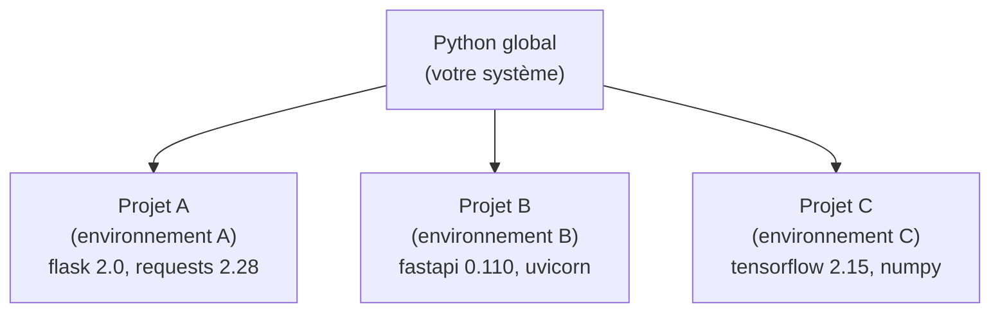
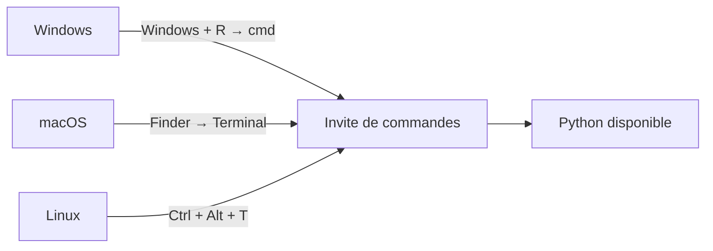
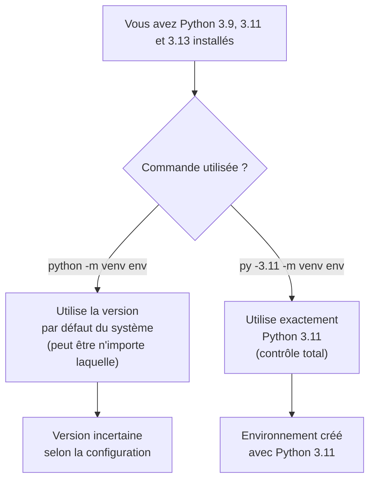
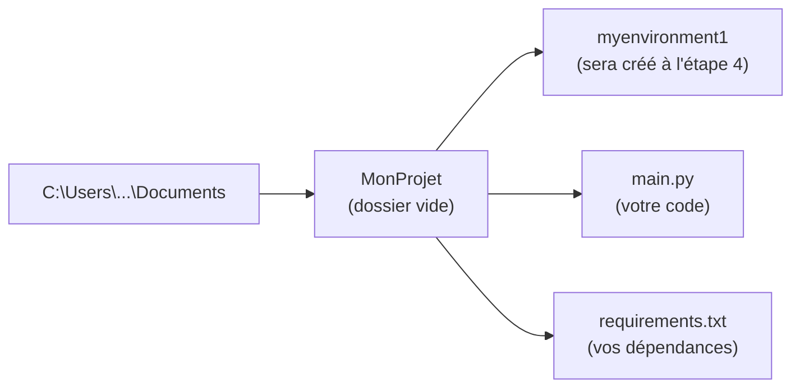
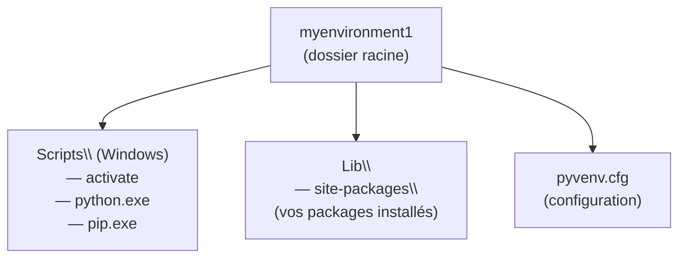
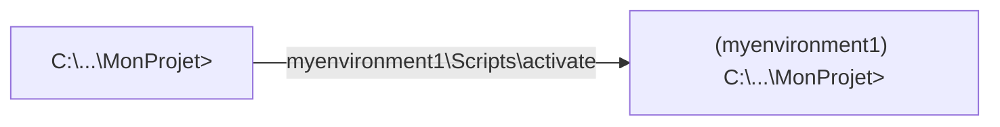
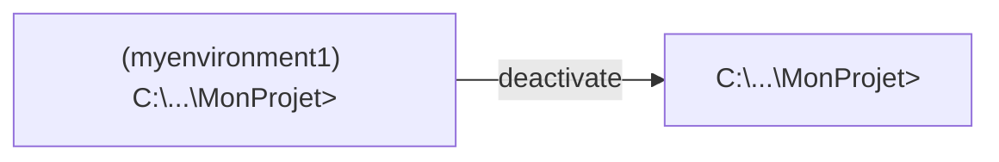
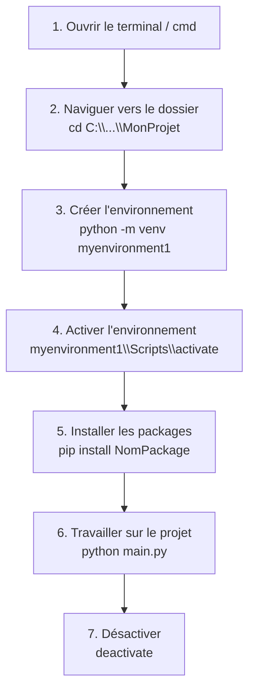

<a id="top"></a>

# Pratique 0 — Créer un environnement virtuel Python

## Table des matières

| #  | Section                                                                                      |
| -- | -------------------------------------------------------------------------------------------- |
| 1  | [Introduction — Qu'est-ce qu'un environnement virtuel ?](#section-1)                        |
| 2  | [Étape 1 — Ouvrir l'invite de commandes](#section-2)                                        |
| 3  | [Étape 2 — Vérifier Python et pip](#section-3)                                              |
| 3a | &nbsp;&nbsp;&nbsp;↳ [Vérifier Python](#section-3)                                           |
| 3b | &nbsp;&nbsp;&nbsp;↳ [Vérifier pip](#section-3)                                              |
| 3c | &nbsp;&nbsp;&nbsp;↳ [Utiliser py -3.11 sur Windows (Python Launcher)](#section-3)          |
| 4  | [Étape 3 — Accéder ou créer un dossier projet](#section-4)                                  |
| 5  | [Étape 4 — Créer l'environnement virtuel](#section-5)                                       |
| 6  | [Étape 5 — Activer l'environnement virtuel](#section-6)                                     |
| 7  | [Étape 6 — Installer des packages](#section-7)                                              |
| 8  | [Étape 7 — Désactiver l'environnement virtuel](#section-8)                                  |
| 9  | [Étape 8 — Supprimer un environnement (optionnel)](#section-9)                              |
| 10 | [Récapitulatif des commandes](#section-10)                                                   |
| 11 | [Pratique guidée](#section-11)                                                               |
| 12 | [Conclusion](#section-12)                                                                    |

---

<a id="section-1"></a>

<details>
<summary><strong>1 — Introduction — Qu'est-ce qu'un environnement virtuel ?</strong></summary>

<br/>

Un **environnement virtuel Python** est un espace isolé qui permet d'installer des packages spécifiques à un projet, sans affecter l'installation Python globale de votre système.



**Pourquoi utiliser un environnement virtuel ?**

| Problème sans venv | Solution avec venv |
|--------------------|--------------------|
| Conflits de versions entre projets | Chaque projet a ses propres packages |
| Mise à jour qui casse un autre projet | Les environnements sont indépendants |
| Difficile de partager les dépendances | `pip freeze > requirements.txt` |
| Installation globale polluée | Environnement propre et supprimable |

</details>

<p align="right"><a href="#top">↑ Retour en haut</a></p>

---

<a id="section-2"></a>

<details>
<summary><strong>2 — Étape 1 — Ouvrir l'invite de commandes</strong></summary>

<br/>

### Windows

- Appuyez sur `Windows + R`, tapez `cmd`, puis appuyez sur **Entrée**.
- Ou tapez **"Invite de commandes"** dans la barre de recherche Windows.

### macOS / Linux

- Ouvrez le **Terminal** depuis les applications ou avec `Ctrl + Alt + T` (Linux).



</details>

<p align="right"><a href="#top">↑ Retour en haut</a></p>

---

<a id="section-3"></a>

<details>
<summary><strong>3 — Étape 2 — Vérifier Python et pip</strong></summary>

<br/>

### Vérifier Python

Tapez l'une de ces commandes selon votre installation :

```cmd
python --version
python3 --version
python3.9 --version
python3.11 --version
python3.12 --version
python3.13 --version
```

**Résultat attendu :**

```plaintext
Python 3.11.5
```

> Si aucune commande ne fonctionne, téléchargez Python depuis [python.org](https://www.python.org) et cochez **"Add Python to PATH"** lors de l'installation.

---

### Vérifier pip

```cmd
pip --version
python -m pip --version
python3 -m pip --version
```

**Résultat attendu :**

```plaintext
pip 24.0 from C:\...\pip (python 3.11)
```

| Commande | Quand l'utiliser |
|----------|-----------------|
| `python --version` | Installation standard Windows |
| `python3 --version` | macOS / Linux |
| `python3.11 --version` | Plusieurs versions installées |

---

### Le Python Launcher Windows — commande `py`

Windows installe automatiquement le **Python Launcher** (`py.exe`) lorsque vous installez Python depuis [python.org](https://www.python.org). Cet outil permet de choisir précisément la version de Python à utiliser, même si plusieurs versions coexistent sur votre machine.

#### Vérifier les versions installées

```cmd
py --list
```

**Exemple de résultat :**

```plaintext
 -V:3.13 *        Python 3.13 (64-bit)
 -V:3.11          Python 3.11 (64-bit)
 -V:3.9           Python 3.9 (64-bit)
```

#### Choisir une version spécifique

```cmd
py -3.11 --version
py -3.12 --version
py -3.9  --version
```

#### Créer un environnement virtuel avec une version précise

```cmd
py -3.11 -m venv myenvironment1
py -3.12 -m venv myenvironment1
py -3.9  -m venv myenvironment1
```

#### Pourquoi utiliser `py -3.11` plutôt que `python` ?



> **Bonne pratique :** Utilisez toujours `py -3.11 -m venv nomenv` si vous avez plusieurs versions de Python sur Windows. Cela garantit que votre environnement utilise exactement la version souhaitée.

#### Flux complet avec `py -3.11`

```cmd
py -3.11 --version
```
```plaintext
Python 3.11.9
```

```cmd
cd C:\Users\VotreNom\Documents\MonProjet
py -3.11 -m venv myenvironment1
myenvironment1\Scripts\activate
python --version
```
```plaintext
(myenvironment1) C:\...\MonProjet> python --version
Python 3.11.9
```

```cmd
pip install fastapi uvicorn
pip list
deactivate
```

| Commande | Rôle |
|----------|------|
| `py --list` | Afficher toutes les versions Python installées |
| `py -3.11 --version` | Vérifier la version 3.11 |
| `py -3.11 -m venv env` | Créer un venv avec Python 3.11 |
| `py -3.12 -m venv env` | Créer un venv avec Python 3.12 |
| `py -3.9 -m venv env` | Créer un venv avec Python 3.9 |

</details>

<p align="right"><a href="#top">↑ Retour en haut</a></p>

---

<a id="section-4"></a>

<details>
<summary><strong>4 — Étape 3 — Accéder ou créer un dossier projet</strong></summary>

<br/>

Naviguez vers le dossier où vous voulez créer votre projet, puis créez un dossier dédié :

```cmd
cd C:\Users\VotreNom\Documents
mkdir MonProjet
cd MonProjet
```

**Vérifier le contenu du dossier :**

```cmd
dir
```



</details>

<p align="right"><a href="#top">↑ Retour en haut</a></p>

---

<a id="section-5"></a>

<details>
<summary><strong>5 — Étape 4 — Créer l'environnement virtuel</strong></summary>

<br/>

```cmd
python -m venv myenvironment1
```

Si `python` ne fonctionne pas, essayez :

```cmd
python3 -m venv myenvironment1
python3.9 -m venv myenvironment1
python3.11 -m venv myenvironment1
python3.12 -m venv myenvironment1
python3.13 -m venv myenvironment1
```

**Résultat attendu :** un dossier `myenvironment1` est créé dans votre projet.

Vérifiez avec :

```cmd
dir
```

```plaintext
Répertoire de C:\Users\VotreNom\Documents\MonProjet

myenvironment1\
```

---

### Structure interne de l'environnement virtuel



</details>

<p align="right"><a href="#top">↑ Retour en haut</a></p>

---

<a id="section-6"></a>

<details>
<summary><strong>6 — Étape 5 — Activer l'environnement virtuel</strong></summary>

<br/>

### Windows

```cmd
myenvironment1\Scripts\activate
```

### macOS / Linux

```bash
source myenvironment1/bin/activate
```

**Résultat attendu :** le préfixe `(myenvironment1)` apparaît dans l'invite de commandes :

```plaintext
(myenvironment1) C:\Users\VotreNom\Documents\MonProjet>
```



> Tant que ce préfixe est visible, vous travaillez dans l'environnement isolé. Toutes les installations `pip` n'affecteront que cet environnement.

</details>

<p align="right"><a href="#top">↑ Retour en haut</a></p>

---

<a id="section-7"></a>

<details>
<summary><strong>7 — Étape 6 — Installer des packages</strong></summary>

<br/>

Une fois l'environnement activé, installez vos packages normalement avec `pip` :

```cmd
pip install requests
pip install fastapi uvicorn
pip install flask
pip install numpy pandas matplotlib
```

**Vérifier les packages installés :**

```cmd
pip list
```

**Exemple de résultat :**

```plaintext
Package    Version
---------  -------
pip        24.0
requests   2.31.0
setuptools 69.0.0
```

---

### Sauvegarder les dépendances

Pour partager votre projet, exportez la liste des packages :

```cmd
pip freeze > requirements.txt
```

Pour réinstaller tous les packages depuis ce fichier :

```cmd
pip install -r requirements.txt
```

| Commande | Rôle |
|----------|------|
| `pip install NomPackage` | Installer un package |
| `pip list` | Lister les packages installés |
| `pip freeze > requirements.txt` | Exporter les dépendances |
| `pip install -r requirements.txt` | Réinstaller depuis un fichier |
| `pip uninstall NomPackage` | Désinstaller un package |

</details>

<p align="right"><a href="#top">↑ Retour en haut</a></p>

---

<a id="section-8"></a>

<details>
<summary><strong>8 — Étape 7 — Désactiver l'environnement virtuel</strong></summary>

<br/>

Une fois votre travail terminé, désactivez l'environnement :

```cmd
deactivate
```

Le préfixe `(myenvironment1)` disparaît. Vous êtes de retour dans l'environnement Python global.



Pour réactiver l'environnement plus tard :

```cmd
myenvironment1\Scripts\activate
```

</details>

<p align="right"><a href="#top">↑ Retour en haut</a></p>

---

<a id="section-9"></a>

<details>
<summary><strong>9 — Étape 8 — Supprimer un environnement (optionnel)</strong></summary>

<br/>

Pour supprimer complètement un environnement virtuel, supprimez son dossier :

### Windows

```cmd
rmdir /s /q myenvironment1
```

### macOS / Linux

```bash
rm -rf myenvironment1
```

| Option | Signification |
|--------|--------------|
| `/s` | Supprime tous les sous-dossiers |
| `/q` | Supprime sans demander confirmation |

> Un environnement virtuel n'est qu'un dossier. Le supprimer est sans risque pour votre projet ou votre système.

</details>

<p align="right"><a href="#top">↑ Retour en haut</a></p>

---

<a id="section-10"></a>

<details>
<summary><strong>10 — Récapitulatif des commandes</strong></summary>

<br/>



---

| Action | Commande (Windows) |
|--------|--------------------|
| Vérifier Python | `python --version` |
| Vérifier pip | `pip --version` |
| Créer un dossier | `mkdir MonProjet` |
| Entrer dans un dossier | `cd MonProjet` |
| Créer l'environnement | `python -m venv myenvironment1` |
| Activer l'environnement | `myenvironment1\Scripts\activate` |
| Installer un package | `pip install NomPackage` |
| Lister les packages | `pip list` |
| Exporter les dépendances | `pip freeze > requirements.txt` |
| Désactiver l'environnement | `deactivate` |
| Supprimer l'environnement | `rmdir /s /q myenvironment1` |

</details>

<p align="right"><a href="#top">↑ Retour en haut</a></p>

---

<a id="section-11"></a>

<details>
<summary><strong>11 — Pratique guidée</strong></summary>

<br/>

Suivez ces étapes pour créer votre premier environnement virtuel de A à Z.

---

### Étape 1 — Créer le dossier projet

```cmd
cd C:\Users\VotreNom\Documents
mkdir MonExercice
cd MonExercice
```

---

### Étape 2 — Créer et activer l'environnement virtuel

```cmd
python -m venv myenvironment1
myenvironment1\Scripts\activate
```

Vérifiez que le préfixe `(myenvironment1)` est visible.

---

### Étape 3 — Installer et vérifier un package

```cmd
pip install flask
pip list
```

**Résultat attendu :**

```plaintext
Package    Version
---------  -------
blinker    1.7.0
click      8.1.7
flask      3.0.2
...
```

---

### Étape 4 — Exporter les dépendances

```cmd
pip freeze > requirements.txt
```

Vérifiez le fichier créé :

```cmd
type requirements.txt
```

---

### Étape 5 — Désactiver l'environnement

```cmd
deactivate
```

---

> **Vérification :** Si le préfixe `(myenvironment1)` n'apparaît pas après l'activation, exécutez `pip list` pour confirmer que l'environnement est bien actif. Utilisez `dir` pour vérifier les fichiers et dossiers présents.

</details>

<p align="right"><a href="#top">↑ Retour en haut</a></p>

---

<a id="section-12"></a>

<details>
<summary><strong>12 — Conclusion</strong></summary>

<br/>

Ce tutoriel vous a montré comment :

- Vérifier que Python et pip sont installés
- Créer un dossier de projet propre
- Créer un environnement virtuel avec `venv`
- Activer et désactiver l'environnement
- Installer des packages de manière isolée
- Exporter les dépendances avec `pip freeze`
- Supprimer un environnement si nécessaire

Avec ces bases, chaque projet Python que vous créerez sera **propre, isolé et reproductible**.

> **Prochaine étape :** consultez le document [01 — FastAPI Calculator API](./01-FastAPI-Calculator-API-with-Swagger-UI.md) pour créer votre première API avec FastAPI dans cet environnement.

</details>

<p align="right"><a href="#top">↑ Retour en haut</a></p>
