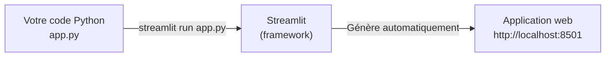
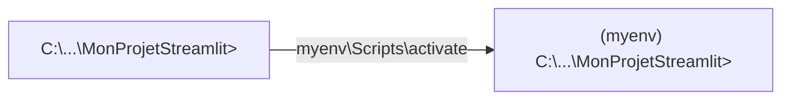
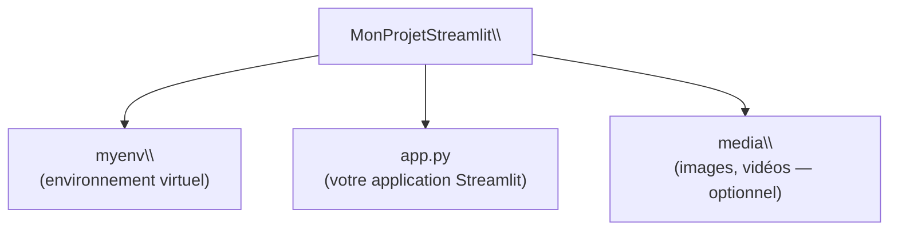
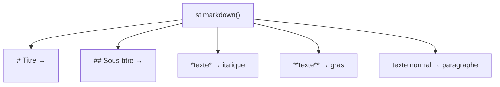

<a id="top"></a>

# Pratique — Apprendre Streamlit avec un environnement virtuel

## Table des matières

| #  | Section                                                                                           |
| -- | ------------------------------------------------------------------------------------------------- |
| 1  | [Introduction — Qu'est-ce que Streamlit ?](#section-1)                                           |
| 2  | [Pré-requis](#section-2)                                                                          |
| 3  | [Étape 1 — Créer et activer l'environnement virtuel](#section-3)                                 |
| 3a | &nbsp;&nbsp;&nbsp;↳ [Créer le venv](#section-3)                                                  |
| 3b | &nbsp;&nbsp;&nbsp;↳ [Activer le venv](#section-3)                                                |
| 3c | &nbsp;&nbsp;&nbsp;↳ [Troubleshooting PowerShell (Windows)](#section-3)                           |
| 4  | [Étape 2 — Installer Streamlit](#section-4)                                                      |
| 5  | [Étape 3 — Créer le fichier app.py](#section-5)                                                  |
| 6  | [Étape 4 — Afficher du texte](#section-6)                                                        |
| 6a | &nbsp;&nbsp;&nbsp;↳ [Texte simple — st.write](#section-6)                                        |
| 6b | &nbsp;&nbsp;&nbsp;↳ [Formater le texte — header, subheader, caption](#section-6)                 |
| 6c | &nbsp;&nbsp;&nbsp;↳ [Markdown — titres, gras, italique](#section-6)                              |
| 7  | [Étape 5 — Messages de statut](#section-7)                                                       |
| 8  | [Étape 6 — Afficher des médias](#section-8)                                                      |
| 8a | &nbsp;&nbsp;&nbsp;↳ [Images](#section-8)                                                         |
| 8b | &nbsp;&nbsp;&nbsp;↳ [Vidéos](#section-8)                                                         |
| 9  | [Code complet — app.py](#section-9)                                                               |
| 10 | [Étape 7 — Évaluation formative](#section-10)                                                    |
| 10a| &nbsp;&nbsp;&nbsp;↳ [Exercices à réaliser](#section-10)                                          |
| 10b| &nbsp;&nbsp;&nbsp;↳ [Exemple de solution complète](#section-10)                                  |
| 10c| &nbsp;&nbsp;&nbsp;↳ [Exercice final — Ajouter un champ password](#section-10)                   |
| 11 | [Conclusion](#section-11)                                                                         |

---

<a id="section-1"></a>

<details>
<summary><strong>1 — Introduction — Qu'est-ce que Streamlit ?</strong></summary>

<br/>

**Streamlit** est une bibliothèque Python open source qui permet de créer des applications web interactives en quelques lignes de code, sans HTML, CSS ni JavaScript.



**Ce que vous pouvez faire avec Streamlit :**

| Fonctionnalité | Commande |
|---------------|----------|
| Afficher du texte | `st.write()`, `st.text()`, `st.markdown()` |
| Titres et sous-titres | `st.header()`, `st.subheader()`, `st.caption()` |
| Messages de statut | `st.success()`, `st.warning()`, `st.error()` |
| Images | `st.image()` |
| Vidéos | `st.video()` |
| Formulaires | `st.form()`, `st.text_input()`, `st.button()` |
| Barres latérales | `st.sidebar.*` |
| Graphiques | `st.line_chart()`, `st.bar_chart()` |

> Dans ce tutoriel, vous apprendrez à utiliser Streamlit **étape par étape**, en testant le résultat après chaque ajout de code.

</details>

<p align="right"><a href="#top">↑ Retour en haut</a></p>

---

<a id="section-2"></a>

<details>
<summary><strong>2 — Pré-requis</strong></summary>

<br/>

Avant de commencer, vérifiez que vous avez :

- **Python** installé sur votre machine ([python.org](https://www.python.org))
- **pip** disponible dans le terminal

**Vérifier Python :**

```cmd
python --version
py --list
```

**Vérifier pip :**

```cmd
pip --version
```

| Outil | Version recommandée | Lien |
|-------|--------------------|----|
| Python | 3.9 ou supérieur | [python.org](https://www.python.org) |
| pip | inclus avec Python | — |
| Streamlit | dernière version | installé à l'étape 2 |

</details>

<p align="right"><a href="#top">↑ Retour en haut</a></p>

---

<a id="section-3"></a>

<details>
<summary><strong>3 — Étape 1 — Créer et activer l'environnement virtuel</strong></summary>

<br/>

### Créer le dossier projet

```cmd
cd C:\Users\VotreNom\Documents
mkdir MonProjetStreamlit
cd MonProjetStreamlit
```

---

### Créer le venv

**Méthode recommandée sur Windows (Python Launcher) :**

```cmd
py -3.11 -m venv myenv
```

**Méthodes alternatives :**

```cmd
python -m venv myenv
python3.9  -m venv myenv39
python3.10 -m venv myenv310
python3.11 -m venv myenv311
python3.12 -m venv myenv312
```

---

### Activer le venv

**Windows :**

```cmd
myenv\Scripts\activate
```

**macOS / Linux :**

```bash
source myenv/bin/activate
```

**Résultat attendu :**

```plaintext
(myenv) C:\Users\VotreNom\Documents\MonProjetStreamlit>
```



---

### Troubleshooting PowerShell — Restriction d'exécution (Windows)

Il est possible que Windows bloque l'activation du venv pour la première fois avec PowerShell. Vous verrez un message du type :

```plaintext
myenv\Scripts\activate : impossible de charger le fichier...
l'exécution de scripts est désactivée sur ce système.
```

**Solution — Ouvrez PowerShell en mode Administrateur et exécutez :**

```powershell
Set-ExecutionPolicy Unrestricted
```

ou, plus sécurisé (recommandé) :

```powershell
Set-ExecutionPolicy -ExecutionPolicy RemoteSigned -Scope CurrentUser
```

| Option | Signification |
|--------|--------------|
| `Unrestricted` | Autorise tous les scripts (moins sécurisé) |
| `RemoteSigned` | Autorise les scripts locaux, bloque les scripts distants non signés |
| `-Scope CurrentUser` | Applique uniquement à votre profil utilisateur |

> Après avoir changé la politique, fermez PowerShell, rouvrez-le et réessayez `myenv\Scripts\activate`.

</details>

<p align="right"><a href="#top">↑ Retour en haut</a></p>

---

<a id="section-4"></a>

<details>
<summary><strong>4 — Étape 2 — Installer Streamlit</strong></summary>

<br/>

Avec l'environnement virtuel **activé**, installez Streamlit :

```cmd
pip install streamlit
```

**Vérifier l'installation :**

```cmd
streamlit --version
pip list
```

**Résultat attendu :**

```plaintext
Streamlit, version 1.32.0
```

**Tester que Streamlit fonctionne :**

```cmd
streamlit hello
```

Cela ouvre une page de démonstration dans le navigateur à `http://localhost:8501`.

</details>

<p align="right"><a href="#top">↑ Retour en haut</a></p>

---

<a id="section-5"></a>

<details>
<summary><strong>5 — Étape 3 — Créer le fichier app.py</strong></summary>

<br/>

Dans votre dossier projet, créez un fichier vide nommé `app.py`.



**Pour lancer votre application à tout moment :**

```cmd
streamlit run app.py
```

> Streamlit recharge automatiquement la page dès que vous enregistrez le fichier `app.py`. Pas besoin de redémarrer le serveur.

</details>

<p align="right"><a href="#top">↑ Retour en haut</a></p>

---

<a id="section-6"></a>

<details>
<summary><strong>6 — Étape 4 — Afficher du texte</strong></summary>

<br/>

### Texte simple — st.write

Ouvrez `app.py` et écrivez :

```python
import streamlit as st

st.write("Hello World")
```

Lancez et testez :

```cmd
streamlit run app.py
```

**Résultat :** La page affiche `Hello World`.

---

### Formater le texte — header, subheader, caption, text

Ajoutez ces lignes à `app.py` :

```python
st.header("This is Header")
st.subheader("This is subheader")
st.caption('This is caption')
st.text('This is plain text')
```

Enregistrez — Streamlit recharge automatiquement.

| Commande | Rendu |
|----------|-------|
| `st.header()` | Titre H2 — grand et visible |
| `st.subheader()` | Titre H3 — sous-titre |
| `st.caption()` | Texte gris, petit — pour les annotations |
| `st.text()` | Texte brut, police fixe |
| `st.write()` | Polyvalent — texte, dataframes, graphiques |

---

### Markdown — titres, gras, italique

```python
st.markdown("""
# This is title
## This is header
### subheader - 1
#### subheader - 2

simple plain text

for *italic* use one asterisk
for **bold** format use two asterisks
""")
```

Enregistrez et observez le résultat.



</details>

<p align="right"><a href="#top">↑ Retour en haut</a></p>

---

<a id="section-7"></a>

<details>
<summary><strong>7 — Étape 5 — Messages de statut</strong></summary>

<br/>

Ajoutez ces lignes à `app.py` :

```python
st.success("this message display text in green background")
st.warning("this message display text in yellow background")
st.error("this message display text in red background")
```

Enregistrez et observez.

| Commande | Couleur | Utilisation typique |
|----------|---------|---------------------|
| `st.success()` | Vert | Opération réussie |
| `st.warning()` | Jaune | Avertissement, attention |
| `st.error()` | Rouge | Erreur, problème critique |
| `st.info()` | Bleu | Information générale |

</details>

<p align="right"><a href="#top">↑ Retour en haut</a></p>

---

<a id="section-8"></a>

<details>
<summary><strong>8 — Étape 6 — Afficher des médias</strong></summary>

<br/>

### Images

Créez un dossier `media` dans votre projet et ajoutez-y une image (ex. `mountains.webp`).

```cmd
mkdir media
```

Ajoutez ce code dans `app.py` :

```python
st.subheader("Display Image")

st.image('./media/mountains.webp',
         caption='mountains',
         width=300)
```

Vous pouvez aussi utiliser une URL directement :

```python
st.image('https://upload.wikimedia.org/wikipedia/commons/thumb/1/1a/24701-nature-natural-beauty.jpg/1200px-24701-nature-natural-beauty.jpg',
         caption='Nature',
         width=400)
```

---

### Vidéos

Ajoutez une vidéo `star.mp4` dans le dossier `media`, puis :

```python
st.subheader('Display Video')
video_file = open('./media/star.mp4', mode='rb').read()
st.video(video_file)
```

Vous pouvez aussi utiliser un lien YouTube :

```python
st.video('https://www.youtube.com/watch?v=dQw4w9WgXcQ')
```

| Commande | Format accepté |
|----------|---------------|
| `st.image()` | `.jpg`, `.png`, `.webp`, `.gif`, URL |
| `st.video()` | `.mp4`, `.webm`, lien YouTube |
| `st.audio()` | `.mp3`, `.wav`, `.ogg` |

</details>

<p align="right"><a href="#top">↑ Retour en haut</a></p>

---

<a id="section-9"></a>

<details>
<summary><strong>9 — Code complet — app.py</strong></summary>

<br/>

Voici le fichier `app.py` complet avec toutes les fonctionnalités vues jusqu'ici :

```python
import streamlit as st

# --- Texte simple ---
st.write("Hello World")

# --- Formater du texte ---
st.header("This is Header")
st.subheader("This is subheader")
st.caption('This is caption')
st.text('This is plain text')

# --- Markdown ---
st.markdown("""
# This is title
## This is header
### subheader - 1
#### subheader - 2

simple plain text

for *italic* use asterisk
for **bold** format use two asterisks
""")

# --- Messages de statut ---
st.success("this message display text in green background")
st.warning("this message display text in yellow background")
st.error("this message display text in red background")

# --- Images ---
st.subheader("Display Image")
st.image('./media/mountains.webp', caption='mountains', width=300)

# --- Vidéos ---
st.subheader('Display Video')
video_file = open('./media/star.mp4', mode='rb').read()
st.video(video_file)
```

**Lancer l'application :**

```cmd
streamlit run app.py
```

**Ouvrir dans le navigateur :**

```
http://localhost:8501
```

</details>

<p align="right"><a href="#top">↑ Retour en haut</a></p>

---

<a id="section-10"></a>

<details>
<summary><strong>10 — Étape 7 — Évaluation formative</strong></summary>

<br/>

### Instructions

1. Créez un **nouvel environnement virtuel** et activez-le.
2. Installez Streamlit dans cet environnement.
3. Créez un fichier `app.py` et implémentez les fonctionnalités suivantes **une par une**, en testant à chaque étape.
4. Soumettez le fichier `app.py` final et une **capture d'écran** de chaque étape testée.

---

### Exercices à réaliser

**1 — Affichage de texte**

- Affichez `Hello Streamlit` avec `st.write`.
- Ajoutez un header, un subheader, une caption et un texte simple.

**2 — Markdown**

- Utilisez `st.markdown` pour afficher un titre, un sous-titre, du texte en italique et en gras.

**3 — Messages de statut**

- Affichez des messages de succès, d'avertissement et d'erreur.

**4 — Médias**

- Affichez une image et une vidéo de votre choix (fichiers locaux ou URL).

**5 — Fonctionnalités avancées (optionnel)**

- Ajoutez une barre latérale avec un titre.
- Utilisez un formulaire pour obtenir une entrée utilisateur (prénom).

---

### Exemple de solution complète

```python
import streamlit as st

# --- Texte simple ---
st.write("Hello Streamlit")

# --- Formater du texte ---
st.header("This is a Header")
st.subheader("This is a Subheader")
st.caption("This is a caption")
st.text("This is plain text")

# --- Markdown ---
st.markdown("""
# This is a Title
## This is a Subtitle
This is *italic* text and this is **bold** text.
""")

# --- Messages de statut ---
st.success("This is a success message")
st.warning("This is a warning message")
st.error("This is an error message")

# --- Images ---
st.subheader("Display Image")
st.image('https://upload.wikimedia.org/wikipedia/commons/thumb/1/1a/24701-nature-natural-beauty.jpg/1200px-24701-nature-natural-beauty.jpg',
         caption='Sample Image', width=300)

# --- Vidéos ---
st.subheader("Display Video")
video_file = open('./media/star.mp4', 'rb').read()
st.video(video_file)

# --- Barre latérale et formulaire (optionnel) ---
st.sidebar.title("Sidebar Title")

with st.sidebar.form(key='my_form'):
    name = st.text_input('Enter your name')
    submit_button = st.form_submit_button(label='Submit')
    if submit_button:
        st.write(f'Hello {name}')
```

---

### Exercice final — Ajouter un champ password

Modifiez le formulaire de la barre latérale pour ajouter un champ **mot de passe** :

```python
st.sidebar.title("Sidebar Title")

with st.sidebar.form(key='my_form'):
    name = st.text_input('Enter your name')
    password = st.text_input('Enter your password', type='password')
    submit_button = st.form_submit_button(label='Submit')
    if submit_button:
        if name and password:
            st.success(f'Bienvenue, {name} ! Connexion réussie.')
        else:
            st.error('Veuillez remplir tous les champs.')
```

> Le paramètre `type='password'` masque automatiquement les caractères saisis.

| Champ | Commande | Option clé |
|-------|----------|-----------|
| Texte | `st.text_input('label')` | — |
| Mot de passe | `st.text_input('label', type='password')` | `type='password'` |
| Bouton de soumission | `st.form_submit_button('label')` | — |

</details>

<p align="right"><a href="#top">↑ Retour en haut</a></p>

---

<a id="section-11"></a>

<details>
<summary><strong>11 — Conclusion</strong></summary>

<br/>

Ce tutoriel vous a montré comment :

- Créer un environnement virtuel Python isolé
- Résoudre les restrictions PowerShell sur Windows
- Installer Streamlit dans un environnement propre
- Afficher du texte, des titres et du contenu Markdown
- Afficher des messages de statut (succès, avertissement, erreur)
- Afficher des images et des vidéos
- Créer un formulaire avec champ texte et mot de passe

Avec ces bases, vous êtes prêt à construire des **applications web interactives** en Python, sans aucune connaissance en HTML ou CSS.

> **Prochaine étape :** consultez le document [24 — Environnement virtuel avec FastAPI et Streamlit](./24-Venv-FastAPI-Streamlit.md) pour connecter Streamlit à une API FastAPI et créer une véritable architecture backend + frontend.

</details>

<p align="right"><a href="#top">↑ Retour en haut</a></p>
