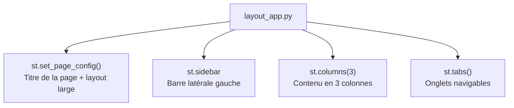
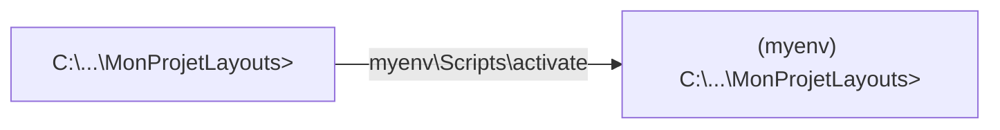
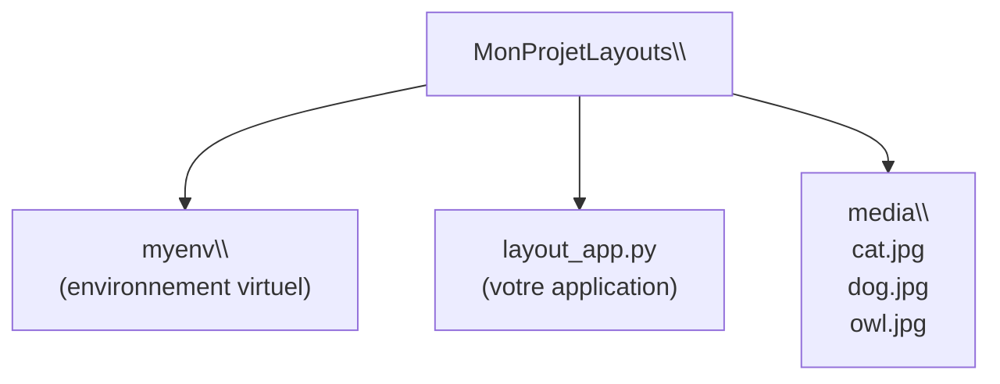
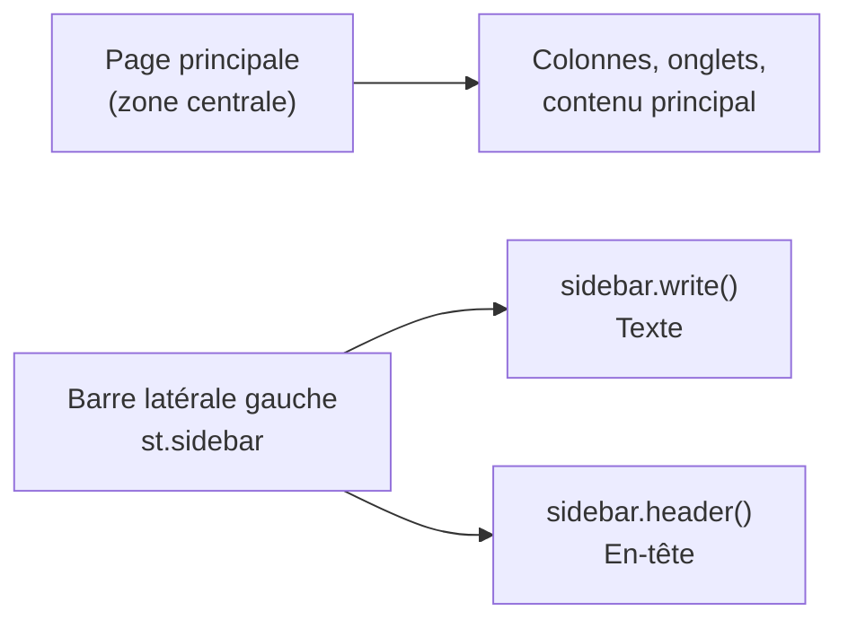
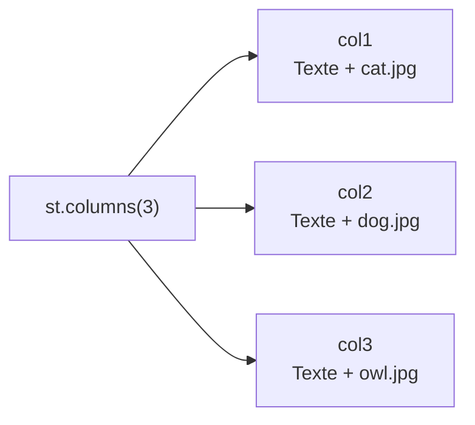
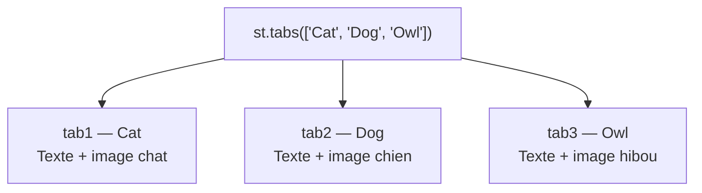

<a id="top"></a>

# Pratique — Layouts Streamlit : Sidebar, Colonnes et Onglets

## Table des matières

| #  | Section                                                                                           |
| -- | ------------------------------------------------------------------------------------------------- |
| 1  | [Introduction — Les layouts dans Streamlit](#section-1)                                          |
| 2  | [Pré-requis](#section-2)                                                                          |
| 3  | [Étape 1 — Créer et activer l'environnement virtuel](#section-3)                                 |
| 4  | [Étape 2 — Installer Streamlit](#section-4)                                                      |
| 5  | [Étape 3 — Créer le fichier layout_app.py](#section-5)                                           |
| 6  | [Étape 4 — Configurer la page](#section-6)                                                       |
| 7  | [Étape 5 — Ajouter une barre latérale (Sidebar)](#section-7)                                    |
| 8  | [Étape 6 — Utiliser les colonnes](#section-8)                                                    |
| 9  | [Étape 7 — Ajouter des onglets (Tabs)](#section-9)                                               |
| 10 | [Code complet — layout_app.py](#section-10)                                                       |
| 11 | [Évaluation formative](#section-11)                                                               |
| 11a| &nbsp;&nbsp;&nbsp;↳ [Exercices à réaliser](#section-11)                                          |
| 11b| &nbsp;&nbsp;&nbsp;↳ [Exemple de solution complète](#section-11)                                  |
| 11c| &nbsp;&nbsp;&nbsp;↳ [Exercice final — Ajouter des emojis](#section-11)                          |
| 12 | [Conclusion](#section-12)                                                                         |

---

<a id="section-1"></a>

<details>
<summary><strong>1 — Introduction — Les layouts dans Streamlit</strong></summary>

<br/>

Streamlit propose plusieurs outils pour **organiser visuellement** votre application : barres latérales, colonnes côte à côte, et onglets navigables.



**Les 3 outils de mise en page principaux :**

| Outil | Commande | Utilisation |
|-------|----------|-------------|
| **Sidebar** | `st.sidebar` | Menu latéral, filtres, navigation |
| **Colonnes** | `st.columns(n)` | Contenu côte à côte |
| **Onglets** | `st.tabs([...])` | Sections séparées par onglets |
| **Configuration** | `st.set_page_config()` | Titre du navigateur, largeur de la page |

</details>

<p align="right"><a href="#top">↑ Retour en haut</a></p>

---

<a id="section-2"></a>

<details>
<summary><strong>2 — Pré-requis</strong></summary>

<br/>

- **Python** installé sur votre machine ([python.org](https://www.python.org))
- **pip** disponible dans le terminal

**Vérifier Python :**

```cmd
python --version
py --list
```

**Préparer les images :**

Créez un dossier `media` dans votre projet et ajoutez-y trois images :

```plaintext
media/
  cat.jpg
  dog.jpg
  owl.jpg
```

> Vous pouvez utiliser n'importe quelle image `.jpg` ou `.png` renommée en `cat.jpg`, `dog.jpg`, `owl.jpg`. Ou utiliser des URL directement dans le code (voir étape 6).

</details>

<p align="right"><a href="#top">↑ Retour en haut</a></p>

---

<a id="section-3"></a>

<details>
<summary><strong>3 — Étape 1 — Créer et activer l'environnement virtuel</strong></summary>

<br/>

### Créer le dossier projet

```cmd
cd C:\Users\VotreNom\Documents
mkdir MonProjetLayouts
cd MonProjetLayouts
mkdir media
```

---

### Créer le venv

**Méthode recommandée sur Windows :**

```cmd
py -3.11 -m venv myenv
```

**Méthodes alternatives :**

```cmd
python -m venv myenv
python3.9  -m venv myenv
python3.12 -m venv myenv
```

---

### Activer le venv

**Windows :**

```cmd
myenv\Scripts\activate
```

**macOS / Linux :**

```bash
source myenv/bin/activate
```

**Résultat attendu :**

```plaintext
(myenv) C:\Users\VotreNom\Documents\MonProjetLayouts>
```



> Si PowerShell bloque l'activation, exécutez en mode administrateur :
> ```powershell
> Set-ExecutionPolicy -ExecutionPolicy RemoteSigned -Scope CurrentUser
> ```

</details>

<p align="right"><a href="#top">↑ Retour en haut</a></p>

---

<a id="section-4"></a>

<details>
<summary><strong>4 — Étape 2 — Installer Streamlit</strong></summary>

<br/>

Avec l'environnement virtuel **activé** :

```cmd
pip install streamlit
```

**Vérifier l'installation :**

```cmd
streamlit --version
```

**Résultat attendu :**

```plaintext
Streamlit, version 1.32.0
```

</details>

<p align="right"><a href="#top">↑ Retour en haut</a></p>

---

<a id="section-5"></a>

<details>
<summary><strong>5 — Étape 3 — Créer le fichier layout_app.py</strong></summary>

<br/>

Créez un fichier `layout_app.py` dans votre dossier projet.

**Structure du projet :**



**Pour lancer l'application à tout moment :**

```cmd
streamlit run layout_app.py
```

> Streamlit recharge automatiquement la page à chaque fois que vous enregistrez le fichier.

</details>

<p align="right"><a href="#top">↑ Retour en haut</a></p>

---

<a id="section-6"></a>

<details>
<summary><strong>6 — Étape 4 — Configurer la page</strong></summary>

<br/>

Ouvrez `layout_app.py` et écrivez :

```python
import streamlit as st

st.set_page_config(page_title="Layouts", layout='wide')
st.title('Streamlit Layout')
```

**Lancez et testez :**

```cmd
streamlit run layout_app.py
```

**Résultat attendu :** Une page large s'ouvre dans le navigateur avec le titre `Streamlit Layout`.

---

| Paramètre | Valeur | Effet |
|-----------|--------|-------|
| `page_title` | `"Layouts"` | Titre affiché dans l'onglet du navigateur |
| `layout` | `'wide'` | Utilise toute la largeur de l'écran |
| `layout` | `'centered'` | Contenu centré (valeur par défaut) |

> `st.set_page_config()` doit toujours être la **première commande Streamlit** dans votre fichier.

</details>

<p align="right"><a href="#top">↑ Retour en haut</a></p>

---

<a id="section-7"></a>

<details>
<summary><strong>7 — Étape 5 — Ajouter une barre latérale (Sidebar)</strong></summary>

<br/>

Ajoutez ces lignes à `layout_app.py` :

```python
# sidebar
sidebar = st.sidebar
sidebar.write('This is my sidebar')
sidebar.header('Header in sidebar')
```

Enregistrez — Streamlit recharge automatiquement.



**Autres éléments que vous pouvez ajouter dans la sidebar :**

```python
sidebar.selectbox('Choisir une option', ['Option 1', 'Option 2', 'Option 3'])
sidebar.slider('Valeur', 0, 100, 50)
sidebar.button('Valider')
sidebar.text_input('Rechercher...')
```

</details>

<p align="right"><a href="#top">↑ Retour en haut</a></p>

---

<a id="section-8"></a>

<details>
<summary><strong>8 — Étape 6 — Utiliser les colonnes</strong></summary>

<br/>

Ajoutez ce bloc à `layout_app.py` :

```python
# columns
col1, col2, col3 = st.columns(3)

with col1:
    st.write('This is column - 1')
    st.image('./media/cat.jpg')

with col2:
    st.write('This is column - 2')
    st.image('./media/dog.jpg')

with col3:
    st.write('This is column - 3')
    st.image('./media/owl.jpg')
```

Enregistrez et observez les 3 colonnes côte à côte.



**Variantes des colonnes :**

```python
# Colonnes de largeurs différentes
col1, col2 = st.columns([2, 1])   # col1 deux fois plus large que col2

# 4 colonnes égales
c1, c2, c3, c4 = st.columns(4)

# Avec gap entre les colonnes
col1, col2 = st.columns(2, gap='large')
```

> Si vous n'avez pas d'images locales, utilisez des URLs :
> ```python
> st.image('https://placekitten.com/300/200', caption='Cat')
> ```

</details>

<p align="right"><a href="#top">↑ Retour en haut</a></p>

---

<a id="section-9"></a>

<details>
<summary><strong>9 — Étape 7 — Ajouter des onglets (Tabs)</strong></summary>

<br/>

Ajoutez ce bloc à `layout_app.py` :

```python
# tabs
st.header('Display in Tabs')
tab1, tab2, tab3 = st.tabs(['Cat', 'Dog', 'Owl'])

with tab1:
    st.write('You are in Cat Tab')
    st.image('./media/cat.jpg')

with tab2:
    st.write('You are in Dog Tab')
    st.image('./media/dog.jpg')

with tab3:
    st.write('You are in Owl Tab')
    st.image('./media/owl.jpg')
```

Enregistrez et testez — des onglets cliquables apparaissent.



**Différence entre colonnes et onglets :**

| | Colonnes | Onglets |
|-|----------|---------|
| Affichage | Tout visible en même temps | Un seul onglet visible à la fois |
| Navigation | Aucune — tout est affiché | Clic sur l'onglet pour changer |
| Idéal pour | Comparaison côte à côte | Contenu alternatif, sections |

</details>

<p align="right"><a href="#top">↑ Retour en haut</a></p>

---

<a id="section-10"></a>

<details>
<summary><strong>10 — Code complet — layout_app.py</strong></summary>

<br/>

```python
import streamlit as st

# --- Configuration de la page ---
st.set_page_config(page_title="Layouts", layout='wide')
st.title('Streamlit Layout')

# --- Barre latérale ---
sidebar = st.sidebar
sidebar.write('This is my sidebar')
sidebar.header('Header in sidebar')

# --- Colonnes ---
col1, col2, col3 = st.columns(3)

with col1:
    st.write('This is column - 1')
    st.image('./media/cat.jpg')

with col2:
    st.write('This is column - 2')
    st.image('./media/dog.jpg')

with col3:
    st.write('This is column - 3')
    st.image('./media/owl.jpg')

# --- Onglets ---
st.header('Display in Tabs')
tab1, tab2, tab3 = st.tabs(['Cat', 'Dog', 'Owl'])

with tab1:
    st.write('You are in Cat Tab')
    st.image('./media/cat.jpg')

with tab2:
    st.write('You are in Dog Tab')
    st.image('./media/dog.jpg')

with tab3:
    st.write('You are in Owl Tab')
    st.image('./media/owl.jpg')
```

**Lancer l'application :**

```cmd
streamlit run layout_app.py
```

**Ouvrir dans le navigateur :**

```
http://localhost:8501
```

</details>

<p align="right"><a href="#top">↑ Retour en haut</a></p>

---

<a id="section-11"></a>

<details>
<summary><strong>11 — Évaluation formative</strong></summary>

<br/>

### Instructions

1. Créez un **nouvel environnement virtuel** et activez-le.
2. Installez Streamlit.
3. Créez `layout_app.py` et implémentez les fonctionnalités **une par une**, en testant à chaque étape.
4. Soumettez le fichier final et une **capture d'écran** de chaque étape.

---

### Exercices à réaliser

**1 — Configuration de la page**
- Configurez la page avec un titre et un layout large.
- Affichez un titre `Streamlit Layout`.

**2 — Barre latérale**
- Ajoutez le texte `This is my sidebar` dans la sidebar.
- Ajoutez un en-tête `Header in sidebar`.

**3 — Colonnes**
- Créez 3 colonnes et affichez une image et un texte dans chacune.

**4 — Onglets**
- Créez 3 onglets (`Cat`, `Dog`, `Owl`) avec une image et un texte dans chacun.

**5 — Fonctionnalités avancées (optionnel)**
- Ajoutez des boutons dans la sidebar pour changer dynamiquement les images affichées dans les colonnes.

---

### Exemple de solution complète

```python
import streamlit as st

st.set_page_config(page_title="Layouts", layout='wide')
st.title('Streamlit Layout')

# --- Sidebar ---
sidebar = st.sidebar
sidebar.write('This is my sidebar')
sidebar.header('Header in sidebar')

# --- Colonnes ---
col1, col2, col3 = st.columns(3)

with col1:
    st.write('This is column - 1')
    st.image('path/to/your/cat.jpg')

with col2:
    st.write('This is column - 2')
    st.image('path/to/your/dog.jpg')

with col3:
    st.write('This is column - 3')
    st.image('path/to/your/owl.jpg')

# --- Onglets ---
st.header('Display in Tabs')
tab1, tab2, tab3 = st.tabs(['Cat', 'Dog', 'Owl'])

with tab1:
    st.write('You are in Cat Tab')
    st.image('path/to/your/cat.jpg')

with tab2:
    st.write('You are in Dog Tab')
    st.image('path/to/your/dog.jpg')

with tab3:
    st.write('You are in Owl Tab')
    st.image('path/to/your/owl.jpg')
```

---

### Exercice final — Ajouter des emojis

Améliorez votre application en ajoutant des emojis dans les titres, onglets, textes et la sidebar :

```python
import streamlit as st

st.set_page_config(page_title="Layouts avec Emojis", layout='wide')
st.title('🐾 Streamlit Layout — Galerie Animaux')

# --- Sidebar avec emojis ---
sidebar = st.sidebar
sidebar.write('🗂️ This is my sidebar')
sidebar.header('📌 Header in sidebar')
sidebar.success('✅ Environnement actif')
sidebar.info('ℹ️ Choisissez un onglet pour explorer')

# --- Colonnes avec emojis ---
col1, col2, col3 = st.columns(3)

with col1:
    st.subheader('🐱 Column 1 — Cat')
    st.image('path/to/your/cat.jpg', caption='Un joli chat')

with col2:
    st.subheader('🐶 Column 2 — Dog')
    st.image('path/to/your/dog.jpg', caption='Un beau chien')

with col3:
    st.subheader('🦉 Column 3 — Owl')
    st.image('path/to/your/owl.jpg', caption='Un hibou magnifique')

# --- Onglets avec emojis ---
st.header('📂 Display in Tabs')
tab1, tab2, tab3 = st.tabs(['🐱 Cat', '🐶 Dog', '🦉 Owl'])

with tab1:
    st.write('🐱 You are in the **Cat** Tab')
    st.image('path/to/your/cat.jpg')
    st.success('✅ Image chargée avec succès !')

with tab2:
    st.write('🐶 You are in the **Dog** Tab')
    st.image('path/to/your/dog.jpg')
    st.success('✅ Image chargée avec succès !')

with tab3:
    st.write('🦉 You are in the **Owl** Tab')
    st.image('path/to/your/owl.jpg')
    st.success('✅ Image chargée avec succès !')
```

**Emojis utiles pour Streamlit :**

| Emoji | Code | Usage |
|-------|------|-------|
| ✅ | `✅` | Succès, validation |
| ⚠️ | `⚠️` | Avertissement |
| ❌ | `❌` | Erreur |
| 📂 | `📂` | Dossier, section |
| 📌 | `📌` | En-tête important |
| 🐱 🐶 🦉 | `🐱 🐶 🦉` | Onglets animaux |
| ℹ️ | `ℹ️` | Information |
| 🚀 | `🚀` | Démarrage, lancement |

> Les emojis s'utilisent directement dans les chaînes de caractères Python — pas de bibliothèque supplémentaire requise.

</details>

<p align="right"><a href="#top">↑ Retour en haut</a></p>

---

<a id="section-12"></a>

<details>
<summary><strong>12 — Conclusion</strong></summary>

<br/>

Ce tutoriel vous a montré comment :

- Configurer une page Streamlit avec `st.set_page_config()`
- Créer une barre latérale avec `st.sidebar`
- Organiser le contenu en colonnes avec `st.columns()`
- Naviguer entre des sections avec des onglets `st.tabs()`
- Ajouter des emojis pour enrichir l'interface

Avec ces outils de mise en page, vous pouvez créer des **tableaux de bord professionnels** et des applications interactives claires et bien organisées.

> **Prochaine étape :** consultez le document [25 — Apprendre Streamlit — Texte, Médias, Formulaires](./25-Streamlit-Tutoriel-Debutant.md) pour découvrir les autres fonctionnalités de Streamlit, ou le document [24 — FastAPI + Streamlit](./24-Venv-FastAPI-Streamlit.md) pour connecter votre interface à une API.

</details>

<p align="right"><a href="#top">↑ Retour en haut</a></p>
