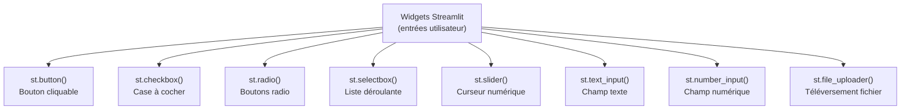
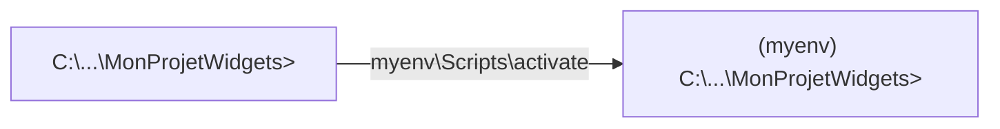
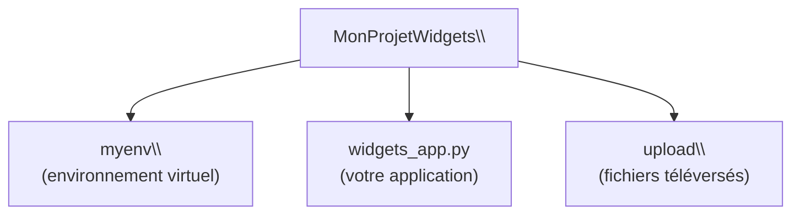
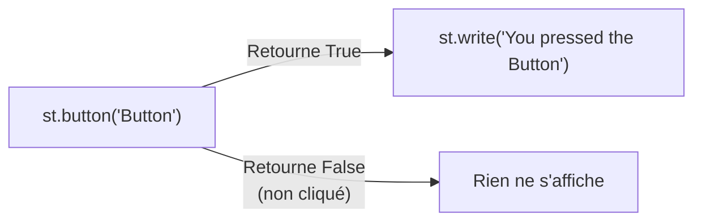
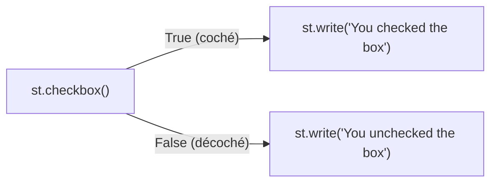
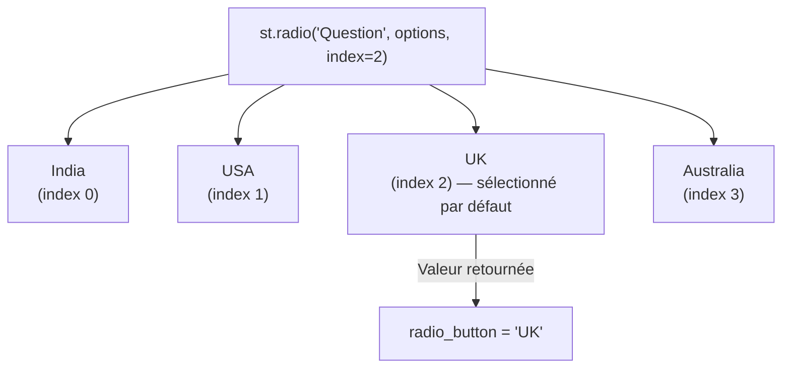
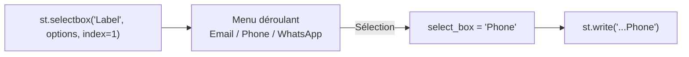
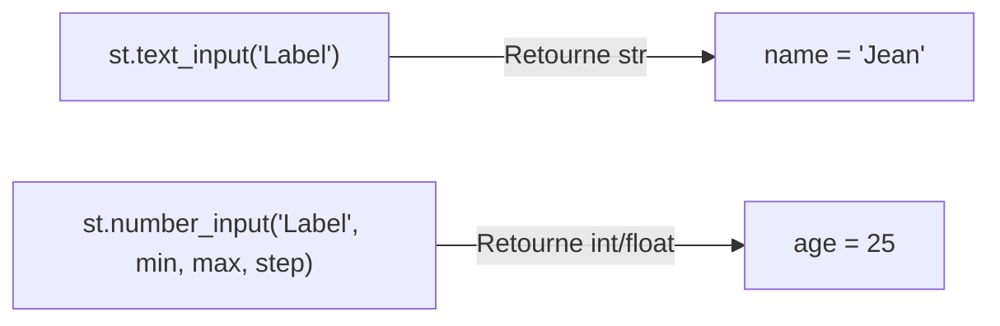
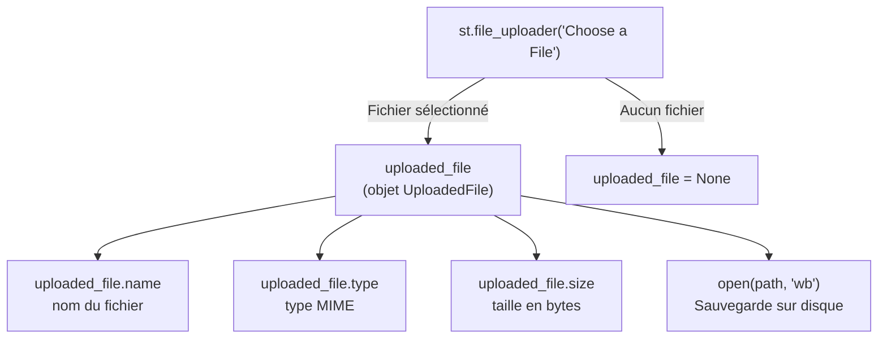

<a id="top"></a>

# Pratique — Widgets Streamlit : Boutons, Sliders, Formulaires et Upload

## Table des matières

| #  | Section                                                                                           |
| -- | ------------------------------------------------------------------------------------------------- |
| 1  | [Introduction — Les widgets dans Streamlit](#section-1)                                          |
| 2  | [Pré-requis](#section-2)                                                                          |
| 3  | [Étape 1 — Créer et activer l'environnement virtuel](#section-3)                                 |
| 4  | [Étape 2 — Installer Streamlit](#section-4)                                                      |
| 5  | [Étape 3 — Créer le fichier widgets_app.py](#section-5)                                          |
| 6  | [Étape 4 — Bouton (Button)](#section-6)                                                          |
| 7  | [Étape 5 — Case à cocher (Checkbox)](#section-7)                                                 |
| 8  | [Étape 6 — Boutons radio (Radio Button)](#section-8)                                             |
| 9  | [Étape 7 — Liste déroulante (Select Box)](#section-9)                                            |
| 10 | [Étape 8 — Curseur (Slider)](#section-10)                                                        |
| 11 | [Étape 9 — Champs de texte (Text Inputs)](#section-11)                                           |
| 12 | [Étape 10 — Téléversement de fichiers (File Upload)](#section-12)                                |
| 13 | [Code complet — widgets_app.py](#section-13)                                                      |
| 14 | [Évaluation formative](#section-14)                                                               |
| 14a| &nbsp;&nbsp;&nbsp;↳ [Exercices à réaliser](#section-14)                                          |
| 14b| &nbsp;&nbsp;&nbsp;↳ [Exemple de solution complète](#section-14)                                  |
| 15 | [Conclusion](#section-15)                                                                         |

---

<a id="section-1"></a>

<details>
<summary><strong>1 — Introduction — Les widgets dans Streamlit</strong></summary>

<br/>

Les **widgets** sont des éléments interactifs qui permettent à l'utilisateur de saisir des données, faire des choix, ajuster des valeurs ou téléverser des fichiers — sans écrire une seule ligne de HTML.



**Valeurs retournées par les widgets :**

| Widget | Type retourné | Exemple |
|--------|--------------|---------|
| `st.button()` | `bool` | `True` si cliqué |
| `st.checkbox()` | `bool` | `True` si coché |
| `st.radio()` | `str` | `"USA"` |
| `st.selectbox()` | `str` | `"Phone"` |
| `st.slider()` | `int` ou `float` | `42` |
| `st.text_input()` | `str` | `"Jean Dupont"` |
| `st.number_input()` | `int` ou `float` | `25` |
| `st.file_uploader()` | `UploadedFile` ou `None` | objet fichier |

</details>

<p align="right"><a href="#top">↑ Retour en haut</a></p>

---

<a id="section-2"></a>

<details>
<summary><strong>2 — Pré-requis</strong></summary>

<br/>

- **Python** installé ([python.org](https://www.python.org))
- **pip** disponible dans le terminal

**Vérifier Python :**

```cmd
python --version
py --list
```

**Préparer le dossier upload :**

Créez un dossier `upload` dans votre projet pour sauvegarder les fichiers téléversés :

```cmd
mkdir upload
```

</details>

<p align="right"><a href="#top">↑ Retour en haut</a></p>

---

<a id="section-3"></a>

<details>
<summary><strong>3 — Étape 1 — Créer et activer l'environnement virtuel</strong></summary>

<br/>

### Créer le dossier projet

```cmd
cd C:\Users\VotreNom\Documents
mkdir MonProjetWidgets
cd MonProjetWidgets
mkdir upload
```

---

### Créer le venv

**Méthode recommandée sur Windows :**

```cmd
py -3.11 -m venv myenv
```

**Méthodes alternatives :**

```cmd
python -m venv myenv
python3.9  -m venv myenv
python3.12 -m venv myenv
```

---

### Activer le venv

**Windows :**

```cmd
myenv\Scripts\activate
```

**macOS / Linux :**

```bash
source myenv/bin/activate
```

**Résultat attendu :**

```plaintext
(myenv) C:\Users\VotreNom\Documents\MonProjetWidgets>
```



> Si PowerShell bloque l'activation :
> ```powershell
> Set-ExecutionPolicy -ExecutionPolicy RemoteSigned -Scope CurrentUser
> ```

</details>

<p align="right"><a href="#top">↑ Retour en haut</a></p>

---

<a id="section-4"></a>

<details>
<summary><strong>4 — Étape 2 — Installer Streamlit</strong></summary>

<br/>

```cmd
pip install streamlit
```

**Vérifier :**

```cmd
streamlit --version
```

</details>

<p align="right"><a href="#top">↑ Retour en haut</a></p>

---

<a id="section-5"></a>

<details>
<summary><strong>5 — Étape 3 — Créer le fichier widgets_app.py</strong></summary>

<br/>

Créez `widgets_app.py` dans votre dossier projet.

**Structure du projet :**



**Lancer l'application à tout moment :**

```cmd
streamlit run widgets_app.py
```

</details>

<p align="right"><a href="#top">↑ Retour en haut</a></p>

---

<a id="section-6"></a>

<details>
<summary><strong>6 — Étape 4 — Bouton (Button)</strong></summary>

<br/>

Ouvrez `widgets_app.py` et écrivez :

```python
import streamlit as st

st.title('Input Widgets')

# Button
st.header('Button')
button = st.button('Button')  # retourne True ou False
if button:
    st.write('You pressed the Button')
```

**Testez :**

```cmd
streamlit run widgets_app.py
```

**Résultat :** Un bouton apparaît. Cliquez dessus — le message s'affiche.

---



> `st.button()` retourne `True` uniquement **au moment du clic**. À chaque rechargement de la page, il revient à `False`.

</details>

<p align="right"><a href="#top">↑ Retour en haut</a></p>

---

<a id="section-7"></a>

<details>
<summary><strong>7 — Étape 5 — Case à cocher (Checkbox)</strong></summary>

<br/>

Ajoutez ce bloc à `widgets_app.py` :

```python
# Checkbox
st.header('Checkbox')
checkbox = st.checkbox("Do you want to agree?")  # retourne True ou False
if checkbox:
    st.write('You checked the box')
else:
    st.write('You unchecked the box')
```

Enregistrez et observez.



**Différence avec le bouton :**

| Widget | État persistant | Retourne |
|--------|----------------|---------|
| `st.button()` | Non — True uniquement au clic | `bool` momentané |
| `st.checkbox()` | Oui — reste coché | `bool` persistant |

</details>

<p align="right"><a href="#top">↑ Retour en haut</a></p>

---

<a id="section-8"></a>

<details>
<summary><strong>8 — Étape 6 — Boutons radio (Radio Button)</strong></summary>

<br/>

```python
# Radio Button
st.header('Radio Button')
options = ("India", "USA", "UK", "Australia")
radio_button = st.radio("What is your favorite country", options, index=2)
st.write('Your favorite country is', radio_button)
```

> `index=2` sélectionne `"UK"` par défaut (index 0 = India, 1 = USA, 2 = UK).

Enregistrez et testez — une seule option peut être sélectionnée à la fois.



**Quand utiliser `st.radio()` ?**

| Situation | Widget recommandé |
|-----------|------------------|
| 2 à 5 options, une seule possible | `st.radio()` |
| Beaucoup d'options | `st.selectbox()` |
| Plusieurs options possibles | `st.multiselect()` |

</details>

<p align="right"><a href="#top">↑ Retour en haut</a></p>

---

<a id="section-9"></a>

<details>
<summary><strong>9 — Étape 7 — Liste déroulante (Select Box)</strong></summary>

<br/>

```python
# Select Box
st.header('Select Box')
options = ('Email', 'Phone', 'WhatsApp')
select_box = st.selectbox('How would you like to contact', options, index=1)
st.write('Your preferred mode of communication is', select_box)
```

> `index=1` sélectionne `"Phone"` par défaut.

Enregistrez et testez — un menu déroulant apparaît.



**Variante — sélection multiple :**

```python
choix = st.multiselect('Choisissez plusieurs options', ['A', 'B', 'C', 'D'])
st.write('Vous avez choisi :', choix)
```

</details>

<p align="right"><a href="#top">↑ Retour en haut</a></p>

---

<a id="section-10"></a>

<details>
<summary><strong>10 — Étape 8 — Curseur (Slider)</strong></summary>

<br/>

```python
# Slider
st.header('Slider')
slider_range = st.slider('How old are you?', min_value=1, max_value=100, step=1, value=20)
st.write('Your age is', slider_range)
```

Enregistrez et glissez le curseur — la valeur se met à jour en temps réel.

| Paramètre | Rôle | Exemple |
|-----------|------|---------|
| `min_value` | Valeur minimale | `1` |
| `max_value` | Valeur maximale | `100` |
| `step` | Pas d'incrément | `1` |
| `value` | Valeur par défaut | `20` |

**Variantes du slider :**

```python
# Plage de valeurs (range slider)
age_range = st.slider('Sélectionnez une plage', 0, 100, (25, 75))
st.write('Plage :', age_range)

# Slider flottant
note = st.slider('Note sur 10', 0.0, 10.0, 5.0, step=0.5)

# Slider de date
from datetime import date
d = st.slider('Date', value=date(2024, 1, 1), min_value=date(2020, 1, 1), max_value=date(2030, 1, 1))
```

</details>

<p align="right"><a href="#top">↑ Retour en haut</a></p>

---

<a id="section-11"></a>

<details>
<summary><strong>11 — Étape 9 — Champs de texte (Text Inputs)</strong></summary>

<br/>

```python
# Text Inputs
st.header('Text Inputs')

name = st.text_input('Enter your Name')
st.write('Your name is', name)

age = st.number_input('Enter your age', min_value=1, max_value=100, step=1, value=25)
st.write('Your age is', age)
```

Enregistrez et saisissez du texte — la valeur s'affiche immédiatement.



**Autres champs de saisie :**

```python
# Mot de passe
password = st.text_input('Mot de passe', type='password')

# Zone de texte multi-lignes
bio = st.text_area('Décrivez-vous', height=150)

# Date
from datetime import date
naissance = st.date_input('Date de naissance', value=date(2000, 1, 1))

# Heure
from datetime import time
heure = st.time_input('Heure de début', value=time(9, 0))
```

</details>

<p align="right"><a href="#top">↑ Retour en haut</a></p>

---

<a id="section-12"></a>

<details>
<summary><strong>12 — Étape 10 — Téléversement de fichiers (File Upload)</strong></summary>

<br/>

```python
import os

# File Upload
st.header('File Upload')
uploaded_file = st.file_uploader('Choose a File')

if uploaded_file is not None:
    st.success('File uploaded successfully')
    details = {
        'filename': uploaded_file.name,
        'filetype': uploaded_file.type,
        'filesize (bytes)': uploaded_file.size
    }
    st.json(details)

    # Sauvegarder le fichier dans le dossier upload/
    path = os.path.join('./upload', uploaded_file.name)
    with open(path, mode='wb') as f:
        f.write(uploaded_file.getbuffer())
        st.success('File saved successfully')
```

> Assurez-vous que le dossier `upload/` existe avant de lancer l'application :
> ```cmd
> mkdir upload
> ```



**Filtrer les types de fichiers acceptés :**

```python
# Accepter uniquement les images
image = st.file_uploader('Téléversez une image', type=['jpg', 'png', 'webp'])

# Accepter uniquement les CSV
csv_file = st.file_uploader('Téléversez un CSV', type=['csv'])

# Afficher l'image directement
if image is not None:
    st.image(image, caption='Image téléversée', width=300)
```

</details>

<p align="right"><a href="#top">↑ Retour en haut</a></p>

---

<a id="section-13"></a>

<details>
<summary><strong>13 — Code complet — widgets_app.py</strong></summary>

<br/>

```python
import streamlit as st
import os

st.title('Input Widgets')

# --- Bouton ---
st.header('Button')
button = st.button('Button')  # retourne True ou False
if button:
    st.write('You pressed the Button')

# --- Case à cocher ---
st.header('Checkbox')
checkbox = st.checkbox("Do you want to agree?")  # retourne bool
if checkbox:
    st.write('You checked the box')
else:
    st.write('You unchecked the box')

# --- Boutons radio ---
st.header('Radio Button')
options = ("India", "USA", "UK", "Australia")
radio_button = st.radio("What is your favorite country", options, index=2)
st.write('Your favorite country is', radio_button)

# --- Liste déroulante ---
st.header('Select Box')
options = ('Email', 'Phone', 'WhatsApp')
select_box = st.selectbox('How would you like to contact', options, index=1)
st.write('Your preferred mode of communication is', select_box)

# --- Curseur ---
st.header('Slider')
slider_range = st.slider('How old are you?', min_value=1, max_value=100, step=1, value=20)
st.write('Your age is', slider_range)

# --- Champs de texte ---
st.header('Text Inputs')
name = st.text_input('Enter your Name')
st.write('Your name is', name)

age = st.number_input('Enter your age', min_value=1, max_value=100, step=1, value=25)
st.write('Your age is', age)

# --- Téléversement de fichier ---
st.header('File Upload')
uploaded_file = st.file_uploader('Choose a File')

if uploaded_file is not None:
    st.success('File uploaded successfully')
    details = {
        'filename': uploaded_file.name,
        'filetype': uploaded_file.type,
        'filesize (bytes)': uploaded_file.size
    }
    st.json(details)

    path = os.path.join('./upload', uploaded_file.name)
    with open(path, mode='wb') as f:
        f.write(uploaded_file.getbuffer())
        st.success('File saved successfully')
```

**Lancer l'application :**

```cmd
streamlit run widgets_app.py
```

**Ouvrir dans le navigateur :**

```
http://localhost:8501
```

</details>

<p align="right"><a href="#top">↑ Retour en haut</a></p>

---

<a id="section-14"></a>

<details>
<summary><strong>14 — Évaluation formative</strong></summary>

<br/>

### Instructions

1. Créez un **nouvel environnement virtuel** et activez-le.
2. Installez Streamlit.
3. Créez `widgets_app.py` et implémentez les widgets **un par un**, en testant à chaque étape.
4. Soumettez le fichier final et une **capture d'écran** de chaque étape.

---

### Exercices à réaliser

**1 — Bouton**
- Affichez un bouton et écrivez un message lorsqu'il est cliqué.

**2 — Case à cocher**
- Ajoutez une case à cocher et affichez un message selon son état (coché / décoché).

**3 — Boutons radio**
- Proposez plusieurs pays — affichez le pays sélectionné.

**4 — Liste déroulante**
- Proposez plusieurs modes de communication — affichez le choix.

**5 — Curseur**
- Ajoutez un curseur d'âge de 1 à 100 — affichez la valeur choisie.

**6 — Champs de texte**
- Champ texte pour le nom + champ numérique pour l'âge — affichez les valeurs.

**7 — Téléversement de fichiers**
- Permettez l'upload d'un fichier et affichez ses détails (nom, type, taille).

---

### Exemple de solution complète

```python
import streamlit as st
import os

st.title('Input Widgets')

# Button
st.header('Button')
button = st.button('Button')
if button:
    st.write('You pressed the Button')

# Checkbox
st.header('Checkbox')
checkbox = st.checkbox("Do you want to agree?")
if checkbox:
    st.write('You checked the box')
else:
    st.write('You unchecked the box')

# Radio Button
st.header('Radio Button')
options = ("India", "USA", "UK", "Australia")
radio_button = st.radio("What is your favorite country", options, index=2)
st.write('Your favorite country is', radio_button)

# Select Box
st.header('Select Box')
options = ('Email', 'Phone', 'WhatsApp')
select_box = st.selectbox('How would you like to contact', options, index=1)
st.write('Your preferred mode of communication is', select_box)

# Slider
st.header('Slider')
slider_range = st.slider('How old are you?', min_value=1, max_value=100, step=1, value=20)
st.write('Your age is', slider_range)

# Text Inputs
st.header('Text Inputs')
name = st.text_input('Enter your Name')
st.write('Your name is', name)

age = st.number_input('Enter your age', min_value=1, max_value=100, step=1, value=25)
st.write('Your age is', age)

# File Upload
st.header('File Upload')
uploaded_file = st.file_uploader('Choose a File')

if uploaded_file is not None:
    st.success('File uploaded successfully')
    details = {
        'filename': uploaded_file.name,
        'filetype': uploaded_file.type,
        'filesize (bytes)': uploaded_file.size
    }
    st.json(details)

    path = os.path.join('./upload', uploaded_file.name)
    with open(path, mode='wb') as f:
        f.write(uploaded_file.getbuffer())
        st.success('File saved successfully')
```

</details>

<p align="right"><a href="#top">↑ Retour en haut</a></p>

---

<a id="section-15"></a>

<details>
<summary><strong>15 — Conclusion</strong></summary>

<br/>

Ce tutoriel vous a montré comment utiliser les principaux widgets de saisie dans Streamlit :

| Widget | Commande | Retourne |
|--------|----------|---------|
| Bouton | `st.button()` | `bool` au clic |
| Case à cocher | `st.checkbox()` | `bool` persistant |
| Boutons radio | `st.radio()` | `str` sélectionné |
| Liste déroulante | `st.selectbox()` | `str` sélectionné |
| Curseur | `st.slider()` | `int` ou `float` |
| Champ texte | `st.text_input()` | `str` |
| Champ numérique | `st.number_input()` | `int` ou `float` |
| Upload fichier | `st.file_uploader()` | `UploadedFile` ou `None` |

Avec ces widgets, vous pouvez créer des formulaires, des filtres interactifs, des tableaux de bord dynamiques et des outils de traitement de fichiers — entièrement en Python.

> **Prochaine étape :** consultez le document [26 — Layouts Streamlit](./26-Streamlit-Layouts-Sidebar-Colonnes-Onglets.md) pour organiser ces widgets dans des colonnes, des onglets et des barres latérales, ou le document [24 — FastAPI + Streamlit](./24-Venv-FastAPI-Streamlit.md) pour connecter vos widgets à une API backend.

</details>

<p align="right"><a href="#top">↑ Retour en haut</a></p>
