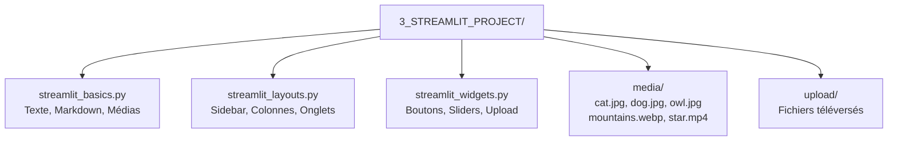
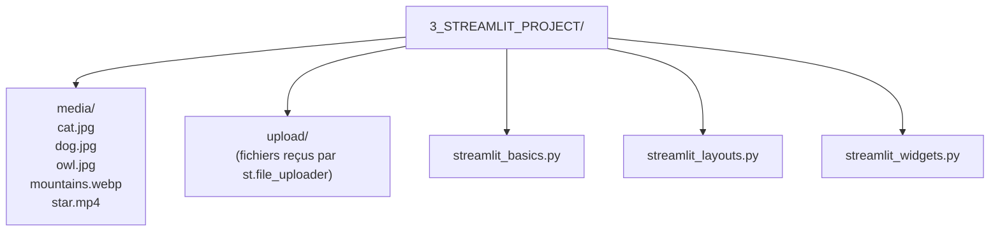
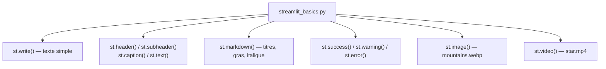
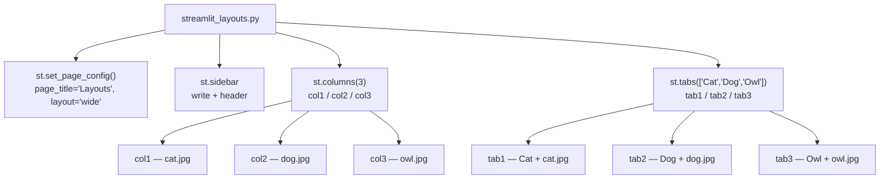
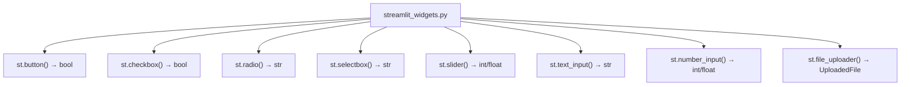
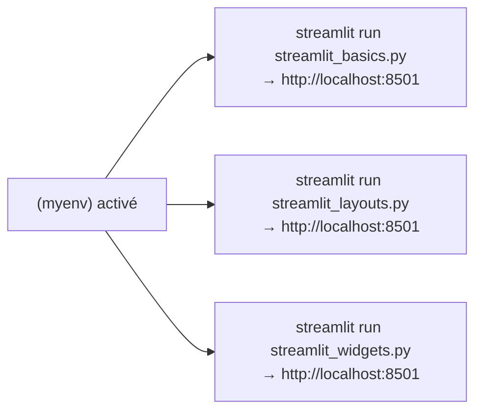
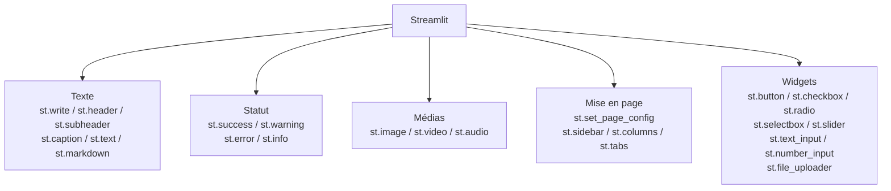

<a id="top"></a>

# Projet Final — Structure complète Streamlit (3 fichiers)

## Table des matières

| #  | Section                                                                                           |
| -- | ------------------------------------------------------------------------------------------------- |
| 1  | [Introduction — Vue d'ensemble du projet final](#section-1)                                      |
| 2  | [Structure du projet](#section-2)                                                                 |
| 3  | [Mise en place — Environnement virtuel et installation](#section-3)                               |
| 4  | [Fichier 1 — streamlit_basics.py](#section-4)                                                    |
| 4a | &nbsp;&nbsp;&nbsp;↳ [Texte simple et formatage](#section-4)                                      |
| 4b | &nbsp;&nbsp;&nbsp;↳ [Markdown](#section-4)                                                       |
| 4c | &nbsp;&nbsp;&nbsp;↳ [Messages de statut](#section-4)                                             |
| 4d | &nbsp;&nbsp;&nbsp;↳ [Images et vidéos](#section-4)                                               |
| 5  | [Fichier 2 — streamlit_layouts.py](#section-5)                                                   |
| 5a | &nbsp;&nbsp;&nbsp;↳ [Configuration de la page](#section-5)                                       |
| 5b | &nbsp;&nbsp;&nbsp;↳ [Sidebar](#section-5)                                                        |
| 5c | &nbsp;&nbsp;&nbsp;↳ [Colonnes](#section-5)                                                       |
| 5d | &nbsp;&nbsp;&nbsp;↳ [Onglets](#section-5)                                                        |
| 6  | [Fichier 3 — streamlit_widgets.py](#section-6)                                                   |
| 6a | &nbsp;&nbsp;&nbsp;↳ [Button, Checkbox, Radio](#section-6)                                        |
| 6b | &nbsp;&nbsp;&nbsp;↳ [SelectBox, Slider, Text Inputs](#section-6)                                 |
| 6c | &nbsp;&nbsp;&nbsp;↳ [File Upload](#section-6)                                                    |
| 7  | [Lancer chaque application](#section-7)                                                           |
| 8  | [Récapitulatif — Tableau des commandes Streamlit](#section-8)                                    |
| 9  | [Conclusion](#section-9)                                                                          |

---

<a id="section-1"></a>

<details>
<summary><strong>1 — Introduction — Vue d'ensemble du projet final</strong></summary>

<br/>

Ce projet regroupe les trois pratiques Streamlit en un seul projet organisé. Il contient **trois applications indépendantes** qui couvrent toutes les bases de Streamlit :



| Fichier | Contenu | Document associé |
|---------|---------|-----------------|
| `streamlit_basics.py` | Texte, formatage, Markdown, images, vidéos | [25 — Tutoriel débutant](./25-Streamlit-Tutoriel-Debutant.md) |
| `streamlit_layouts.py` | Sidebar, colonnes, onglets | [26 — Layouts](./26-Streamlit-Layouts-Sidebar-Colonnes-Onglets.md) |
| `streamlit_widgets.py` | Boutons, sliders, formulaires, upload | [27 — Widgets](./27-Streamlit-Widgets-Boutons-Sliders-Upload.md) |

</details>

<p align="right"><a href="#top">↑ Retour en haut</a></p>

---

<a id="section-2"></a>

<details>
<summary><strong>2 — Structure du projet</strong></summary>

<br/>

```
3_STREAMLIT_PROJECT/
├── media/
│   ├── cat.jpg
│   ├── dog.jpg
│   ├── mountains.webp
│   ├── owl.jpg
│   └── star.mp4
├── upload/
│   ├── mountains.webp
│   └── star.mp4
├── streamlit_basics.py
├── streamlit_layouts.py
└── streamlit_widgets.py
```

**Créer cette structure depuis le terminal :**

```cmd
mkdir 3_STREAMLIT_PROJECT
cd 3_STREAMLIT_PROJECT
mkdir media
mkdir upload
```

Placez ensuite vos fichiers médias (`cat.jpg`, `dog.jpg`, `owl.jpg`, `mountains.webp`, `star.mp4`) dans le dossier `media/`.



</details>

<p align="right"><a href="#top">↑ Retour en haut</a></p>

---

<a id="section-3"></a>

<details>
<summary><strong>3 — Mise en place — Environnement virtuel et installation</strong></summary>

<br/>

### Créer et activer le venv

```cmd
cd 3_STREAMLIT_PROJECT
py -3.11 -m venv myenv
myenv\Scripts\activate
```

**macOS / Linux :**

```bash
source myenv/bin/activate
```

**Résultat attendu :**

```plaintext
(myenv) C:\...\3_STREAMLIT_PROJECT>
```

---

### Installer Streamlit

```cmd
pip install streamlit
```

**Vérifier :**

```cmd
streamlit --version
pip list
```

---

### Troubleshooting PowerShell

Si l'activation est bloquée sur Windows :

```powershell
Set-ExecutionPolicy -ExecutionPolicy RemoteSigned -Scope CurrentUser
```

</details>

<p align="right"><a href="#top">↑ Retour en haut</a></p>

---

<a id="section-4"></a>

<details>
<summary><strong>4 — Fichier 1 — streamlit_basics.py</strong></summary>

<br/>

Ce fichier couvre les **fondations de Streamlit** : affichage de texte, formatage, Markdown, messages de statut, images et vidéos.



---

### Code complet — streamlit_basics.py

```python
import streamlit as st

# --- Texte simple ---
st.write("Hello World")

# --- Formater du texte ---
st.header("This is Header")
st.subheader("This is subheader")
st.caption('This is caption')
st.text('This is plain text')

# --- Markdown ---
st.markdown("""
# This is title
## This header
### subheader - 1
#### subheader - 2

simple plain text

for *italic* use asterisk
for **bold** format use two asterisks
""")

# --- Messages de statut ---
st.success("this message display text in green background")
st.warning("this message display text in yellow background")
st.error("this message display text in red background")

# --- Images ---
st.subheader("Display Image")
st.image('./media/mountains.webp', caption='mountains', width=300)

# --- Vidéos ---
st.subheader('Display Video')
video_file = open('./media/star.mp4', 'rb').read()
st.video(video_file)
```

**Lancer :**

```cmd
streamlit run streamlit_basics.py
```

| Commande | Rendu |
|----------|-------|
| `st.write()` | Texte polyvalent |
| `st.header()` | Titre H2 |
| `st.subheader()` | Titre H3 |
| `st.caption()` | Texte gris, petit |
| `st.text()` | Texte brut |
| `st.markdown()` | Contenu Markdown complet |
| `st.success()` | Fond vert |
| `st.warning()` | Fond jaune |
| `st.error()` | Fond rouge |
| `st.image()` | Afficher une image |
| `st.video()` | Lire une vidéo |

</details>

<p align="right"><a href="#top">↑ Retour en haut</a></p>

---

<a id="section-5"></a>

<details>
<summary><strong>5 — Fichier 2 — streamlit_layouts.py</strong></summary>

<br/>

Ce fichier couvre la **mise en page** : configuration de la page, barre latérale, colonnes et onglets.



---

### Code complet — streamlit_layouts.py

```python
import streamlit as st

st.set_page_config(page_title="Layouts", layout='wide')
st.title('Streamlit Layout')

# --- Sidebar ---
sidebar = st.sidebar
sidebar.write('This is my sidebar')
sidebar.header('Header in sidebar')

# --- Colonnes ---
col1, col2, col3 = st.columns(3)

with col1:
    st.write('This is column - 1')
    st.image('./media/cat.jpg')

with col2:
    st.write('This is column - 2')
    st.image('./media/dog.jpg')

with col3:
    st.write('This is column - 3')
    st.image('./media/owl.jpg')

# --- Onglets ---
st.header('Display in Tabs')
tab1, tab2, tab3 = st.tabs(['Cat', 'Dog', 'Owl'])

with tab1:
    st.write('You are in Cat Tab')
    st.image('./media/cat.jpg')

with tab2:
    st.write('You are in Dog Tab')
    st.image('./media/dog.jpg')

with tab3:
    st.write('You are in Owl Tab')
    st.image('./media/owl.jpg')
```

**Lancer :**

```cmd
streamlit run streamlit_layouts.py
```

| Commande | Rôle |
|----------|------|
| `st.set_page_config()` | Titre navigateur + largeur de page |
| `st.sidebar` | Barre latérale gauche |
| `st.columns(n)` | Diviser en n colonnes |
| `st.tabs([...])` | Onglets navigables |

</details>

<p align="right"><a href="#top">↑ Retour en haut</a></p>

---

<a id="section-6"></a>

<details>
<summary><strong>6 — Fichier 3 — streamlit_widgets.py</strong></summary>

<br/>

Ce fichier couvre tous les **widgets interactifs** : bouton, checkbox, radio, selectbox, slider, champs texte et upload de fichier.



---

### Code complet — streamlit_widgets.py

```python
import streamlit as st
import os

st.title('Input Widgets')

# --- Bouton ---
st.header('Button')
button = st.button('Button')  # retourne True ou False
if button:
    st.write('You pressed the Button')

# --- Case à cocher ---
st.header('Checkbox')
checkbox = st.checkbox("Do you want to agree?")  # retourne bool
if checkbox:
    st.write('You checked the box')
else:
    st.write('You unchecked the box')

# --- Boutons radio ---
st.header('Radio Button')
options = ("India", "USA", "UK", "Australia")
radio_button = st.radio("What is your favorite country", options, index=2)
st.write('Your favorite country is', radio_button)

# --- Liste déroulante ---
st.header('Select Box')
options = ('Email', 'Phone', 'WhatsApp')
select_box = st.selectbox('How would you like to contact', options, index=1)
st.write('Your preferred mode of communication is', select_box)

# --- Curseur ---
st.header('Slider')
slider_range = st.slider('How old are you?', min_value=1, max_value=100, step=1, value=20)
st.write('Your age is', slider_range)

# --- Champs de texte ---
st.header('Text Inputs')
name = st.text_input('Enter your Name')
st.write('Your name is', name)

age = st.number_input('Enter your age', min_value=1, max_value=100, step=1, value=25)
st.write('Your age is', age)

# --- Téléversement de fichier ---
st.header('File Upload')
uploaded_file = st.file_uploader('Choose a File')

if uploaded_file is not None:
    st.success('File uploaded successfully')
    details = {
        'filename': uploaded_file.name,
        'filetype': uploaded_file.type,
        'filesize (bytes)': uploaded_file.size
    }
    st.json(details)

    path = os.path.join('./upload', uploaded_file.name)
    with open(path, mode='wb') as f:
        f.write(uploaded_file.getbuffer())
        st.success('File saved successfully')
```

**Lancer :**

```cmd
streamlit run streamlit_widgets.py
```

| Widget | Commande | Retourne |
|--------|----------|---------|
| Bouton | `st.button()` | `bool` au clic |
| Case à cocher | `st.checkbox()` | `bool` persistant |
| Boutons radio | `st.radio()` | `str` sélectionné |
| Liste déroulante | `st.selectbox()` | `str` sélectionné |
| Curseur | `st.slider()` | `int` ou `float` |
| Champ texte | `st.text_input()` | `str` |
| Champ numérique | `st.number_input()` | `int` ou `float` |
| Upload fichier | `st.file_uploader()` | `UploadedFile` ou `None` |

</details>

<p align="right"><a href="#top">↑ Retour en haut</a></p>

---

<a id="section-7"></a>

<details>
<summary><strong>7 — Lancer chaque application</strong></summary>

<br/>

Chaque fichier est une application **indépendante**. Lancez-les séparément dans le même environnement virtuel activé.



**Commandes :**

```cmd
streamlit run streamlit_basics.py
```

```cmd
streamlit run streamlit_layouts.py
```

```cmd
streamlit run streamlit_widgets.py
```

> Une seule application tourne à la fois sur le port `8501`. Pour arrêter, appuyez sur `Ctrl + C` dans le terminal.

</details>

<p align="right"><a href="#top">↑ Retour en haut</a></p>

---

<a id="section-8"></a>

<details>
<summary><strong>8 — Récapitulatif — Tableau des commandes Streamlit</strong></summary>

<br/>



---

### Texte et formatage

| Commande | Description |
|----------|-------------|
| `st.write(...)` | Affichage universel — texte, données, graphiques |
| `st.header(...)` | Titre H2 |
| `st.subheader(...)` | Titre H3 |
| `st.caption(...)` | Texte gris, annotatif |
| `st.text(...)` | Texte brut, police fixe |
| `st.markdown(...)` | Contenu Markdown |
| `st.title(...)` | Grand titre de page |

### Messages de statut

| Commande | Couleur |
|----------|---------|
| `st.success(...)` | Vert |
| `st.warning(...)` | Jaune |
| `st.error(...)` | Rouge |
| `st.info(...)` | Bleu |

### Médias

| Commande | Usage |
|----------|-------|
| `st.image(path, caption, width)` | Afficher une image |
| `st.video(data)` | Lire une vidéo |
| `st.audio(data)` | Lire un fichier audio |

### Mise en page

| Commande | Usage |
|----------|-------|
| `st.set_page_config(page_title, layout)` | Configuration globale de la page |
| `st.sidebar` | Barre latérale gauche |
| `st.columns(n)` | Diviser en n colonnes |
| `st.tabs([...])` | Onglets navigables |

### Widgets

| Commande | Retourne |
|----------|---------|
| `st.button(label)` | `bool` |
| `st.checkbox(label)` | `bool` |
| `st.radio(label, options, index)` | `str` |
| `st.selectbox(label, options, index)` | `str` |
| `st.multiselect(label, options)` | `list` |
| `st.slider(label, min, max, step, value)` | `int` / `float` |
| `st.text_input(label)` | `str` |
| `st.text_area(label)` | `str` |
| `st.number_input(label, min, max, step)` | `int` / `float` |
| `st.date_input(label)` | `date` |
| `st.file_uploader(label, type)` | `UploadedFile` / `None` |

</details>

<p align="right"><a href="#top">↑ Retour en haut</a></p>

---

<a id="section-9"></a>

<details>
<summary><strong>9 — Conclusion</strong></summary>

<br/>

Ce projet final regroupe les trois piliers de Streamlit :

| Fichier | Ce que vous maîtrisez |
|---------|----------------------|
| `streamlit_basics.py` | Afficher du contenu — texte, images, vidéos, messages |
| `streamlit_layouts.py` | Organiser l'interface — sidebar, colonnes, onglets |
| `streamlit_widgets.py` | Interagir avec l'utilisateur — formulaires, upload, sliders |

Avec ces trois fichiers comme base, vous êtes prêt à construire des **applications web interactives complètes** en Python.

**Prochaines étapes :**

- Connecter Streamlit à une API FastAPI → [24 — FastAPI + Streamlit](./24-Venv-FastAPI-Streamlit.md)
- Ajouter des graphiques avec `st.line_chart()`, `st.bar_chart()`, Plotly
- Déployer votre application sur [Streamlit Cloud](https://streamlit.io/cloud)

</details>

<p align="right"><a href="#top">↑ Retour en haut</a></p>
