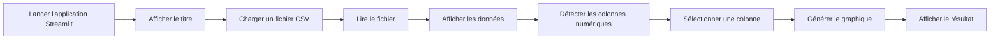

<a id="top"></a>

# Mini-lab 1 — Développement d’une application de visualisation de données CSV avec Streamlit

## Table des matières

| #  | Section                                                         |
| -- | --------------------------------------------------------------- |
| 1  | [Présentation générale de l’évaluation](#section-1)             |
| 2  | [Objectif du mini-lab](#section-2)                              |
| 3  | [Contexte professionnel](#section-3)                            |
| 4  | [Ressources fournies](#section-4)                               |
| 5  | [Travail demandé](#section-5)                                   |
| 5a |    ↳ [Titre de l’application](#section-5a)                      |
| 5b |    ↳ [Chargement du fichier CSV](#section-5b)                   |
| 5c |    ↳ [Lecture et affichage des données](#section-5c)            |
| 5d |    ↳ [Sélection d’une colonne numérique](#section-5d)           |
| 5e |    ↳ [Génération du graphique](#section-5e)                     |
| 5f |    ↳ [Gestion des erreurs et des cas particuliers](#section-5f) |
| 5g |    ↳ [Bonus : chargement depuis la barre latérale](#section-5g) |
| 6  | [Structure attendue de l’application](#section-6)               |
| 7  | [Exigences spécifiques](#section-7)                             |
| 8  | [Critères d’évaluation](#section-8)                             |
| 9  | [Barème suggéré](#section-9)                                    |
| 10 | [Fichiers à remettre](#section-10)                              |
| 11 | [Conseils de réalisation](#section-11)                          |
| 12 | [Erreurs fréquentes à éviter](#section-12)                      |
| 13 | [Exemple de logique attendue](#section-13)                      |
| 14 | [Consignes de soumission](#section-14)                          |
| 15 | [Synthèse finale](#section-15)                                  |

---

<a id="section-1"></a>

<details open>
<summary><strong>1 — Présentation générale de l’évaluation</strong></summary>

<br/>

Ce mini-lab porte sur le développement d’une application simple de visualisation de données avec **Streamlit**. L’objectif est de créer une interface permettant à un utilisateur de charger un fichier CSV, de visualiser son contenu et de générer un graphique à partir d’une colonne numérique.

Ce travail permet de pratiquer plusieurs compétences importantes dans un projet d’analyse de données. Il faut savoir créer une interface utilisateur, charger un fichier, lire des données avec Python, détecter les colonnes numériques, afficher un tableau et produire une visualisation claire.

L’évaluation ne porte pas uniquement sur le fait que l’application fonctionne. Elle porte aussi sur la clarté du code, la gestion des erreurs, la qualité de l’interface et la capacité à prévoir les cas particuliers. Une application professionnelle ne doit pas simplement fonctionner lorsque tout va bien. Elle doit aussi réagir correctement lorsqu’aucun fichier n’est chargé, lorsqu’un fichier est incorrect ou lorsqu’il ne contient aucune colonne numérique.

Ce mini-lab doit donc être réalisé avec soin. Le résultat attendu est une petite application Streamlit claire, fonctionnelle, bien structurée et facile à utiliser.

</details>

<p align="right"><a href="#top">↑ Retour en haut</a></p>

---

<a id="section-2"></a>

<details>
<summary><strong>2 — Objectif du mini-lab</strong></summary>

<br/>

L’objectif principal de ce mini-lab est de développer une application avec **Streamlit** permettant de charger un fichier CSV, d’afficher les données contenues dans ce fichier et de générer un graphique basé sur une colonne numérique choisie par l’utilisateur.

L’application doit permettre à une personne qui ne connaît pas nécessairement Python de déposer un fichier CSV dans l’interface, de voir rapidement un aperçu des données et de produire un graphique sans modifier le code.

L’idée est de transformer un traitement de données classique en une petite application interactive. Au lieu d’écrire directement le chemin du fichier dans le code, l’utilisateur doit pouvoir charger le fichier depuis l’interface. Au lieu de modifier manuellement le nom de la colonne dans le script, il doit pouvoir choisir la colonne à partir d’une liste.

À la fin du mini-lab, l’application doit donc être capable de répondre à trois besoins simples : charger, afficher et visualiser.

| Besoin         | Explication                                                                                     |
| -------------- | ----------------------------------------------------------------------------------------------- |
| **Charger**    | L’utilisateur doit pouvoir charger un fichier CSV à partir de l’interface Streamlit.            |
| **Afficher**   | L’application doit afficher un aperçu des données dans un tableau lisible.                      |
| **Visualiser** | L’utilisateur doit pouvoir sélectionner une colonne numérique et générer un graphique en ligne. |

</details>

<p align="right"><a href="#top">↑ Retour en haut</a></p>

---

<a id="section-3"></a>

<details>
<summary><strong>3 — Contexte professionnel</strong></summary>

<br/>

Dans un contexte professionnel, les équipes de données doivent souvent produire rapidement des outils simples pour explorer des fichiers CSV. Ces fichiers peuvent contenir des ventes, des résultats d’enquête, des mesures techniques, des données financières, des données de capteurs ou des informations provenant d’un système interne.

Un analyste peut vouloir ouvrir un fichier CSV, vérifier les premières lignes, repérer les colonnes numériques et visualiser l’évolution d’une variable. Sans interface, il doit souvent utiliser un notebook ou un script Python. Avec Streamlit, il peut créer une application simple qui rend cette exploration plus accessible.

Ce mini-lab simule donc une situation réaliste. Vous devez créer une petite application qui permet à un utilisateur de manipuler un fichier CSV sans avoir besoin d’ouvrir le code. L’utilisateur doit comprendre rapidement quoi faire, où charger le fichier et comment générer un graphique.

Ce type d’application peut être utilisé comme prototype dans une entreprise. Il ne s’agit pas encore d’une application complète de production, mais d’un outil simple et utile pour explorer des données rapidement.

</details>

<p align="right"><a href="#top">↑ Retour en haut</a></p>

---

<a id="section-4"></a>

<details>
<summary><strong>4 — Ressources fournies</strong></summary>

<br/>

Des ressources sont fournies pour vous aider à réaliser le mini-lab. Elles peuvent contenir des fichiers de données, des exemples, des captures ou une vidéo explicative.

### Liens fournis

| Ressource                              | Lien                                                                                                                                                                         |
| -------------------------------------- | ---------------------------------------------------------------------------------------------------------------------------------------------------------------------------- |
| **Données**                            | [https://drive.google.com/drive/folders/17Cmg05yZFeWIC_ZCNwEGjQPB030Nk1EE?usp=sharing](https://drive.google.com/drive/folders/17Cmg05yZFeWIC_ZCNwEGjQPB030Nk1EE?usp=sharing) |
| **Vidéo / ressources complémentaires** | [https://drive.google.com/drive/folders/1AvnBZcGnTznxmJE2sMPMkdMXK_a5gDnw?usp=sharing](https://drive.google.com/drive/folders/1AvnBZcGnTznxmJE2sMPMkdMXK_a5gDnw?usp=sharing) |

### Utilisation des ressources

Les fichiers fournis doivent être utilisés pour tester l’application. Il est recommandé de tester le programme avec au moins un fichier CSV valide. Il est aussi recommandé de tester le comportement de l’application lorsque l’utilisateur ne charge aucun fichier ou lorsque le fichier ne contient pas de colonne numérique.

L’objectif n’est pas seulement de copier un exemple. L’objectif est de comprendre la logique générale : charger un fichier, lire les données, afficher le contenu, détecter les colonnes numériques et générer une visualisation.

</details>

<p align="right"><a href="#top">↑ Retour en haut</a></p>

---

<a id="section-5"></a>

<details>
<summary><strong>5 — Travail demandé</strong></summary>

<br/>

Vous devez développer une application Streamlit complète permettant de charger un fichier CSV, d’afficher un aperçu des données et de générer un graphique en ligne basé sur une colonne numérique sélectionnée.

L’application doit être claire, simple à utiliser et suffisamment robuste pour éviter les erreurs évidentes. Elle doit afficher des messages compréhensibles pour guider l’utilisateur.

Le travail doit être réalisé dans un fichier Python, par exemple `app.py`. Le code doit être structuré, lisible et commenté. Les commentaires doivent expliquer les principales parties du programme, sans surcharger inutilement le fichier.

Le mini-lab est composé de plusieurs étapes. Chaque étape correspond à une fonctionnalité attendue dans l’application.



</details>

<p align="right"><a href="#top">↑ Retour en haut</a></p>

---

<a id="section-5a"></a>

<details>
<summary><strong>5a — Titre de l’application</strong></summary>

<br/>

L’application doit afficher un titre clair en haut de la page. Ce titre doit permettre à l’utilisateur de comprendre immédiatement le rôle de l’application.

Le titre attendu est :

```text
Application de Visualisation de Données CSV
```

Dans Streamlit, le titre doit être affiché avec la fonction `st.title`. Cette fonction permet d’ajouter un grand titre dans l’interface.

### Attendu

L’utilisateur doit voir clairement le titre de l’application dès l’ouverture de la page. Le titre ne doit pas être caché dans la barre latérale ou affiché après le chargement du fichier. Il doit être visible au début de l’application.

### Exemple de logique attendue

```python
import streamlit as st

st.title("Application de Visualisation de Données CSV")
```

</details>

<p align="right"><a href="#top">↑ Retour en haut</a></p>

---

<a id="section-5b"></a>

<details>
<summary><strong>5b — Chargement du fichier CSV</strong></summary>

<br/>

L’application doit permettre à l’utilisateur de charger un fichier CSV depuis l’interface. Pour cela, il faut utiliser une fonction Streamlit adaptée au chargement de fichiers.

La fonction attendue est `st.file_uploader`. Cette fonction crée un bouton permettant à l’utilisateur de sélectionner un fichier depuis son ordinateur.

Il faut aussi préciser que seuls les fichiers CSV sont acceptés. Cela permet d’éviter que l’utilisateur charge un fichier Word, PDF, image ou un autre format qui ne peut pas être lu comme un tableau de données.

### Attendu

L’utilisateur doit pouvoir cliquer sur un bouton de chargement, choisir un fichier CSV et le transmettre à l’application. L’application doit ensuite utiliser ce fichier pour lire les données.

### Exemple de logique attendue

```python
uploaded_file = st.file_uploader(
    "Veuillez charger un fichier CSV",
    type=["csv"]
)
```

### Explication simple

La variable `uploaded_file` contient le fichier chargé par l’utilisateur. Si aucun fichier n’est chargé, cette variable ne contient pas encore de fichier. Il faut donc vérifier son contenu avant d’essayer de lire les données.

</details>

<p align="right"><a href="#top">↑ Retour en haut</a></p>

---

<a id="section-5c"></a>

<details>
<summary><strong>5c — Lecture et affichage des données</strong></summary>

<br/>

Après le chargement du fichier CSV, l’application doit lire les données. Pour lire un fichier CSV en Python, il est courant d’utiliser la bibliothèque **Pandas** avec la fonction `pd.read_csv`.

Une fois le fichier lu, les données doivent être affichées dans un tableau. Streamlit permet d’afficher un tableau avec `st.dataframe` ou `st.write`. Il est préférable d’utiliser `st.dataframe`, car cette fonction affiche les données dans un tableau interactif.

### Attendu

L’application doit afficher un aperçu clair des données contenues dans le fichier CSV. L’utilisateur doit pouvoir voir les colonnes et les premières lignes du fichier.

### Exemple de logique attendue

```python
import pandas as pd

if uploaded_file is not None:
    df = pd.read_csv(uploaded_file)
    st.subheader("Aperçu des données")
    st.dataframe(df)
```

### Explication simple

La variable `df` représente le tableau de données chargé. Dans Pandas, ce tableau s’appelle un **DataFrame**. C’est une structure qui ressemble à une feuille Excel, avec des lignes et des colonnes.

</details>

<p align="right"><a href="#top">↑ Retour en haut</a></p>

---

<a id="section-5d"></a>

<details>
<summary><strong>5d — Sélection d’une colonne numérique</strong></summary>

<br/>

L’application doit permettre à l’utilisateur de sélectionner une colonne pour générer un graphique. Cependant, toutes les colonnes ne peuvent pas être utilisées pour produire un graphique en ligne numérique.

Par exemple, une colonne contenant des noms de personnes ou des villes n’est pas une colonne numérique. Une colonne contenant des prix, des quantités, des températures ou des scores est une colonne numérique.

Il faut donc identifier automatiquement les colonnes qui contiennent des nombres. En Pandas, on peut sélectionner les colonnes numériques avec `select_dtypes`.

### Attendu

L’application doit afficher dans la liste de sélection uniquement les colonnes numériques. L’utilisateur ne doit pas pouvoir choisir une colonne texte pour générer un graphique numérique.

### Exemple de logique attendue

```python
numeric_columns = df.select_dtypes(include=["int64", "float64"]).columns

selected_column = st.selectbox(
    "Sélectionnez une colonne numérique pour le graphique",
    numeric_columns
)
```

### Explication simple

La variable `numeric_columns` contient uniquement les colonnes qui peuvent être utilisées pour le graphique. La fonction `st.selectbox` affiche ensuite une liste déroulante permettant à l’utilisateur de choisir une colonne.

</details>

<p align="right"><a href="#top">↑ Retour en haut</a></p>

---

<a id="section-5e"></a>

<details>
<summary><strong>5e — Génération du graphique</strong></summary>

<br/>

Après la sélection d’une colonne numérique, l’application doit générer un graphique en ligne. Ce graphique doit montrer l’évolution des valeurs de la colonne sélectionnée dans l’ordre des lignes du fichier.

Streamlit propose une fonction simple pour afficher un graphique en ligne : `st.line_chart`. Cette fonction peut recevoir une colonne numérique d’un DataFrame et produire automatiquement une visualisation.

### Attendu

L’application doit afficher un graphique clair basé sur la colonne choisie par l’utilisateur. Le graphique doit se mettre à jour lorsque l’utilisateur sélectionne une autre colonne numérique.

### Exemple de logique attendue

```python
st.subheader(f"Graphique de la colonne : {selected_column}")
st.line_chart(df[selected_column])
```

### Explication simple

Le graphique en ligne permet de visualiser les variations d’une colonne numérique. Si la colonne contient des ventes, le graphique permet de voir les hausses et les baisses. Si la colonne contient des températures, le graphique permet de voir leur évolution.

</details>

<p align="right"><a href="#top">↑ Retour en haut</a></p>

---

<a id="section-5f"></a>

<details>
<summary><strong>5f — Gestion des erreurs et des cas particuliers</strong></summary>

<br/>

Une application correcte ne doit pas seulement fonctionner avec un fichier parfait. Elle doit aussi gérer les situations problématiques. Dans ce mini-lab, plusieurs cas particuliers doivent être prévus.

Si aucun fichier n’est chargé, l’application ne doit pas essayer de lire les données. Elle doit afficher un message clair demandant à l’utilisateur de charger un fichier CSV.

Si le fichier chargé ne peut pas être lu, l’application doit afficher un message d’erreur compréhensible. Par exemple, le fichier peut être vide, mal encodé ou ne pas respecter le format CSV attendu.

Si le fichier CSV ne contient aucune colonne numérique, l’application ne doit pas afficher une liste vide ou planter. Elle doit expliquer que le fichier ne contient pas de colonne numérique utilisable pour générer un graphique.

### Attendu

L’application doit être capable de gérer au minimum les situations suivantes :

| Situation                               | Comportement attendu                                                   |
| --------------------------------------- | ---------------------------------------------------------------------- |
| Aucun fichier chargé                    | Afficher un message demandant de charger un fichier CSV.               |
| Fichier incorrect ou illisible          | Afficher un message d’erreur clair.                                    |
| Fichier sans colonne numérique          | Afficher un message expliquant qu’aucun graphique ne peut être généré. |
| Fichier valide avec colonnes numériques | Afficher les données, permettre la sélection et générer le graphique.  |

### Exemple de logique attendue

```python
if uploaded_file is None:
    st.info("Veuillez charger un fichier CSV pour commencer.")
else:
    try:
        df = pd.read_csv(uploaded_file)
        st.dataframe(df)

        numeric_columns = df.select_dtypes(include=["int64", "float64"]).columns

        if len(numeric_columns) == 0:
            st.warning("Le fichier CSV ne contient aucune colonne numérique.")
        else:
            selected_column = st.selectbox(
                "Sélectionnez une colonne numérique",
                numeric_columns
            )
            st.line_chart(df[selected_column])

    except Exception as e:
        st.error("Une erreur est survenue lors de la lecture du fichier CSV.")
```

</details>

<p align="right"><a href="#top">↑ Retour en haut</a></p>

---

<a id="section-5g"></a>

<details>
<summary><strong>5g — Bonus : chargement depuis la barre latérale</strong></summary>

<br/>

Le bonus consiste à permettre le chargement du fichier CSV depuis la barre latérale de l’application. La barre latérale est utile pour regrouper les paramètres, les filtres ou les options de l’application.

Dans Streamlit, la barre latérale est accessible avec `st.sidebar`. Il est donc possible d’utiliser `st.sidebar.file_uploader` pour placer le bouton de chargement dans cette zone.

### Attendu pour le bonus

L’application doit proposer le chargement du fichier CSV depuis la barre latérale. Cette fonctionnalité rend l’interface plus propre, car la zone principale peut être réservée à l’affichage des données et du graphique.

### Exemple de logique attendue

```python
uploaded_file = st.sidebar.file_uploader(
    "Chargez un fichier CSV",
    type=["csv"]
)
```

### Explication simple

La barre latérale joue le rôle d’un panneau de contrôle. L’utilisateur y charge le fichier ou choisit certaines options, tandis que la partie centrale de la page affiche les résultats.

</details>

<p align="right"><a href="#top">↑ Retour en haut</a></p>

---

<a id="section-6"></a>

<details>
<summary><strong>6 — Structure attendue de l’application</strong></summary>

<br/>

L’application doit être organisée de manière simple et logique. Le code doit être facile à lire et chaque partie doit avoir un rôle clair.

Une structure possible est la suivante :

```text
mini_lab_2_streamlit_csv/
│
├── app.py
├── requirements.txt
└── README.md   facultatif
```

Le fichier principal attendu est `app.py`. C’est dans ce fichier que l’application Streamlit doit être développée.

Le fichier `requirements.txt` peut contenir les bibliothèques nécessaires pour exécuter l’application. Par exemple, il peut contenir `streamlit` et `pandas`.

Le fichier `README.md` est facultatif, mais il peut être utile pour expliquer comment lancer l’application.

### Organisation logique du code

| Partie du code          | Rôle attendu                                                                                    |
| ----------------------- | ----------------------------------------------------------------------------------------------- |
| **Imports**             | Importer Streamlit et Pandas.                                                                   |
| **Titre**               | Afficher le titre de l’application avec `st.title`.                                             |
| **Chargement**          | Permettre le chargement d’un fichier CSV avec `st.file_uploader` ou `st.sidebar.file_uploader`. |
| **Lecture**             | Lire le fichier CSV avec `pd.read_csv`.                                                         |
| **Affichage**           | Afficher les données avec `st.dataframe`.                                                       |
| **Colonnes numériques** | Détecter les colonnes numériques avec `select_dtypes`.                                          |
| **Sélection**           | Permettre à l’utilisateur de choisir une colonne avec `st.selectbox`.                           |
| **Graphique**           | Afficher le graphique avec `st.line_chart`.                                                     |
| **Gestion des erreurs** | Utiliser des conditions et éventuellement `try/except`.                                         |

### Commande de lancement

Pour lancer l’application, vous pouvez utiliser la commande suivante dans le terminal :

```bash
streamlit run app.py
```

</details>

<p align="right"><a href="#top">↑ Retour en haut</a></p>

---

<a id="section-7"></a>

<details>
<summary><strong>7 — Exigences spécifiques</strong></summary>

<br/>

L’application doit respecter plusieurs exigences précises. Ces exigences permettent de vérifier que le mini-lab répond bien aux objectifs attendus.

| #  | Exigence                                                          | Explication                                                                    |
| -- | ----------------------------------------------------------------- | ------------------------------------------------------------------------------ |
| 1  | **Afficher un message clair si aucun fichier n’est chargé.**      | L’application ne doit pas rester vide. Elle doit guider l’utilisateur.         |
| 2  | **Accepter uniquement les fichiers CSV.**                         | Le chargeur de fichiers doit limiter le type de fichier accepté.               |
| 3  | **Lire correctement le fichier CSV chargé.**                      | Le fichier doit être lu avec une fonction adaptée, comme `pd.read_csv`.        |
| 4  | **Afficher les données dans un tableau.**                         | L’utilisateur doit pouvoir voir un aperçu du contenu du fichier.               |
| 5  | **Détecter les colonnes numériques.**                             | Seules les colonnes `int` ou `float` doivent être proposées pour le graphique. |
| 6  | **Afficher une liste de sélection pour les colonnes numériques.** | L’utilisateur doit pouvoir choisir la colonne à visualiser.                    |
| 7  | **Générer un graphique en ligne.**                                | Le graphique doit être basé sur la colonne sélectionnée.                       |
| 8  | **Gérer les erreurs de lecture.**                                 | L’application ne doit pas planter si le fichier est incorrect.                 |
| 9  | **Afficher un message si aucune colonne numérique n’existe.**     | L’utilisateur doit comprendre pourquoi aucun graphique n’est affiché.          |
| 10 | **Ajouter le chargement depuis la barre latérale pour le bonus.** | Le fichier peut être chargé avec `st.sidebar.file_uploader`.                   |

### Exigence importante

Le code ne doit pas simplement fonctionner avec un seul fichier précis. Il doit fonctionner avec différents fichiers CSV, à condition qu’ils soient lisibles et qu’ils contiennent au moins une colonne numérique pour le graphique.

</details>

<p align="right"><a href="#top">↑ Retour en haut</a></p>

---

<a id="section-8"></a>

<details>
<summary><strong>8 — Critères d’évaluation</strong></summary>

<br/>

L’évaluation portera sur trois grands aspects : la fonctionnalité de l’application, la qualité de l’interface utilisateur et la qualité du code.

### Fonctionnalité

L’application doit charger et lire correctement un fichier CSV. Elle doit afficher les données du fichier dans un tableau. Elle doit aussi permettre à l’utilisateur de sélectionner une colonne numérique et de générer un graphique en ligne basé sur cette colonne.

Si l’application ne peut pas lire le fichier, elle doit afficher une erreur claire. Si le fichier ne contient pas de colonne numérique, elle doit afficher un message compréhensible au lieu de planter.

### Interface utilisateur

L’interface doit être intuitive et facile à utiliser. L’utilisateur doit comprendre rapidement comment charger un fichier et comment générer un graphique. Les messages doivent être clairs, courts et utiles.

Une bonne interface ne doit pas laisser l’utilisateur deviner ce qu’il doit faire. Elle doit guider l’utilisateur étape par étape.

### Code

Le code doit être bien structuré et commenté. Les différentes parties du programme doivent être faciles à repérer. Le code doit utiliser les fonctions appropriées de Streamlit et de Pandas.

Le code doit aussi gérer les erreurs et les cas particuliers. Un programme qui fonctionne uniquement dans le cas idéal n’est pas suffisant.

</details>

<p align="right"><a href="#top">↑ Retour en haut</a></p>

---

<a id="section-9"></a>

<details>
<summary><strong>9 — Barème suggéré</strong></summary>

<br/>

Le barème suivant peut être utilisé pour corriger le mini-lab. Il permet d’évaluer à la fois le fonctionnement, l’interface, la qualité du code et le bonus.

| Critère                                          | Description                                                                                    | Points |
| ------------------------------------------------ | ---------------------------------------------------------------------------------------------- | -----: |
| **Titre de l’application**                       | Le titre est présent, clair et affiché avec une fonction Streamlit appropriée.                 |      1 |
| **Chargement du fichier CSV**                    | L’application permet de charger un fichier CSV et limite le type accepté aux fichiers CSV.     |      2 |
| **Lecture du fichier**                           | Le fichier chargé est lu correctement avec une fonction adaptée.                               |      2 |
| **Affichage des données**                        | Les données sont affichées dans un tableau clair.                                              |      2 |
| **Détection des colonnes numériques**            | L’application identifie correctement les colonnes numériques.                                  |      2 |
| **Sélection de colonne**                         | L’utilisateur peut sélectionner une colonne numérique dans une liste.                          |      2 |
| **Graphique en ligne**                           | Le graphique est généré correctement à partir de la colonne sélectionnée.                      |      3 |
| **Message si aucun fichier n’est chargé**        | L’application affiche un message clair lorsque l’utilisateur n’a pas encore chargé de fichier. |      2 |
| **Gestion des fichiers incorrects**              | Le code gère les erreurs de lecture sans faire planter l’application.                          |      2 |
| **Message si aucune colonne numérique n’existe** | L’application informe clairement l’utilisateur lorsqu’aucun graphique ne peut être produit.    |      2 |
| **Qualité de l’interface**                       | L’application est simple, lisible et facile à utiliser.                                        |      2 |
| **Qualité du code**                              | Le code est structuré, lisible et suffisamment commenté.                                       |      3 |
| **Soumission et nommage des fichiers**           | Les fichiers remis sont bien nommés et déposés correctement.                                   |      1 |
| **Bonus : barre latérale**                       | Le chargement du fichier CSV est proposé dans la barre latérale.                               |     +2 |
| **Total**                                        | Note maximale avant bonus.                                                                     | **26** |

### Remarque sur le bonus

Le bonus ne remplace pas les fonctionnalités principales. Une application qui charge le fichier depuis la barre latérale, mais qui ne lit pas correctement les données ou qui ne génère pas de graphique, ne peut pas obtenir une bonne note uniquement grâce au bonus.

</details>

<p align="right"><a href="#top">↑ Retour en haut</a></p>

---

<a id="section-10"></a>

<details>
<summary><strong>10 — Fichiers à remettre</strong></summary>

<br/>

Le travail doit être remis sur **LÉA**. Les fichiers soumis doivent être bien nommés et organisés.

### Fichiers obligatoires

| Fichier              | Description                                                      |
| -------------------- | ---------------------------------------------------------------- |
| **app.py**           | Fichier principal contenant le code de l’application Streamlit.  |
| **requirements.txt** | Liste des bibliothèques nécessaires pour exécuter l’application. |

### Fichier facultatif

| Fichier       | Description                                                                                       |
| ------------- | ------------------------------------------------------------------------------------------------- |
| **README.md** | Court document expliquant comment lancer l’application et quelles fonctionnalités sont présentes. |

### Exemple de contenu pour `requirements.txt`

```text
streamlit
pandas
```

### Exemple de nommage recommandé

```text
mini_lab_2_nom_prenom/
│
├── app.py
├── requirements.txt
└── README.md
```

Les fichiers doivent être faciles à identifier. Un fichier nommé simplement `test.py`, `nouveau.py` ou `code_final_final.py` n’est pas recommandé. Le nom du fichier doit montrer clairement qu’il correspond au mini-lab.

</details>

<p align="right"><a href="#top">↑ Retour en haut</a></p>

---

<a id="section-11"></a>

<details>
<summary><strong>11 — Conseils de réalisation</strong></summary>

<br/>

Il est recommandé de commencer par une version simple de l’application. La première version doit seulement afficher un titre et permettre de charger un fichier CSV. Une fois cette étape fonctionnelle, il faut ajouter la lecture du fichier et l’affichage des données.

Ensuite, il faut ajouter la détection des colonnes numériques. Cette étape est importante, car elle évite de proposer à l’utilisateur des colonnes qui ne peuvent pas produire un graphique numérique.

Après cela, il faut ajouter la sélection de colonne et le graphique. Lorsque le graphique fonctionne, il faut revenir sur le code pour ajouter les messages d’erreur et les cas particuliers.

Il ne faut pas attendre la fin pour tester. Chaque fonctionnalité doit être testée progressivement. Après chaque étape, il faut relancer l’application et vérifier que le comportement est correct.

### Méthode conseillée

| Étape | Action                                                      |
| ----- | ----------------------------------------------------------- |
| 1     | Créer le fichier `app.py`.                                  |
| 2     | Importer `streamlit` et `pandas`.                           |
| 3     | Ajouter le titre de l’application.                          |
| 4     | Ajouter le chargement du fichier CSV.                       |
| 5     | Vérifier si un fichier est chargé.                          |
| 6     | Lire le fichier avec `pd.read_csv`.                         |
| 7     | Afficher le DataFrame.                                      |
| 8     | Extraire les colonnes numériques.                           |
| 9     | Ajouter la sélection de colonne.                            |
| 10    | Afficher le graphique.                                      |
| 11    | Ajouter les messages d’erreur.                              |
| 12    | Tester avec différents fichiers CSV.                        |
| 13    | Ajouter le chargement dans la barre latérale pour le bonus. |

</details>

<p align="right"><a href="#top">↑ Retour en haut</a></p>

---

<a id="section-12"></a>

<details>
<summary><strong>12 — Erreurs fréquentes à éviter</strong></summary>

<br/>

Plusieurs erreurs reviennent souvent dans ce type de mini-lab. Il faut les éviter pour obtenir une application propre et fonctionnelle.

La première erreur consiste à essayer de lire le fichier avant de vérifier s’il a été chargé. Si aucun fichier n’est chargé, l’application risque de produire une erreur. Il faut donc toujours vérifier que la variable du fichier n’est pas vide avant d’utiliser `pd.read_csv`.

La deuxième erreur consiste à proposer toutes les colonnes dans la liste de sélection. Cela peut poser problème si l’utilisateur choisit une colonne contenant du texte. Il faut donc filtrer les colonnes et ne garder que les colonnes numériques.

La troisième erreur consiste à ne pas gérer les fichiers incorrects. Même si le chargeur accepte seulement les fichiers CSV, il est possible qu’un fichier soit vide, mal formé ou difficile à lire. Une application correcte doit prévoir ce cas.

La quatrième erreur consiste à écrire tout le code sans commentaires. Les commentaires ne doivent pas expliquer chaque ligne évidente, mais ils doivent aider à comprendre les grandes parties du programme.

La cinquième erreur consiste à négliger l’interface. L’application doit être simple, claire et agréable à utiliser. Les messages affichés doivent aider l’utilisateur à comprendre ce qu’il doit faire.

| Erreur fréquente                                | Conséquence                                   | Correction attendue                                       |
| ----------------------------------------------- | --------------------------------------------- | --------------------------------------------------------- |
| Lire le fichier avant de vérifier son existence | L’application peut planter.                   | Vérifier que `uploaded_file is not None`.                 |
| Proposer toutes les colonnes                    | L’utilisateur peut choisir une colonne texte. | Filtrer avec `select_dtypes`.                             |
| Ne pas gérer les fichiers incorrects            | L’application affiche une erreur technique.   | Utiliser `try/except` et afficher un message clair.       |
| Ne pas prévoir le cas sans colonne numérique    | La liste de sélection peut être vide.         | Vérifier la longueur de la liste des colonnes numériques. |
| Ne pas commenter le code                        | Le code devient difficile à comprendre.       | Ajouter des commentaires courts et utiles.                |
| Oublier le bonus                                | L’application perd des points possibles.      | Ajouter `st.sidebar.file_uploader`.                       |

</details>

<p align="right"><a href="#top">↑ Retour en haut</a></p>

---

<a id="section-13"></a>

<details>
<summary><strong>13 — Exemple de logique attendue</strong></summary>

<br/>

L’exemple suivant montre une logique possible pour réaliser l’application. Il ne doit pas être compris comme la seule manière de faire. Il sert surtout à montrer l’organisation générale attendue.

```python
import streamlit as st
import pandas as pd

# ------------------------------------------------------------
# Titre principal de l'application
# ------------------------------------------------------------
st.title("Application de Visualisation de Données CSV")

# ------------------------------------------------------------
# Chargement du fichier CSV depuis la barre latérale
# ------------------------------------------------------------
uploaded_file = st.sidebar.file_uploader(
    "Chargez un fichier CSV",
    type=["csv"]
)

# ------------------------------------------------------------
# Vérification : aucun fichier chargé
# ------------------------------------------------------------
if uploaded_file is None:
    st.info("Veuillez charger un fichier CSV pour commencer.")

else:
    try:
        # ------------------------------------------------------------
        # Lecture du fichier CSV avec Pandas
        # ------------------------------------------------------------
        df = pd.read_csv(uploaded_file)

        # ------------------------------------------------------------
        # Affichage des données
        # ------------------------------------------------------------
        st.subheader("Aperçu des données")
        st.dataframe(df)

        # ------------------------------------------------------------
        # Sélection automatique des colonnes numériques
        # ------------------------------------------------------------
        numeric_columns = df.select_dtypes(include=["int64", "float64"]).columns

        # ------------------------------------------------------------
        # Vérification : aucune colonne numérique trouvée
        # ------------------------------------------------------------
        if len(numeric_columns) == 0:
            st.warning("Le fichier CSV ne contient aucune colonne numérique à visualiser.")

        else:
            # ------------------------------------------------------------
            # Sélection de la colonne numérique par l'utilisateur
            # ------------------------------------------------------------
            selected_column = st.selectbox(
                "Sélectionnez une colonne numérique pour générer le graphique",
                numeric_columns
            )

            # ------------------------------------------------------------
            # Génération du graphique en ligne
            # ------------------------------------------------------------
            st.subheader(f"Graphique de la colonne : {selected_column}")
            st.line_chart(df[selected_column])

    except Exception:
        st.error("Une erreur est survenue lors de la lecture du fichier CSV. Veuillez vérifier le fichier et réessayer.")
```

### Explication de la logique

Le programme commence par afficher le titre de l’application. Ensuite, il propose à l’utilisateur de charger un fichier CSV depuis la barre latérale. Si aucun fichier n’est chargé, l’application affiche un message d’information.

Si un fichier est chargé, le programme tente de le lire avec Pandas. Si la lecture réussit, les données sont affichées dans un tableau. Le programme recherche ensuite les colonnes numériques. Si aucune colonne numérique n’est trouvée, un message d’avertissement est affiché.

Si des colonnes numériques existent, l’utilisateur peut sélectionner une colonne dans une liste déroulante. Le programme utilise ensuite cette colonne pour générer un graphique en ligne.

Le bloc `try/except` permet d’éviter que l’application plante si le fichier CSV est incorrect ou impossible à lire.

</details>

<p align="right"><a href="#top">↑ Retour en haut</a></p>

---

<a id="section-14"></a>

<details>
<summary><strong>14 — Consignes de soumission</strong></summary>

<br/>

Le travail doit être soumis sur **LÉA** avant la date limite indiquée. Le dépôt doit contenir le code source de l’application et les fichiers nécessaires à son exécution.

Les fichiers doivent être bien nommés. Le fichier principal doit s’appeler de préférence `app.py`. Le code doit contenir des commentaires expliquant les principales sections de l’application.

Avant de remettre le travail, il faut vérifier que l’application démarre correctement avec la commande suivante :

```bash
streamlit run app.py
```

Il faut aussi vérifier que le chargement du fichier CSV fonctionne, que les données s’affichent, que les colonnes numériques sont détectées et que le graphique apparaît correctement.

### Liste de vérification avant remise

| Vérification                                                     | Oui / Non |
| ---------------------------------------------------------------- | --------- |
| Le fichier `app.py` est présent.                                 |           |
| Le fichier `requirements.txt` est présent.                       |           |
| L’application se lance avec `streamlit run app.py`.              |           |
| Le titre de l’application est affiché.                           |           |
| Le chargement du fichier CSV fonctionne.                         |           |
| Les données s’affichent dans un tableau.                         |           |
| Les colonnes numériques sont détectées.                          |           |
| La sélection de colonne fonctionne.                              |           |
| Le graphique en ligne s’affiche.                                 |           |
| Un message apparaît si aucun fichier n’est chargé.               |           |
| Un message apparaît si aucune colonne numérique n’existe.        |           |
| Les erreurs de lecture sont gérées.                              |           |
| Le chargement depuis la barre latérale est ajouté pour le bonus. |           |
| Le code est clair et commenté.                                   |           |

</details>

<p align="right"><a href="#top">↑ Retour en haut</a></p>

---

<a id="section-15"></a>

<details>
<summary><strong>15 — Synthèse finale</strong></summary>

<br/>

Ce mini-lab permet de créer une première application interactive avec Streamlit. L’objectif est de comprendre comment passer d’un script Python classique à une application simple utilisable par une autre personne.

L’application doit permettre de charger un fichier CSV, lire les données, afficher un tableau, détecter les colonnes numériques, sélectionner une colonne et générer un graphique en ligne.

Le travail doit aussi montrer que vous savez gérer les cas particuliers. Une application correcte ne doit pas planter lorsqu’aucun fichier n’est chargé, lorsque le fichier est incorrect ou lorsqu’il ne contient aucune colonne numérique.

La qualité du code est importante. Le programme doit être lisible, structuré et commenté. Les messages affichés à l’utilisateur doivent être clairs et utiles.

À la fin du mini-lab, vous devez avoir une petite application Streamlit fonctionnelle, simple et propre, qui montre clairement les bases de la visualisation de données CSV avec Python.

### Phrase finale

Une bonne application de données ne se contente pas d’afficher un graphique. Elle guide l’utilisateur, vérifie les données, gère les erreurs et présente les résultats de manière claire.

</details>

<p align="right"><a href="#top">↑ Retour en haut</a></p>
